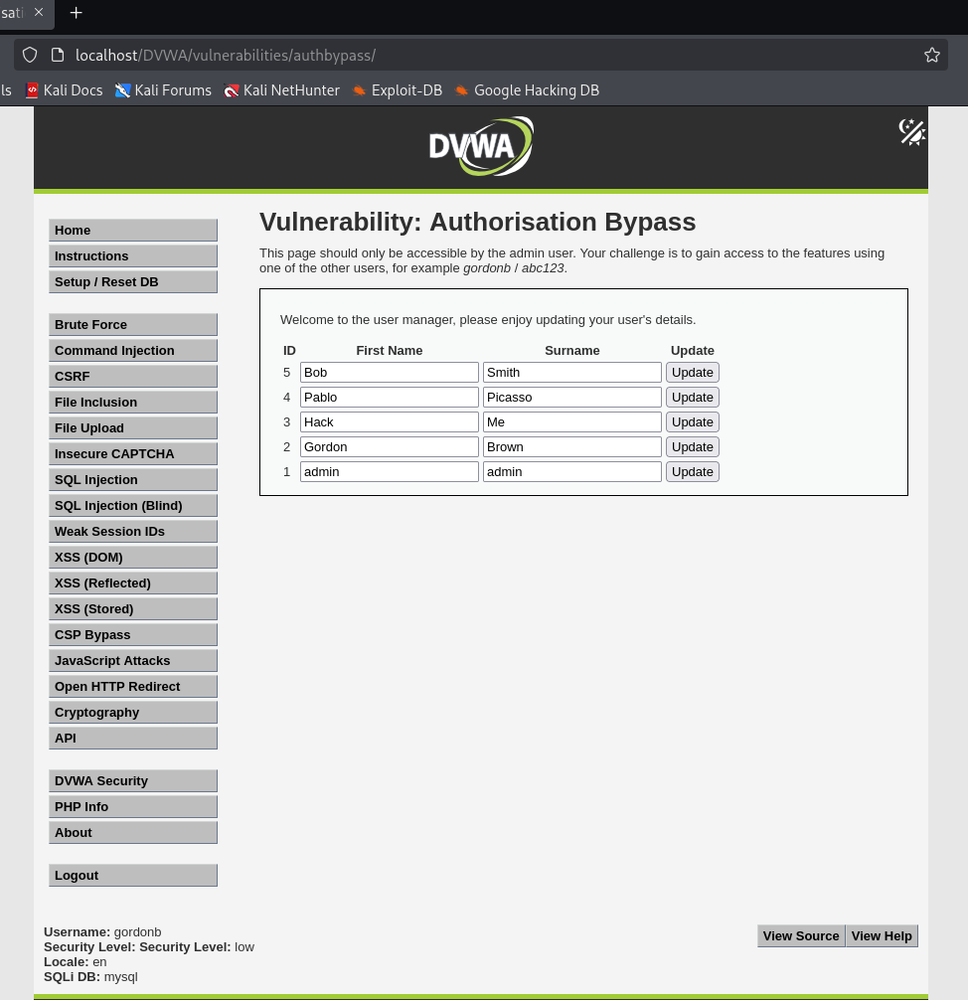
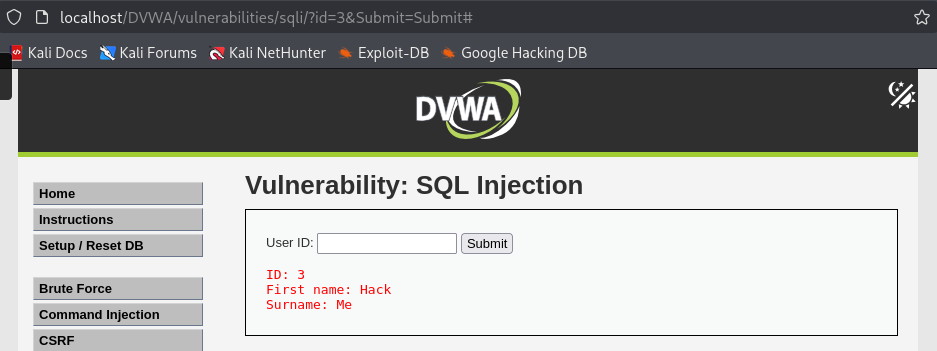
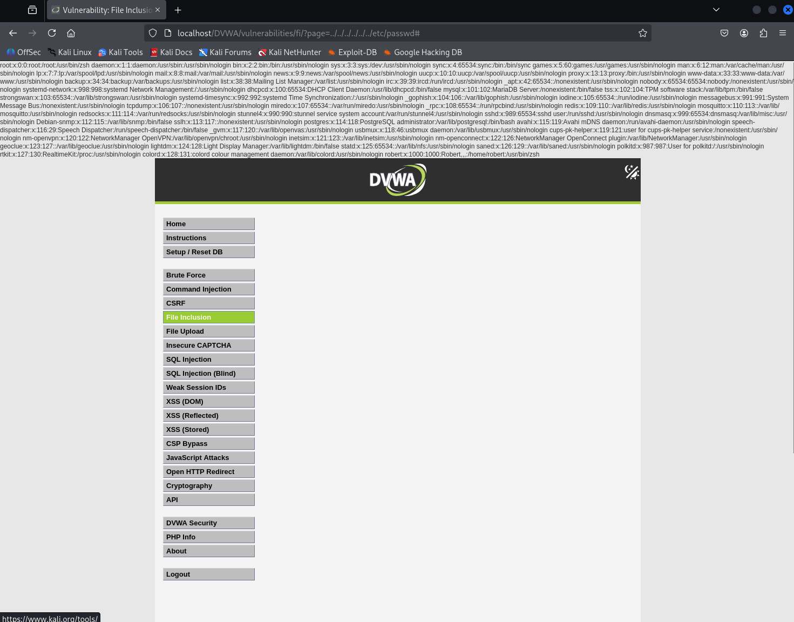
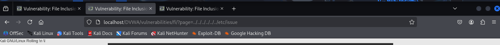
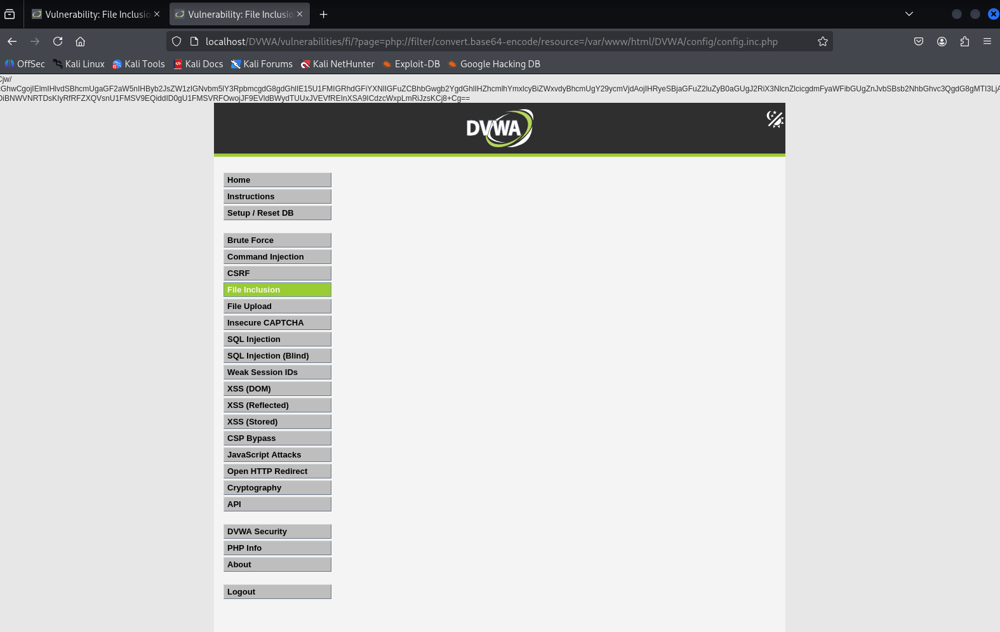
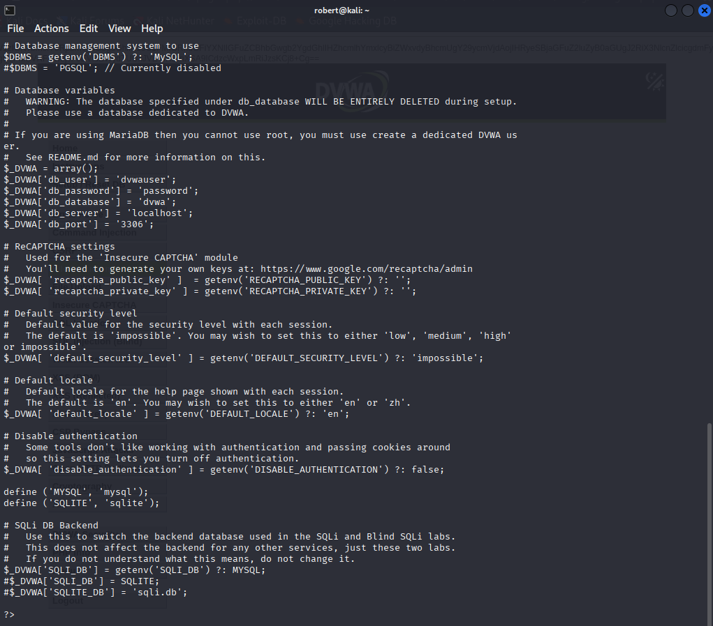

# DVWA Web Security Lab – Junior Pentester Portfolio

This repository documents hands-on vulnerability testing performed against Damn Vulnerable Web Application (DVWA) in a controlled local lab environment.

The objective of this project was to practice identifying, exploiting, and understanding common web application vulnerabilities while documenting findings in a professional, evidence-based format.

---

# Environment

- Apache 2.4 (Debian)
- PHP 8.4
- MariaDB / MySQL
- DVWA hosted locally
- Security level tested: Low (with source comparison for higher levels)

---

# Vulnerabilities Tested

---

## 1. SQL Injection (Error-Based & Blind)

- Confirmed injectable parameter
- Demonstrated error-based SQLi
- Performed boolean-based blind SQLi
- Enumerated database structure and metadata

Key Learning:
- Blind SQLi relies on true/false logic instead of visible errors.
- Input sanitization and prepared statements are critical.

---

## 2. Cross-Site Scripting (XSS)

### Reflected XSS
- Injected script into user input
- Observed immediate client-side execution

### Stored XSS
- Injected persistent payload stored in database
- Script executed upon page load

Key Learning:
- Output encoding prevents XSS even when access control is broken.
- Persistent XSS can compromise authenticated sessions.

---

## 3. Cross-Site Request Forgery (CSRF)

- Demonstrated password modification via forged request
- Analyzed lack of CSRF token protection at low security level

Key Learning:
- Authentication does not verify user intent.
- CSRF tokens must be validated server-side.

---

## 4. Command Injection

- Injected OS-level commands via unsanitized input
- Confirmed system command execution

Key Learning:
- Applications must restrict command execution context.
- Input validation alone is insufficient without proper sanitization.

---

## 5. Authorization Bypass (Broken Access Control)

### Vulnerability

The application restricted access to an admin-only feature using UI controls only.  
No server-side authorization checks were enforced.

### Exploitation

- Logged in as non-admin user (`gordonb`)
- Accessed admin-only endpoint directly via URL
- Retrieved full user list from backend API
- Successfully modified admin account information

### Impact

Broken access control allowed unauthorized data access and modification.  
In real-world applications, this could result in privilege escalation or account takeover.

### Evidence

#### Direct URL Access

#### API Data Exposure

#### Unauthorized Admin Update

#### IDOR / Direct Object Access

---

## 6. Local File Inclusion (LFI)

### Vulnerability

The application passed a user-controlled `page` parameter directly into a PHP include function without validation.

### Exploitation Steps

- Performed directory traversal using `../`
- Successfully read `/etc/passwd`
- Retrieved Apache configuration files
- Used `php://filter/convert.base64-encode` wrapper
- Extracted and decoded DVWA configuration file
- Recovered database credentials

### Impact

LFI enabled arbitrary local file read and credential disclosure.  
In production systems, this could expose sensitive secrets, API keys, and database credentials.

### Evidence

#### /etc/passwd Disclosure

#### Apache Configuration Disclosure

#### /etc/issue Disclosure

#### /proc/version Disclosure

#### Config File Base64 Disclosure

#### Config File Decoded Credentials

---

# Key Security Lessons Learned

- Broken Access Control is often more critical than injection flaws.
- UI restrictions do not enforce security — authorization must be server-side.
- LFI combined with PHP stream wrappers can expose application source code.
- Credential disclosure enables lateral movement and deeper compromise.
- Secure coding requires validation, authorization enforcement, and output encoding.

---

# Disclaimer

All testing documented in this repository was performed in a controlled local lab environment for educational purposes only.

No unauthorized testing was performed against production systems.
