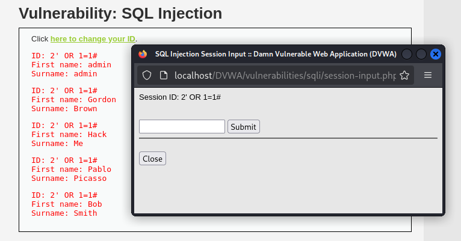

# DVWA – SQL Injection (Medium & High), API Exposure & Session Management

## Overview

Multi-vector testing session against DVWA covering SQL injection at Medium and High security levels, API endpoint security comparison, and weak session management analysis.

**Target:** DVWA (Local Lab) | **Stack:** Apache 2.4, MySQL | **Attacker:** Kali Linux

**Attack Path:**

SQLi Medium (UNION) → SQLi High (Session-Based) → API v1 Credential Exposure → Weak Session ID Analysis

---

## 1. SQL Injection – Medium (UNION & Enumeration)

UNION-based and boolean-based injection both confirmed at Medium security level. Database version, name, and user successfully extracted.

#### Boolean Injection

#### Database Version Disclosure

#### Database Name Disclosure

#### Database User Disclosure

---

## 2. SQL Injection – High (Session-Based)

Session input was concatenated directly into a SQL query with no sanitization or prepared statements, making the session parameter injectable despite the input being passed through a cookie rather than a form field.

#### Successful Boolean Bypass

#### Vulnerable Source Code

---

## 3. API Security Testing

API v1 exposed password hashes and allowed unauthenticated access. API v2 removed the password field entirely, demonstrating improved but incomplete security practice — authentication was still not enforced.

#### API v1 Password Exposure

#### API v1 Unauthenticated Access via curl

#### API v2 Improved Response

---

## 4. Weak Session Management

Session identifiers appeared sequential and predictable, making them vulnerable to session fixation and brute force attacks.

---

## Findings Summary

| Area | Issue | Result |
|------|-------|--------|
| SQLi Medium | UNION-based injection | Database, version, and user extracted |
| SQLi High | Session cookie injection | Boolean bypass confirmed |
| API v1 | Unauthenticated access | Password hashes exposed |
| API v2 | Password field removed | Hash exposure mitigated |
| Session Management | Sequential session IDs | Predictable identifiers confirmed |

---

## Recommended Mitigations

- Use parameterized queries and prepared statements for all SQL construction
- Validate and sanitize session input before use in queries
- Enforce authentication on all API endpoints regardless of version
- Minimize sensitive fields returned by APIs
- Generate session identifiers using a cryptographically secure random source

---

## Skills Demonstrated

- UNION-Based SQL Injection
- Boolean-Based SQL Injection
- Session Parameter Manipulation
- API Security Testing
- curl-Based Manual API Enumeration
- Session Management Analysis
- Source Code Review