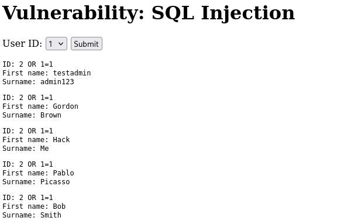
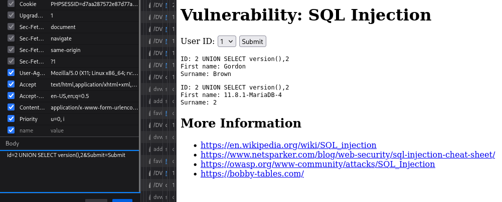
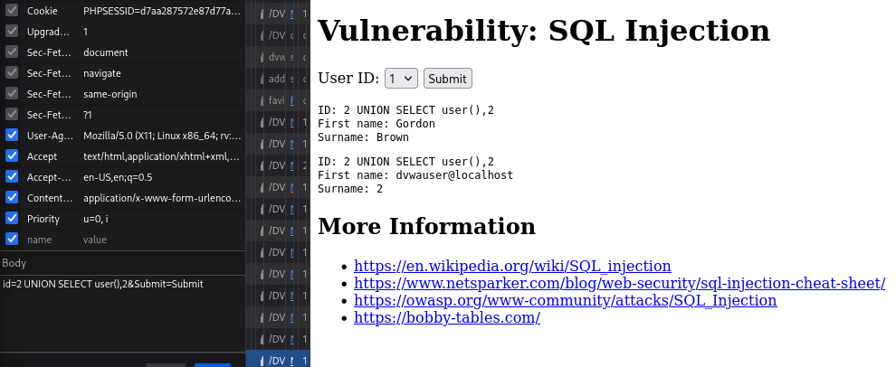
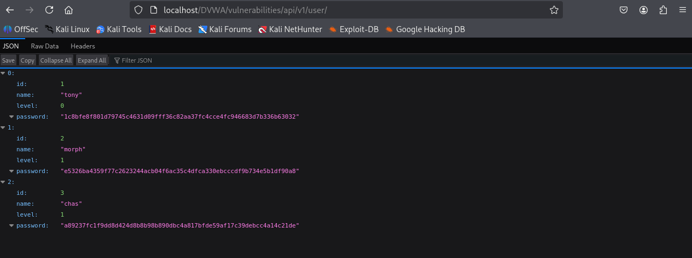
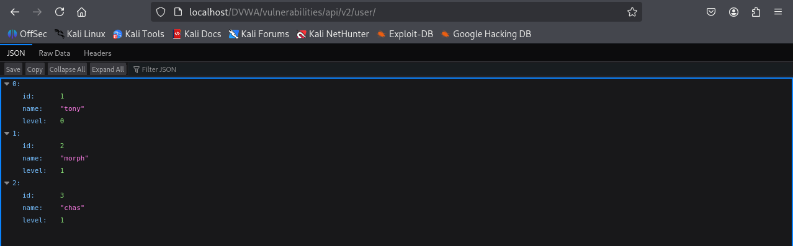

# Lab Report — 2026-02-17 (SQLi Medium/High + API + Sessions)

## Scope
DVWA testing focused on:
- SQL Injection (Medium)
- SQL Injection (High / session-input)
- API endpoint exposure (v1 vs v2)
- Weak session management

---

## 1) SQL Injection — Medium (UNION & Enumeration)

### What I Verified
- Boolean-based SQLi works
- UNION-based extraction works

### Evidence
#### Boolean Injection

#### Database Version Disclosure

#### Database Name Disclosure

#### Database User Disclosure

---

## 2) SQL Injection — High (Session-Based)

### Root Cause
Session input was concatenated directly into a SQL query.

### Evidence
#### Successful Boolean Bypass

#### Vulnerable Source Code

---

## 3) API Security Testing

### What I Found
- API v1 exposed password hashes and allowed unauthenticated access
- API v2 removed the password field (improved security)

### Evidence
#### API v1 Password Exposure

#### API v1 Unauthenticated Access (curl)

#### API v2 Improved Response

---

## 4) Weak Session Management

### What I Observed
Session identifiers appeared predictable/sequential.

### Evidence
#### Sequential Session Cookie

---

## Key Takeaways
- SQL queries must use prepared statements (parameterized queries).
- Avoid storing raw user input in sessions without validation.
- APIs must enforce authentication and minimize sensitive fields.
- Session identifiers must be unpredictable and random.
