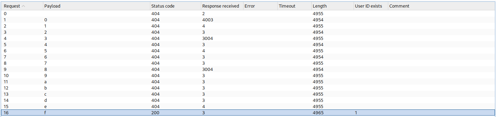

# DVWA – SQL Injection (Blind) – High Security

## Overview

Boolean-based blind SQL injection against DVWA at High security level, extracting the administrator password hash character by character using Burp Suite Intruder.

**Target:** DVWA (Local Lab) | **Stack:** Apache 2.4, MySQL | **Attacker:** Kali Linux

**Tools:** Burp Suite Intruder (Sniper Mode) | **Security Level:** High

**Attack Path:**

Injection Confirmation → Hash Length Extraction → Character-by-Character Blind Extraction → Hash Recovery → Verification

---

## Vulnerability Overview

At High security level, the SQL Injection (Blind) module accepts input via a cookie parameter and suppresses query output entirely. Although no results are returned directly, the backend query remains injectable due to unsafe SQL construction without prepared statements. TRUE and FALSE conditions produce measurable differences in HTTP status and response length, making blind extraction possible.

---

## 1. Confirm Password Hash Length

Hash length confirmed using a boolean condition:

```sql
1' AND LENGTH((SELECT password FROM users WHERE user_id = 1)) = 32#
```

Result confirmed the hash is 32 characters — consistent with MD5.

---

## 2. Character-by-Character Extraction

Blind extraction performed using:

```sql
1' AND substr((SELECT password FROM users WHERE user_id=1),1,1)='5'-- -
```

Burp Intruder was configured in Sniper mode with a payload list of `0-9` and `a-f`, iterating one character position per attack. A TRUE condition was identified by:

- HTTP 200 response
- Increased response length
- "User ID exists" indicator in the body

---

## 3. Position 1 Extraction

Only payload `5` produced a TRUE condition — HTTP 200 and increased response length.


**Position 1 = 5**

---

## 4. Position 2 Extraction

Only payload `f` produced a TRUE condition.



**Position 2 = f**

---

## 5. ASCII-Based Boolean Extraction Confirmation

ASCII comparison using `ORD()` and `MID()` used to confirm extraction logic during blind enumeration.


---

## 6. Full Hash Reconstruction


**Extracted Hash:**

```
5f4dcc3b5aa765d61d8327deb882cf99
```

---

## 7. Hash Verification

```bash
echo -n password | md5sum
```


Extracted hash matches the MD5 of `password`. Administrator credentials successfully recovered.

---

## 8. Observed Mitigation Attempt

High security attempts integer casting on input, but unsafe query construction still allows injection through the cookie parameter.


---

## Findings Summary

| Phase | Technique | Result |
|-------|-----------|--------|
| Injection Confirmation | Boolean Condition Testing | Vulnerable Parameter Confirmed |
| Hash Length | LENGTH() Boolean Query | 32 Characters (MD5) |
| Character Extraction | substr() + Burp Intruder | Full Hash Recovered |
| Hash Cracking | MD5 Verification | Password Identified |
| Mitigation Review | Source Code Analysis | Integer Cast Bypass Confirmed |

---

## Recommended Mitigations

- Use parameterized queries and prepared statements
- Avoid string concatenation in SQL construction
- Implement modern password hashing (bcrypt / Argon2)
- Enforce least-privilege database permissions
- Validate and sanitize all user-controlled input

---

## Key Takeaways

- Blind SQL injection does not require visible query output to be effective
- Response length differences alone can leak sensitive data
- High security level does not guarantee secure implementation
- Burp Intruder automates character-by-character extraction efficiently

---

## Skills Demonstrated

- Blind SQL Injection (Boolean-Based)
- Burp Suite Intruder (Sniper Mode)
- Hash Extraction and Offline Verification
- Cookie Parameter Manipulation
- Security Control Bypass Analysis
- Source Code Review