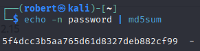

# 2026-02-18 – SQL Injection (Blind) – High Security

---

## Objective

Exploit a boolean-based blind SQL injection vulnerability in DVWA at High security level and extract the administrator password hash.

---

## Environment

- DVWA (Local Lab)
- Apache 2.4 (Debian)
- MySQL
- Kali Linux
- Burp Suite (Intruder – Sniper Mode)
- Security Level: High

---

## Vulnerability Overview

At High security level, the SQL Injection (Blind) module:

- Accepts input via a cookie parameter
- Does not return SQL query results
- Requires inference of TRUE/FALSE conditions
- Produces measurable response differences (HTTP status and content length)

Although output is suppressed, the backend query remains injectable due to unsafe SQL construction without prepared statements.

---

## Step 1 – Confirm Password Hash Length

The administrator password hash length was confirmed using:

```sql
1' AND LENGTH((SELECT password FROM users WHERE user_id = 1)) = 32#
```

Result confirmed the hash length is 32 characters (MD5).

---

## Step 2 – Character-by-Character Extraction

Blind extraction was performed using:

```sql
1' AND substr((SELECT password FROM users WHERE user_id=1),1,1)='5'-- -
```

### Method

- Burp Intruder (Sniper mode)
- Payload list: 0-9 and a-f
- One character position per attack
- TRUE condition identified via:
  - HTTP 200 response
  - Increased response length
  - “User ID exists” indicator

---

## Position 1 Extraction


Only payload 5 produced:

- HTTP 200
- Increased response length
- TRUE condition confirmed

Position 1 = 5

---

## Position 2 Extraction


Only payload f produced:

- HTTP 200
- Increased response length
- TRUE condition confirmed

Position 2 = f

---

## ASCII-Based Boolean Extraction Confirmation


Demonstrates ASCII comparison using `ORD()` and `MID()` during blind extraction.

---

## Final Extracted Hash

```
5f4dcc3b5aa765d61d8327deb882cf99
```

---

## Full Hash Reconstruction Proof


---

## Hash Verification

Verified via:

```bash
echo -n password | md5sum
```



The extracted hash matches the MD5 of "password".

Administrator credentials successfully recovered.

---

## Observed Mitigation Attempt (High Level)


High security attempts integer casting; however, unsafe query construction still allows injection.

---

## Impact

An attacker can:

- Extract password hashes
- Perform offline password cracking
- Fully compromise user accounts
- Escalate privileges
- Bypass authentication mechanisms

Even at High security level, absence of prepared statements enables full credential extraction.

---

## Recommended Mitigations

- Use parameterized queries / prepared statements
- Avoid string concatenation in SQL
- Implement modern password hashing (bcrypt / Argon2)
- Enforce least-privilege database permissions
- Validate and sanitize user-controlled input

---

## Key Takeaways

- Blind SQL injection does not require visible query output
- Response length differences can leak sensitive information
- High security does not guarantee secure implementation
- Burp Intruder can automate blind extraction efficiently
- Repetitive extraction steps omitted for brevity
