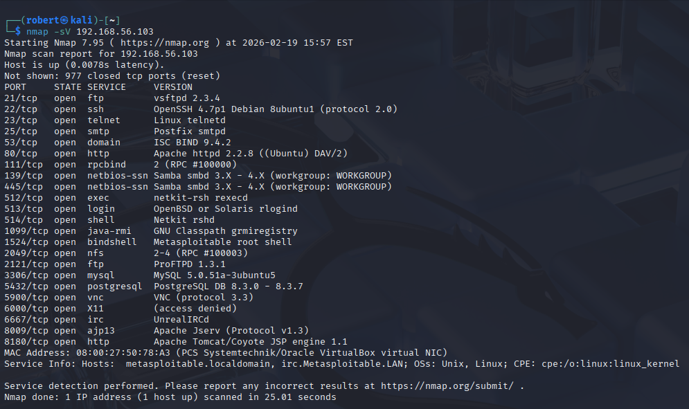
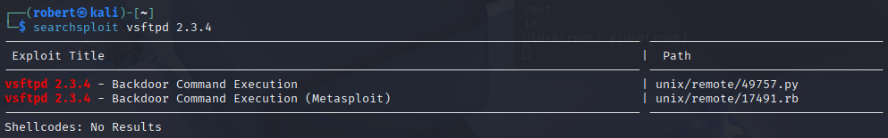
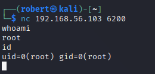
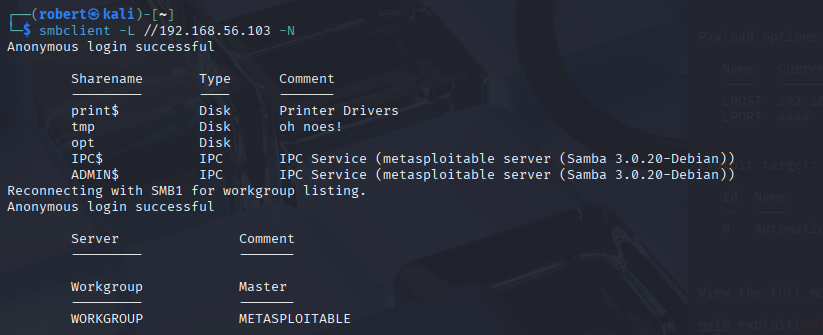
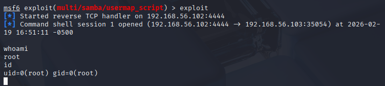
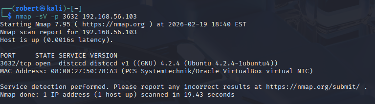
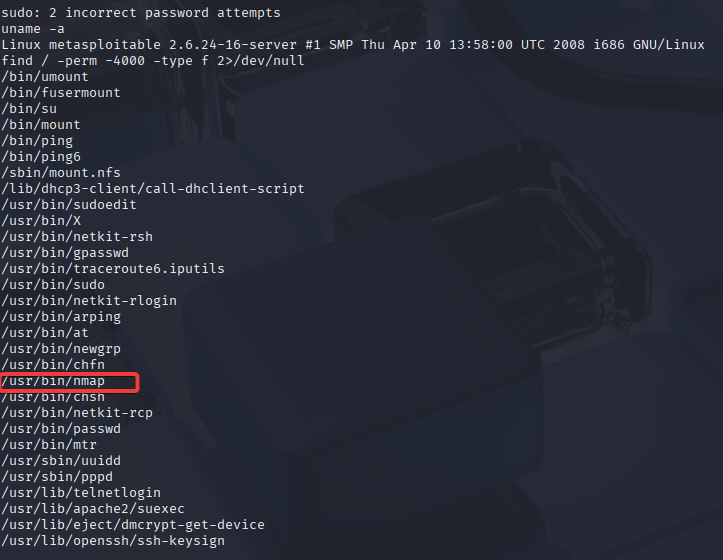
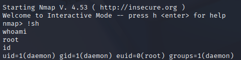
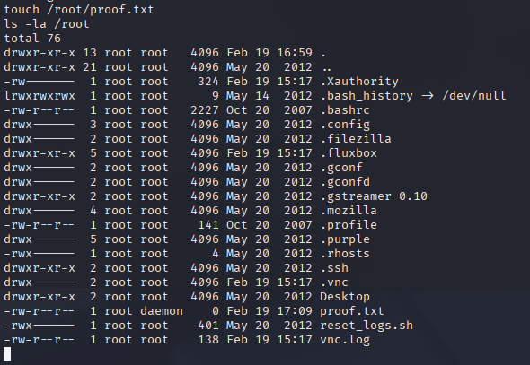

# Metasploitable 2 – Multi-Vector Root Compromise

## Overview

This lab demonstrates full system compromise of a vulnerable Linux host (Metasploitable 2) through multiple independent attack vectors. The objective was to enumerate exposed services, exploit remote vulnerabilities, escalate privileges where required, and validate root-level impact.

Target: 192.168.56.103  
Attacker: Kali Linux  
Environment: Isolated VirtualBox Lab  

---

## Enumeration

Initial reconnaissance was performed using Nmap version detection to identify exposed services and potential attack vectors.

Several legacy and vulnerable services were identified, including:

- vsftpd 2.3.4
- Samba (SMB)
- Distcc
- UnrealIRCd
- MySQL, PostgreSQL, and Tomcat

The exposed attack surface significantly increased the likelihood of remote compromise.

---

## Exploitation Path 1 – vsftpd 2.3.4 Backdoor

Vulnerability research confirmed that vsftpd 2.3.4 contains a known backdoor.

Triggering the backdoor resulted in immediate root-level shell access.

**Impact:** Unauthenticated remote root access.

---

## Exploitation Path 2 – Samba usermap_script RCE

Anonymous SMB enumeration confirmed accessible Samba shares and version details.

The Metasploit module `exploit/multi/samba/usermap_script` was used to exploit a command execution vulnerability.

**Impact:** Remote code execution with root privileges.

---

## Exploitation Path 3 – Distcc RCE → Privilege Escalation

Distcc service was identified running on port 3632.

Using the Metasploit module `exploit/unix/misc/distcc_exec`, a reverse shell was obtained as the low-privileged user `daemon`.

Although initial access was limited, local enumeration revealed a SUID misconfiguration.

The binary `/usr/bin/nmap` was configured with the SUID bit set. Using interactive mode:

nmap --interactive
!sh

Root privileges were obtained.

Root access was validated by reading sensitive system files and writing to `/root`.

**Impact:** Full system compromise via remote entry and local privilege escalation.

---

## Summary of Findings

| Vector | Vulnerability Type | Result |
|--------|-------------------|--------|
| vsftpd 2.3.4 | Backdoored service | Root access |
| Samba | Remote Code Execution | Root access |
| Distcc | Unauthenticated RCE | Low-privilege shell |
| SUID nmap | Local Privilege Escalation | Root access |

---

## Skills Demonstrated

- Network reconnaissance and service fingerprinting
- Vulnerability research and validation
- Metasploit exploitation workflow
- Reverse shell troubleshooting and payload selection
- Local privilege escalation via SUID abuse
- Post-exploitation validation and impact confirmation

---

## Conclusion

The target system was fully compromised through three independent exploitation paths. This lab demonstrates practical offensive security workflow:

Enumeration → Exploitation → Privilege Escalation → Impact Validation

The exercise highlights the risks associated with legacy services, exposed network daemons, and improper SUID configurations.