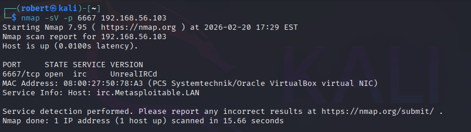
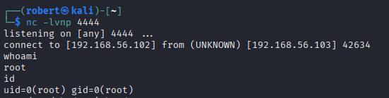
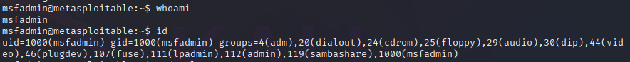
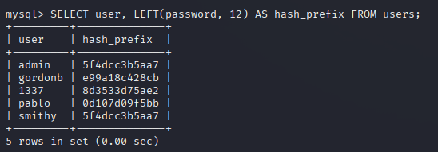

# Metasploitable 2 – Manual RCE, Privilege Escalation & Post-Exploitation

## Overview

This lab demonstrates multiple compromise paths against a Metasploitable 2 host.  
The objective was to manually exploit exposed services, escalate privileges through system misconfiguration, and perform post-exploitation data access.

Target: 192.168.56.103  
Environment: Local VirtualBox Lab  

---

## 1. Service Enumeration

Initial reconnaissance identified UnrealIRCd running on port 6667.



---

## 2. Manual UnrealIRCd Backdoor Exploitation

The backdoored UnrealIRCd service was manually exploited using netcat.  
A reverse shell was obtained with root privileges.



Root access was validated by accessing sensitive system files:


---

## 3. Privilege Escalation via Sudo Misconfiguration

Logged in as user `msfadmin` to simulate a lower-privileged compromise.

User context and group memberships:



Enumeration revealed unrestricted sudo permissions:


Privilege escalation was achieved using:

```bash
sudo -i
```

Root access confirmed:


---

## 4. Post-Exploitation – Credential & Database Access

With root access, application configuration files were reviewed.  
DVWA database credentials were extracted from:

```
/var/www/dvwa/config/config.inc.php
```

Direct MySQL access as root was obtained.  
User credential hashes were extracted from the DVWA database:



---

## Findings Summary

| Path | Technique | Result |
|------|-----------|--------|
| UnrealIRCd | Manual backdoor exploitation | Root |
| Sudo Misconfiguration | Overly permissive privileges | Root |
| Post-Exploitation | Credential harvesting & DB access | User data exposure |

---

## Skills Demonstrated

- Manual service exploitation (no Metasploit)
- Reverse shell handling
- Privilege enumeration and escalation
- Sudo misconfiguration analysis
- Application credential discovery
- Direct database access and data extraction

---

## Conclusion

The Metasploitable 2 host was compromised through multiple independent privilege paths.  
This lab demonstrates structured attacker workflow:

Enumeration → Exploitation → Privilege Escalation → Data Access