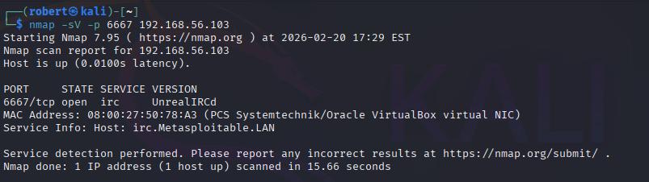
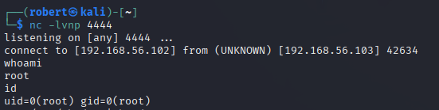
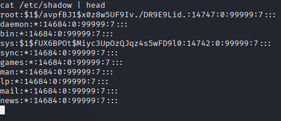
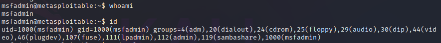
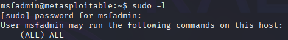
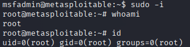
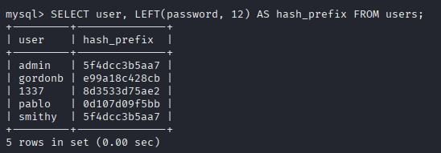

# Metasploitable 2 – Manual RCE, Privilege Escalation & Post-Exploitation

## Overview

Manual compromise of a Metasploitable 2 host at 192.168.56.103 by exploiting the UnrealIRCd backdoor on port 6667 with `netcat` to land a root reverse shell, then re-entering as `msfadmin` and abusing unrestricted `sudo -i` to escalate, finishing with post-exploitation extraction of DVWA database credentials from `config.inc.php` and direct `mysql` access to dump user password hashes.

**Target:** `192.168.56.103` (Metasploitable 2, VirtualBox host-only network)

---

## 1. Service Enumeration

Initial reconnaissance identified UnrealIRCd running on port 6667.



---

## 2. Manual UnrealIRCd Backdoor Exploitation

The backdoored UnrealIRCd service was manually exploited using netcat — no Metasploit. A reverse shell was obtained with root privileges.



Root access validated by accessing sensitive system files:



---

## 3. Privilege Escalation via Sudo Misconfiguration

Logged in as `msfadmin` to simulate a lower-privileged compromise. Enumeration revealed unrestricted sudo permissions.





Privilege escalation achieved using:

```bash
sudo -i
```



---

## 4. Post-Exploitation – Credential & Database Access

With root access, DVWA database credentials were extracted from `/var/www/dvwa/config/config.inc.php`. Direct MySQL access obtained and user credential hashes pulled from the DVWA database.



---

## Findings Summary

| Phase | Technique | Result |
|-------|-----------|--------|
| Service Recon | Port Scanning & Version Detection | UnrealIRCd Backdoor Identified |
| Exploitation | Manual Backdoor via Netcat | Root Shell |
| Privilege Escalation | Sudo Misconfiguration | Root Access |
| Post-Exploitation | Config File Review & DB Access | Credential Extraction |

---

## Skills Demonstrated

- Manual Service Exploitation (no Metasploit)
- Reverse Shell Handling
- Privilege Enumeration and Escalation
- Sudo Misconfiguration Analysis
- Application Credential Discovery
- Direct Database Access and Data Extraction