# Basic Pentesting 1 – WordPress Compromise & Local Privilege Escalation

## Overview

Full system compromise of a vulnerable Ubuntu host through web application exploitation and local privilege escalation.

**Target:** 192.168.56.104 | **Hostname:** vtcsec | **Environment:** VirtualBox Host-Only Network

**Attack Path:**

Web Enumeration → WordPress Compromise → Reverse Shell (www-data) → SUID Enumeration → pkexec Exploitation → Root

---

## 1. Service Enumeration

Initial reconnaissance identified exposed services: FTP (ProFTPD 1.3.3c), SSH (OpenSSH 7.2p2), HTTP (Apache 2.4.18).

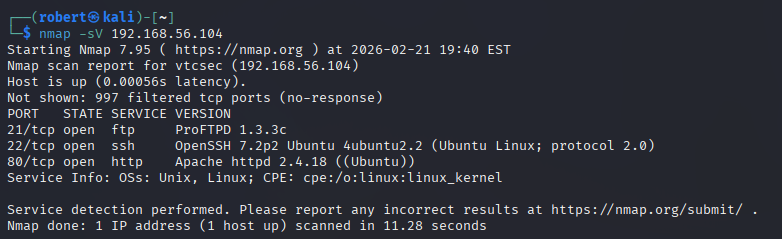

---

## 2. Directory Enumeration

Directory brute forcing revealed a hidden `/secret` directory containing a WordPress instance.

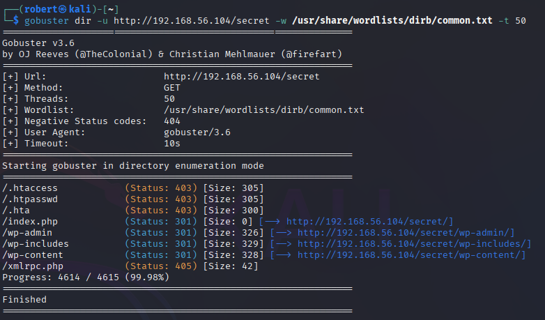

---

## 3. WordPress Identification

WordPress 4.9 identified via page source.

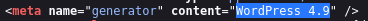

---

## 4. User Enumeration

WPScan identified a valid WordPress user: `admin`.

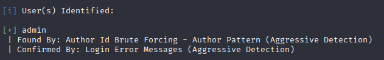

---

## 5. Local DNS Resolution Fix

Target mapped in `/etc/hosts` for proper hostname resolution.

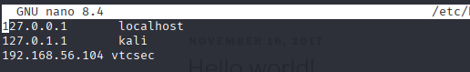

---

## 6. WordPress Admin Access

Authenticated using weak credentials.

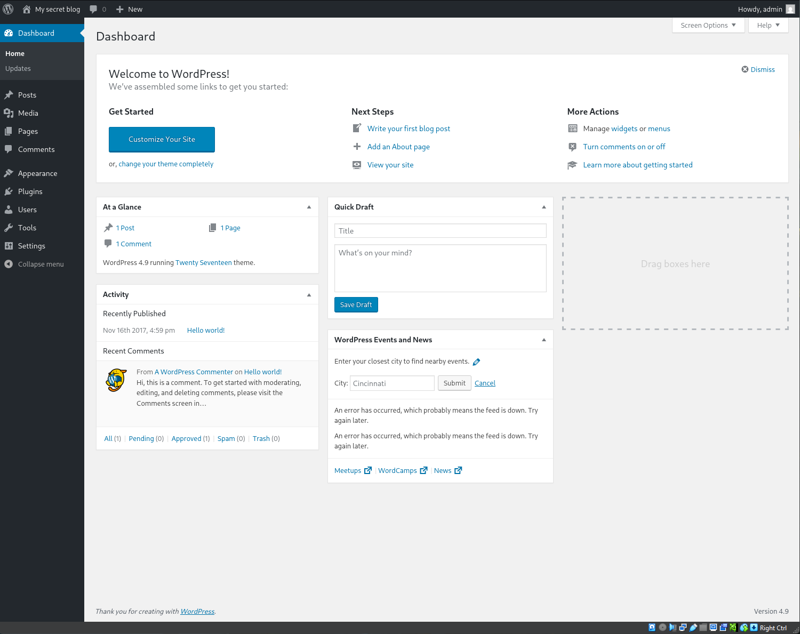

---

## 7. Initial Shell Access

Reverse shell obtained through WordPress administrative access. User context confirmed as `www-data`.

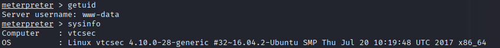

---

## 8. Local Enumeration

System user enumeration revealed additional local accounts.

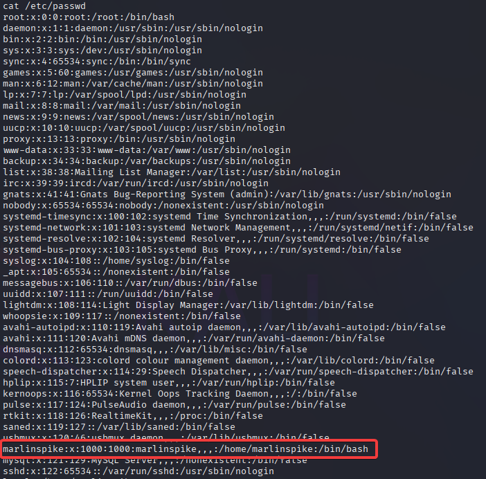

---

## 9. SUID Enumeration

SUID binaries enumerated. `pkexec` identified as a potential escalation vector.

---

## 10. WordPress Configuration Review

Database credentials discovered within `wp-config.php`. Direct MySQL login attempted with extracted credentials.

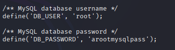

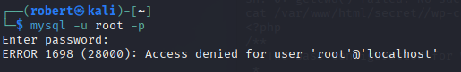

---

## 11. pkexec Analysis

SUID permissions and version confirmed as exploitable.

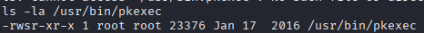

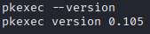

---

## 12. Exploit Preparation

Exploit files transferred to `/tmp`. Compiler availability confirmed.

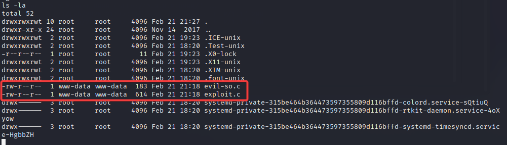

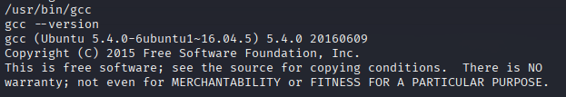

---

## 13. Privilege Escalation – Root

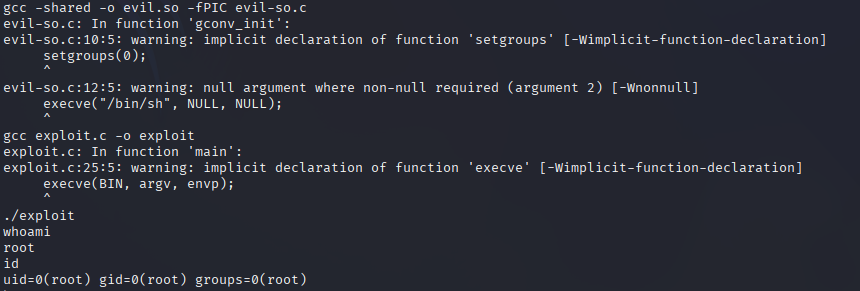

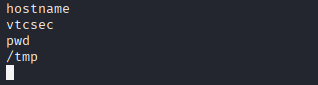

---

## Findings Summary

| Phase | Technique | Result |
|-------|-----------|--------|
| Web Recon | Directory Brute Force | Hidden WordPress Instance |
| Enumeration | WPScan User Enumeration | Valid Admin Account |
| Application Layer | Weak Credentials | WordPress Admin Access |
| OS Pivot | Reverse Shell | www-data Access |
| Local Enumeration | SUID Discovery | pkexec Identified |
| Privilege Escalation | pkexec Exploit | Root Access |

---

## Skills Demonstrated

- Service Enumeration (nmap)
- Directory Brute Forcing (gobuster)
- WordPress Enumeration (WPScan)
- Weak Credential Exploitation
- Reverse Shell Handling
- Local User Enumeration
- SUID Privilege Escalation
- Root Compromise Confirmation