# Kioptrix Level 2 – Web to Root

## Lab Overview

This lab demonstrates a full attack chain against Kioptrix Level 2, starting from network discovery and ending with root-level compromise via kernel exploitation.

Attack Path:

- Target Discovery
- Service Enumeration
- SQL Injection (Auth Bypass)
- Command Injection (RCE)
- Database Credential Extraction
- Reverse Shell
- Kernel Privilege Escalation
- Root Proof

---

# 1. Target Discovery

Identified target using ARP scanning.


---

# 2. Full Port Scan & Service Enumeration

Performed full TCP scan.


Service fingerprinting:


Web technology identification:


Identified:
- Apache 2.0.52 (CentOS)
- PHP 4.3.9
- MySQL
- OpenSSH

---

# 3. Web Application Analysis

Initial login page:

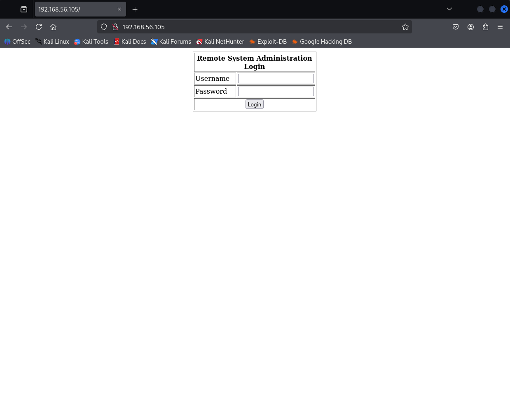

HTML source inspection:


---

# 4. SQL Injection – Authentication Bypass

The login form was vulnerable to SQL injection.

Successful bypass:

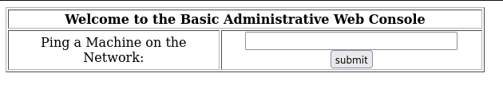

Root cause in source code:


```php
$query = "SELECT * FROM users WHERE username = '$username' AND password='$password'";
```

No sanitization or prepared statements were used.

---

# 5. Command Injection – Remote Code Execution

Ping functionality:

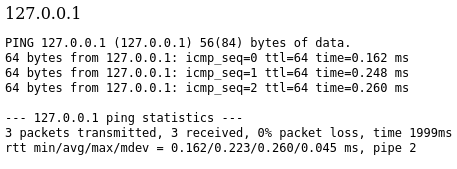

Command injection confirmed:


Source vulnerability:


```php
echo shell_exec('ping -c 3 ' . $target);
```

User input passed directly into shell command execution.

---

# 6. Initial OS Enumeration

Execution context:


Directory listing:

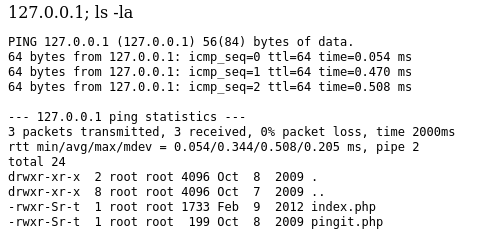

Local users:


SUID binaries:

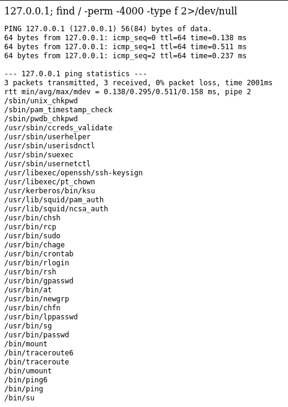

Kernel version:


Writable /tmp:

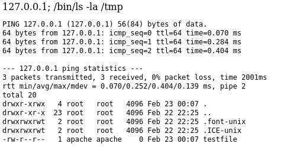

GCC availability:

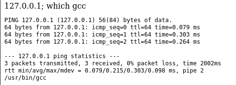

---

# 7. Database Credential Extraction

Extracted MySQL credentials from source:


Confirmed MySQL client:

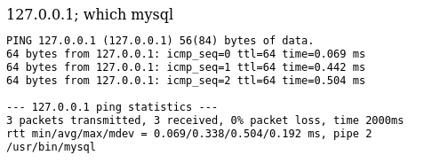

Database enumeration:

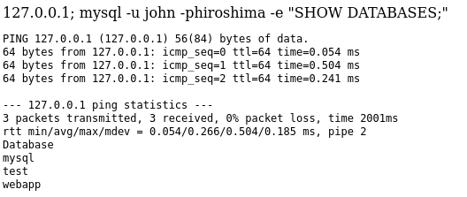

Tables:

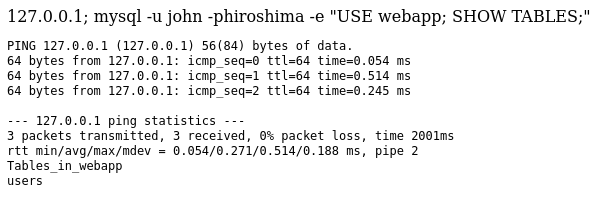

User credentials extracted:


---

# 8. Reverse Shell Access

Reverse shell received:


Shell stabilized:


---

# 9. Kernel Exploitation – Privilege Escalation

Kernel matched to known RHEL 4 vulnerability:


Exploit copied:

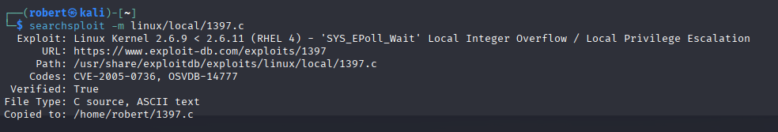

Exploit transferred:

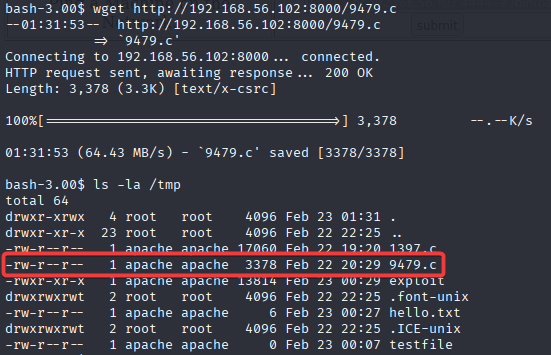

Exploit compiled:


Exploit executed successfully:


---

# 10. Root Validation

Confirmed root:


Access to /etc/shadow:


---

# Final Result

✔ SQL Injection  
✔ Command Injection  
✔ Remote Code Execution  
✔ Credential Extraction  
✔ Reverse Shell  
✔ Kernel Privilege Escalation  
✔ Root Access  

Full system compromise achieved.

---

## Skills Demonstrated

- Network Reconnaissance
- Web Exploitation
- SQL Injection
- OS Command Injection
- Source Code Analysis
- Database Enumeration
- Shell Stabilization
- Kernel Exploitation
- Linux Privilege Escalation

---

Lab Completed Successfully.