# Kioptrix Level 2 – Web to Root

## Overview

Full compromise of the Kioptrix Level 1.1 CentOS host by discovering the target with `netdiscover`, fingerprinting an outdated Apache/PHP/MySQL stack with `nmap` and `whatweb`, bypassing authentication via SQL injection on the login form, gaining RCE through a ping command-injection flaw, spawning a reverse shell as `apache`, and escalating to root with the `sock_sendpage` (CVE-2009-2698) kernel exploit matched via `searchsploit`.

**Target:** `192.168.56.105` (CentOS / Apache 2.0.52, PHP 4.3.9, kernel 2.6.9-55.EL)

---

## 1. Target Discovery

Identified target using `netdiscover` ARP scanning.

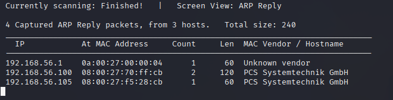

---

## 2. Service Enumeration

Full TCP `nmap` scan, service fingerprinting, and `whatweb` technology identification. Stack identified: Apache 2.0.52, PHP 4.3.9, MySQL, OpenSSH on CentOS.

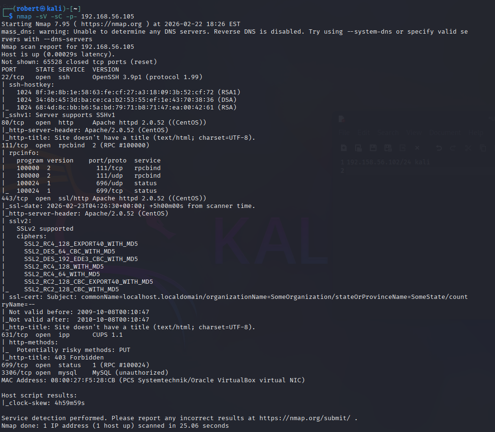

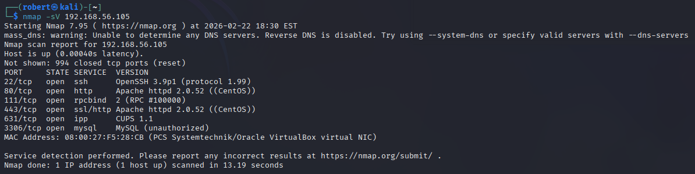

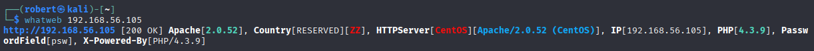

---

## 3. Web Application Analysis

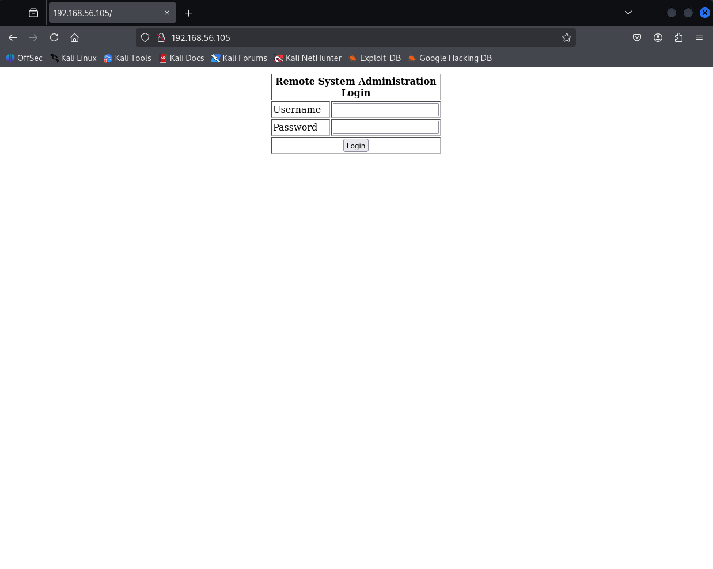

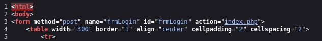

---

## 4. SQL Injection – Authentication Bypass

The login form was vulnerable to SQL injection. User input was concatenated directly into the query with no sanitization or prepared statements.

```php
$query = "SELECT * FROM users WHERE username = '$username' AND password='$password'";
```

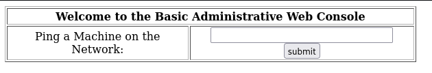

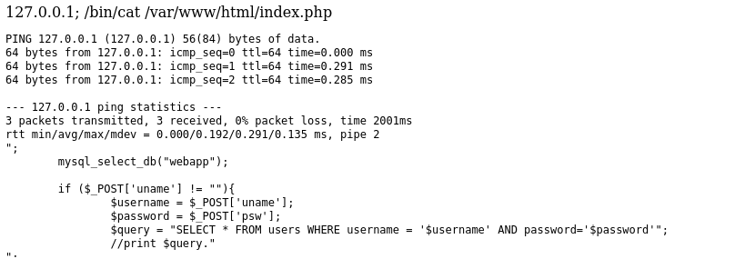

---

## 5. Command Injection – Remote Code Execution

The ping feature passed user input directly into a shell command with no filtering.

```php
echo shell_exec('ping -c 3 ' . $target);
```

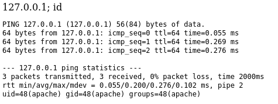

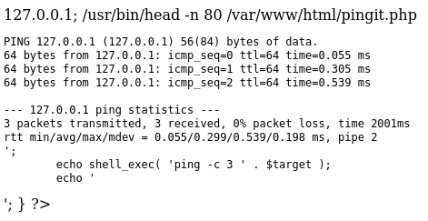

---

## 6. OS Enumeration

Kernel version, local users, SUID binaries, writable /tmp, and GCC availability confirmed through the injection point.

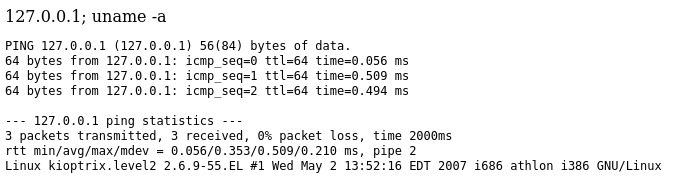

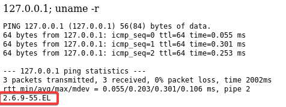

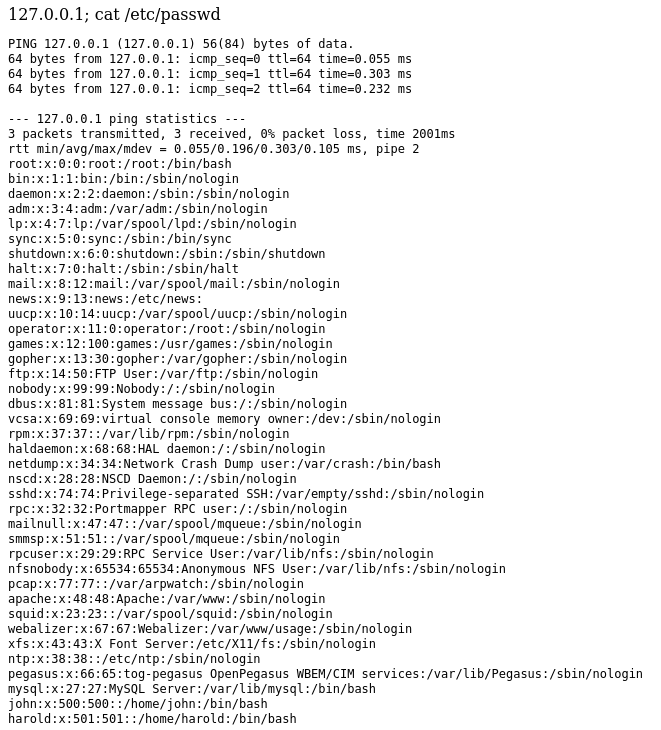

---

## 7. Database Credential Extraction

MySQL credentials found hardcoded in source. Database and user table enumerated through the injection point.

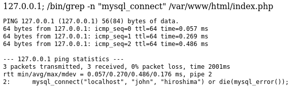

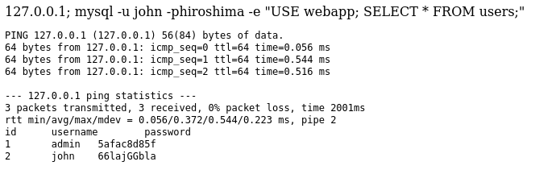

---

## 8. Reverse Shell

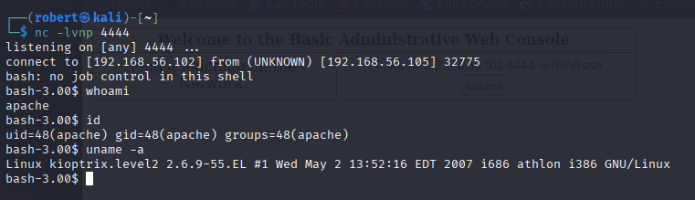

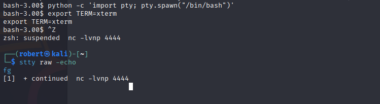

---

## 9. Kernel Exploitation – Privilege Escalation

Kernel version `2.6.9-55.EL` matched via `searchsploit` to a known RHEL 4 local privilege escalation via `sock_sendpage()`. Exploit transferred, compiled with `gcc`, and executed on target.

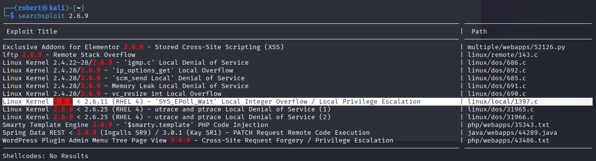

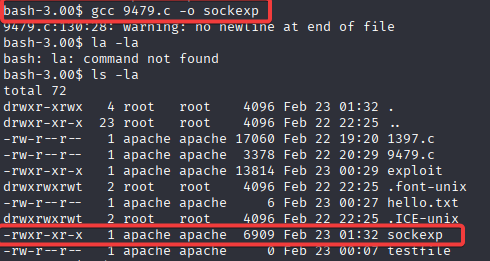

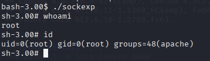

---

## 10. Root Validation

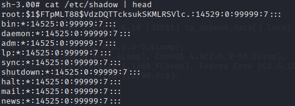

---

## Findings Summary

| Phase | Technique | Result |
|-------|-----------|--------|
| Web Recon | Service & Stack Fingerprinting | Outdated Apache & PHP Identified |
| Authentication | SQL Injection Bypass | Admin Access |
| RCE | Command Injection | Remote Code Execution as apache |
| Credential Access | Source Code Review | Hardcoded DB Credentials |
| Privilege Escalation | Kernel Exploit (sock_sendpage) | Root Access |

---

## Skills Demonstrated

- Network Reconnaissance
- Web Exploitation
- SQL Injection
- OS Command Injection
- Source Code Analysis
- Database Enumeration
- Reverse Shell Handling
- Kernel Exploitation
- Linux Privilege Escalation