# Investigating with Splunk - C2 Backdoor Detection

**Platform:** TryHackMe  
**Difficulty:** Easy  
**OS:** Windows (Log Analysis)  
**Date:** 2026-03-10

---

## Overview

Acting as a SOC analyst on the Cybertees network, this investigation uses Splunk SPL queries over 12,256 pre-ingested Windows event logs and Sysmon records to uncover a WMI-launched backdoor account (`A1berto` impersonating `Alberto`) created on `Micheal.Beaven` and a double-Base64 encoded PowerShell C2 beacon on `James.browne` that, after decoding with iconv on Kali and defanging in CyberChef, resolves to `hxxp[://]10[.]10[.]10[.]5/news[.]php`.

**Target:** `Cybertees` (Windows enterprise environment — hosts Micheal.Beaven and James.browne)

---

## Investigation

### Phase 1: Scoping the Data

The first step in any `Splunk` investigation is confirming how much data you are working with. A broad search against the index establishes scope.

```
index="main"
```

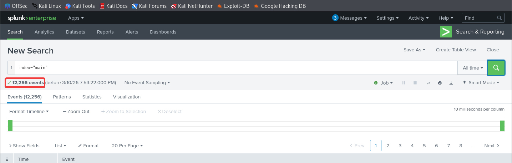

**Total events ingested: 12,256**

Checking the sourcetype confirms all logs are Windows event logs ingested as `event_logs` from `splunk_challenge1.json`.

---

### Phase 2: Backdoor User Discovery

Windows logs user account creation under EventID 4720. Searching for this event surfaces a suspicious account created by `James` on host `Micheal.Beaven`.

```
index="main" EventID=4720
```

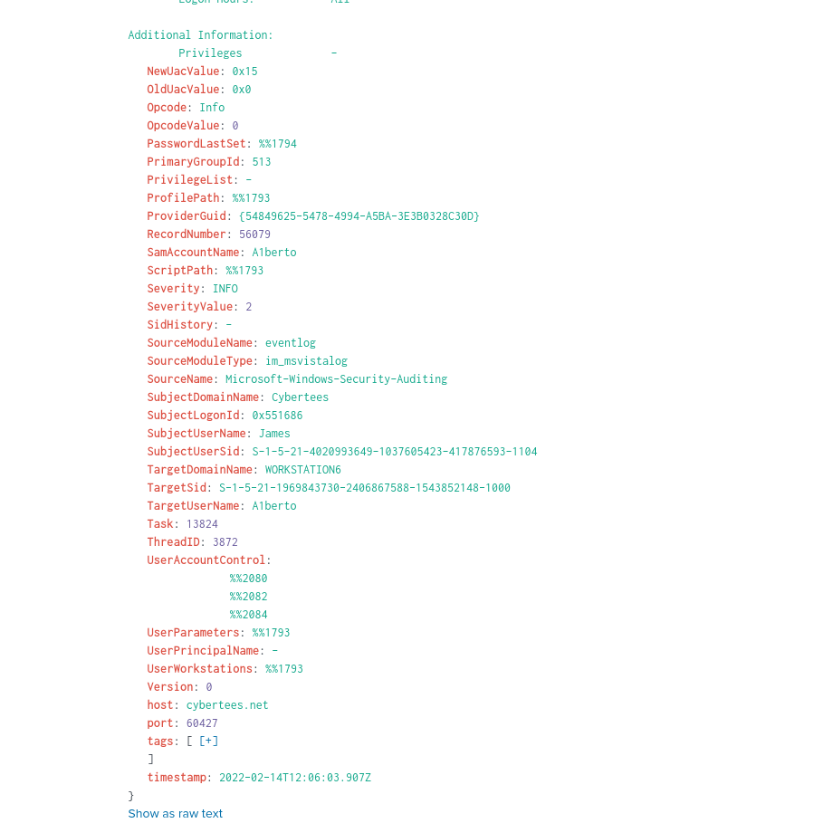

**Backdoor username: `A1berto`**

The account name is a deliberate impersonation of the legitimate user `Alberto`, replacing the lowercase L with the number 1. This is a common social engineering technique used to make the account blend in with real user accounts during a casual review.

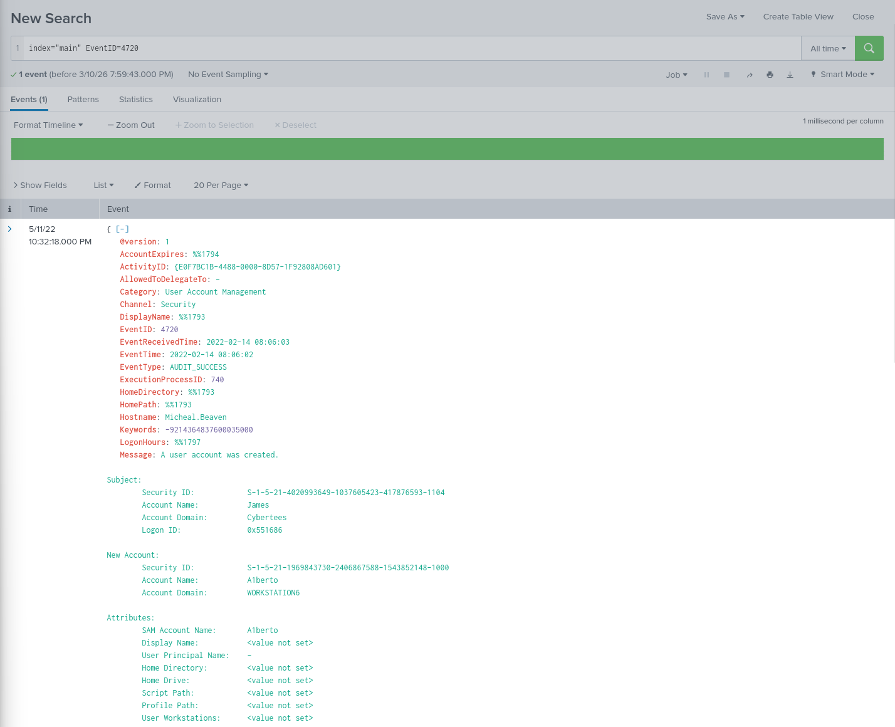

**User being impersonated: `Alberto`**

---

### Phase 3: Registry Key Analysis

When a new user account is created on Windows, a corresponding registry key is written under the SAM hive. Sysmon EventID 13 logs registry value set operations. Filtering for A1berto and EventID 13 surfaces the key path.

```
index="main" A1berto EventID=13 | table _time, TargetObject, Details, Hostname
```

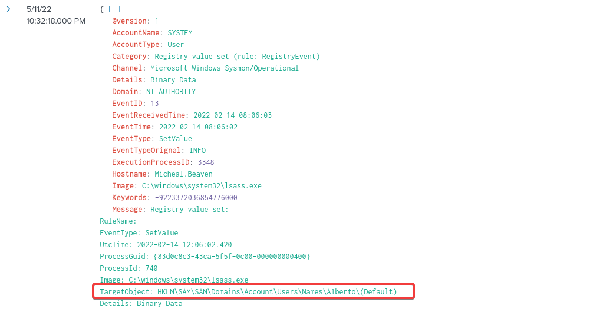

**Registry key path: `HKLM\SAM\SAM\Domains\Account\Users\Names\A1berto`**

---

### Phase 4: Remote User Creation Command

To find the exact command used to create the backdoor account, searching for process creation events referencing A1berto surfaces EventID 4688 with the full command line.

```
index="main" A1berto "net user"
```

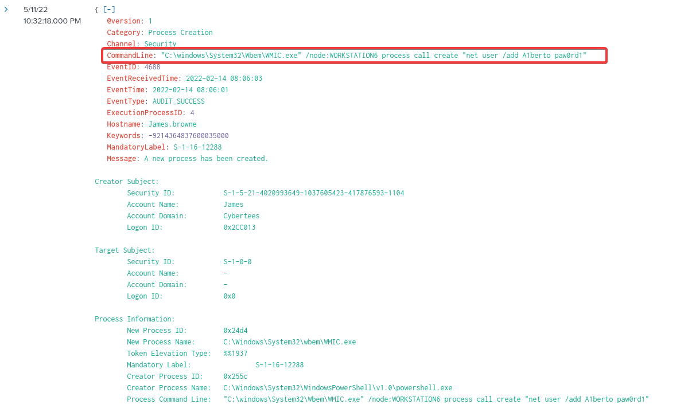

**Command used:**
```
"C:\windows\System32\Wbem\WMIC.exe" /node:WORKSTATION6 process call create "net user /add A1berto paw0rd1"
```

The creator process is `WmiPrvSE.exe`, confirming the command was executed remotely via WMI rather than run locally. The attacker used WMIC to connect to WORKSTATION6 and execute the user creation command without ever logging in interactively.

---

### Phase 5: Login Attempt Verification

Checking whether the backdoor account was ever used to log in confirms there are zero successful logon events for A1berto. EventID 4624 does not appear in the results for this account.

```
index="main" "A1berto" | stats count by EventID
```

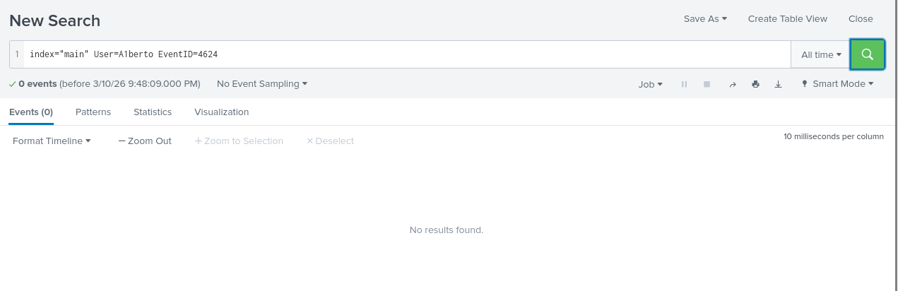

**Login attempts from A1berto: 0**

The account was created but never used directly, suggesting it was staged for future use or persistence rather than immediate access.

---

### Phase 6: Malicious PowerShell Execution

Searching for EventID 4103 (PowerShell module logging) identifies the host where suspicious PowerShell commands were executed.

```
index="main" EventID=4103 | stats count by Hostname
```

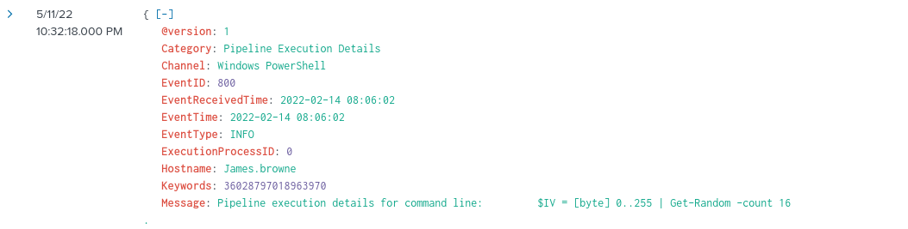

**Infected host: `James.browne`**

Filtering for EventID 4103 on this host returns the full count of logged PowerShell events.

```
index="main" EventID=4103
```

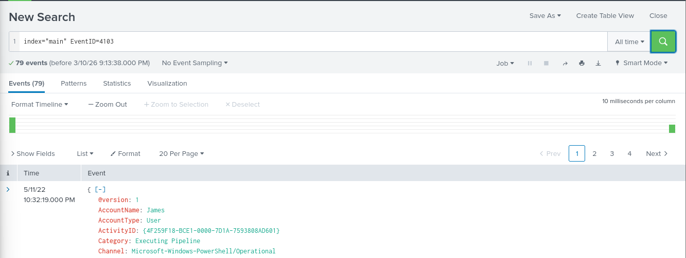

**PowerShell events logged: 79**

---

### Phase 7: C2 URL Extraction

The malicious PowerShell process was launched with the `-enc` flag, indicating an encoded command. The encoded string is Base64 encoded UTF-16LE, which is standard for PowerShell. Decoding it on `Kali Linux` using `iconv` reveals the full script.

```bash
echo "<base64_string>" | base64 -d | iconv -f UTF-16LE -t UTF-8 2>/dev/null
```

The decoded script contains a second layer of Base64 encoding for the C2 IP address, and the path stored in the `$t` variable.

**Decoded C2 IP:**

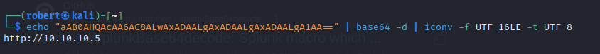

**Decoded URL path:**

The script sets `$t='/news.php'` and combines it with the decoded server address to form the full C2 URL. The URL was defanged using CyberChef for safe reporting.

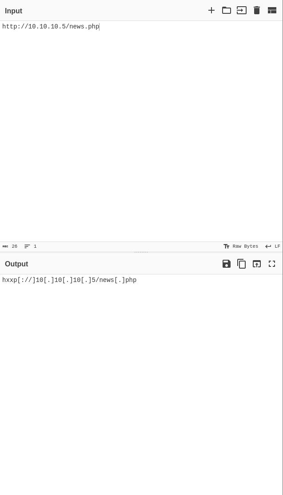

**Full C2 URL (defanged): `hxxp[://]10[.]10[.]10[.]5/news[.]php`**

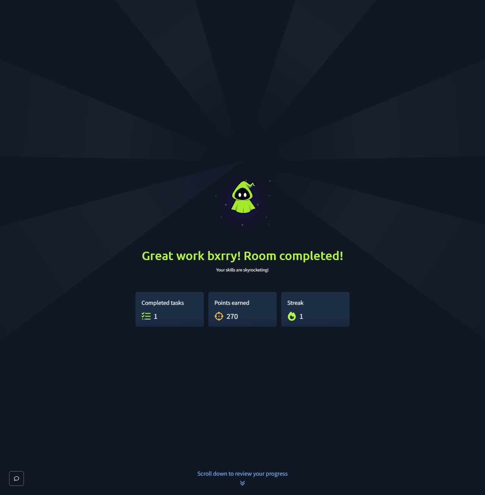

---

## Vulnerability Summary

### Backdoor Account Creation via WMI - WORKSTATION6

An authenticated attacker used WMIC to remotely execute a `net user /add` command on WORKSTATION6, creating a backdoor account named A1berto designed to impersonate the legitimate user Alberto. The account was created from a remote host without an interactive logon, making it less likely to be caught by monitoring focused on direct logon events.

**Remediation:** Monitor for EventID 4720 (account creation) and correlate with EventID 4688 (process creation) to catch accounts created via scripted or remote methods. Restrict WMI remote execution to administrators.

### Encoded PowerShell C2 Beacon - James.browne

A PowerShell Empire-style C2 agent was executed on James.browne using a double-encoded Base64 script launched with `-noP -sta -w 1 -enc`. The script disabled PowerShell script block logging, established a WebClient, and beaconed to `10.10.10.5/news.php` using RC4 encryption and a randomized URI path to evade detection. The payload was executed entirely in memory using `IEX` (Invoke-Expression), leaving no files on disk.

**Remediation:** Enable PowerShell Constrained Language Mode and ScriptBlock logging. Alert on processes launched with `-enc` flags. Monitor outbound HTTP connections from PowerShell processes.

---

## Key Takeaways

- EventID 4720 is the primary indicator for new account creation. Correlating it with EventID 4688 reveals whether the account was created interactively or via a remote mechanism like WMI
- Attackers name backdoor accounts to visually resemble legitimate users. A1berto vs Alberto is easy to miss in a long user list
- PowerShell `-enc` flags are a reliable indicator of obfuscated execution. Decoding the Base64 with iconv is straightforward on Linux and should be a standard step in any PowerShell investigation
- Double-encoded scripts are used to hide C2 infrastructure. The outer layer is the execution framework and the inner layer contains the actual IOCs
- Defanging URLs and IPs before including them in reports is standard practice to prevent accidental resolution or clicking
- CyberChef is the fastest way to defang indicators for reporting