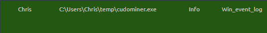
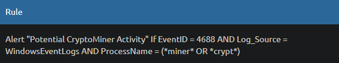
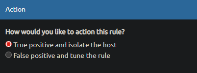
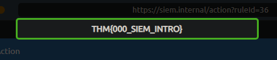
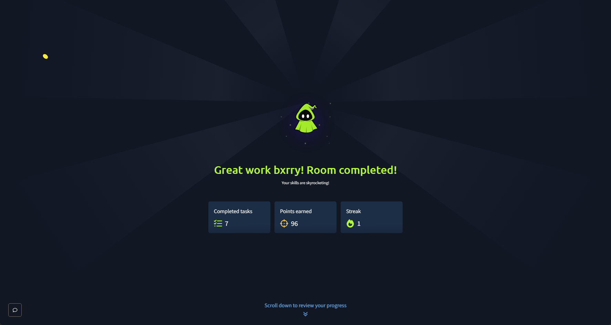

# Introduction to SIEM - Cryptominer Alert Triage

**Platform:** TryHackMe  
**Difficulty:** Easy  
**Type:** Blue Team / SIEM Fundamentals  
**Date:** 2026-04-14

---

## Overview

Introduction to SIEM is a SOC Level 1 room covering the fundamentals of Security Information and Event Management: host-centric vs network-centric log sources, the limitations of analyzing isolated logs, centralized collection and normalization, log ingestion methods, correlation, and how detection rules drive real-time alerting. The hands-on portion simulates a SOC analyst workflow in a static SIEM dashboard where a suspicious process triggers an alert, the analyst pivots into the underlying event, inspects the rule logic, and decides whether to escalate.

---

## Target Information

| Field | Value |
|---|---|
| Platform | TryHackMe SOC Level 1 Path |
| Module | Core SOC Solutions |
| Log Source | WindowsEventLogs |
| Event ID | 4688 (Process Creation) |
| Infected Host | HR_02 |
| Compromised User | Chris |
| Malicious Process | cudominer.exe |

---

## Detection Rule

| Field | Value |
|---|---|
| Rule Name | Potential CryptoMiner Activity |
| Log Source | WindowsEventLogs |
| Event ID | 4688 |
| Process Name Match | `*miner*` OR `*crypt*` |

---

## Tools Used

- Simulated SIEM dashboard (TryHackMe static lab)
- Detection rule review
- Windows Event Log (EventID 4688) analysis

---

## Investigation

### Phase 1: Alert Triggered on Suspicious Process

After starting the simulated activity, the SIEM dashboard raised a single alert surfacing the offending process in the alert panel.


**Suspicious process: `cudominer.exe`**

The filename is a strong indicator of cryptocurrency mining activity. "Cudo Miner" is a known GPU-based cryptominer, and its presence on a corporate endpoint is almost always a policy violation regardless of how it was installed.

---

### Phase 2: Pivoting to the Raw Event

Drilling into the underlying event log entry surfaced the full context of the process creation event.



| Field | Value |
|---|---|
| User | Chris |
| Process | C:\Users\Chris\temp\cudominer.exe |
| Log Source | Win_event_log |
| Hostname | HR_02 |

The execution path is the key detail: `C:\Users\Chris\temp\cudominer.exe`. Running binaries from a user's `temp` directory is a well-known red flag because `%TEMP%` is writable by low-privilege users and is routinely abused by malware and unauthorized software to stage payloads outside of monitored install paths.

---

### Phase 3: Inspecting the Detection Rule

The rule panel showed the logic that correlated the raw event into an actionable alert.



```
Alert "Potential CryptoMiner Activity"
If EventID = 4688
AND Log_Source = WindowsEventLogs
AND ProcessName = (*miner* OR *crypt*)
```

The rule leverages EventID 4688 (Windows process creation) and fires on any new process whose name contains `miner` or `crypt`. In this case, the `miner` substring inside `cudominer.exe` satisfied the condition. This is the same kind of normalized field-value matching described in the theory portion of the room, the logs have to be parsed and normalized before a rule like this can work.

---

### Phase 4: Action Decision

The analyst is offered two triage outcomes: treat the alert as a true positive and isolate the host, or treat it as a false positive and tune the rule.



**Action taken: True Positive - Isolate the Host**

The decision is based on three correlated findings:

- **Process name:** `cudominer.exe` matches a known cryptominer family
- **Execution path:** `C:\Users\Chris\temp\` is a user-writable staging directory, not a legitimate install location
- **Host role:** `HR_02` is an HR workstation with no legitimate reason to run GPU mining software

Any one of these would warrant investigation. Together they are conclusive.

---

### Phase 5: Flag Extraction

Selecting the correct action surfaced the room flag.



**Flag:** `THM{000_SIEM_INTRO}`

---

### Room Completed



---

## Vulnerability Summary

### Unauthorized Cryptominer Execution - Chris on HR_02

The user Chris executed `cudominer.exe` from `C:\Users\Chris\temp\` on the HR workstation HR_02. Cryptominer software running on corporate endpoints consumes hardware resources, inflates power costs, degrades user productivity, and in many cases indicates a broader compromise since miners are commonly dropped as post-exploitation payloads.

**Remediation:** Isolate HR_02 from the network to prevent lateral movement and any outbound mining pool connections. Acquire the binary from the temp directory for malware analysis. Review Chris's account activity for the initial infection vector (phishing, drive-by download, USB, insider install). Reset Chris's credentials. After containment, restore or reimage the host.

### Detection Rule Coverage Gap - Wildcard Matching

The rule `ProcessName = (*miner* OR *crypt*)` is effective for commodity miners but is also prone to false positives on legitimate software whose names happen to match, such as `TrueCrypt`, `BitLocker`-adjacent tooling, or internal tools using those substrings. Without paired tuning the rule will generate alert fatigue.

**Remediation:** Pair wildcard process-name rules with additional signals such as execution path (flag binaries running from user temp/AppData), parent process, or user group. Maintain an allowlist of legitimate processes matching `*crypt*` for the environment. Monitor false positive rates and retire or narrow rules that produce consistent noise.

---

## Key Takeaways

- SIEM value comes from correlation and normalization, not just collection. A single 4688 event is noise; the same event matched against a curated rule set becomes an actionable alert
- Detection rules are field-driven. Writing good rules depends on understanding which normalized fields (EventID, ProcessName, Log_Source, NewProcessName) a given activity populates
- Wildcard string matching on process names is cheap and effective for commodity threats like cryptominers, but it is prone to false positives. Any rule using `*miner*` or `*crypt*` must be paired with a tuning process for legitimate software that matches
- Execution path is a strong triage signal. Binaries running out of user-writable directories like `C:\Users\<user>\temp\` deserve scrutiny even when the filename itself looks benign
- The triage decision is not just "did the rule match" but "does this match represent a policy violation in this context." An HR endpoint running a GPU miner is a true positive regardless of whether the miner is technically malware
