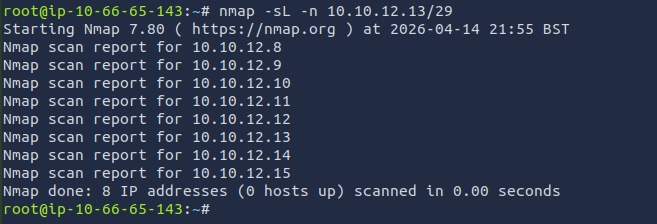

# Nmap Live Host Discovery

**Platform:** TryHackMe  
**Difficulty:** Easy  
**Type:** Offensive Security / Network Reconnaissance  
**Date:** 2026-04-14

---

## Overview

The room walks through Nmap's host discovery stage end to end, covering ARP behavior on a segmented LAN, cross-subnet ICMP Echo/Timestamp/Address-Mask probes, TCP SYN/ACK and UDP ping fallbacks when ICMP is filtered, the impact of attacker privilege level on which packets Nmap can craft, and safe target enumeration with `nmap -sL` before any probe leaves the box.

---

## Key Concepts Covered

| Concept | Summary |
|---|---|
| Target specification | Lists (`scanme.nmap.org example.com`), ranges (`10.11.12.15-20`), CIDR subnets (`/24`, `/30`), and file input via `-iL` |
| Dry-run enumeration | `nmap -sL TARGETS` lists what would be scanned without sending probes, and performs reverse DNS unless `-n` is added |
| ARP scan | Link-layer discovery, only works on the same subnet, required before any L3 probe to a local host |
| ICMP scan | Echo (Type 8), Timestamp (Type 13), and Address Mask (Type 17) requests — used when targets are on a different subnet |
| TCP/UDP ping scan | Crafted TCP SYN/ACK or UDP packets used when ICMP is blocked; inference is based on whether any reply is received |
| Privilege model | Root/sudo users can craft raw SYN/ACK/UDP packets; unprivileged users are forced into full TCP 3-way handshakes |
| Related scanners | `arp-scan` for pure ARP sweeps, `masscan` for aggressive high-rate scanning |

---

## Nmap Discovery Flags

| Scan Type | Flag | Example |
|---|---|---|
| ARP scan | `-PR` | `sudo nmap -PR -sn MACHINE_IP/24` |
| ICMP Echo | `-PE` | `sudo nmap -PE -sn MACHINE_IP/24` |
| ICMP Timestamp | `-PP` | `sudo nmap -PP -sn MACHINE_IP/24` |
| ICMP Address Mask | `-PM` | `sudo nmap -PM -sn MACHINE_IP/24` |
| TCP SYN ping | `-PS<ports>` | `sudo nmap -PS22,80,443 -sn MACHINE_IP/30` |
| TCP ACK ping | `-PA<ports>` | `sudo nmap -PA22,80,443 -sn MACHINE_IP/30` |
| UDP ping | `-PU<ports>` | `sudo nmap -PU53,161,162 -sn MACHINE_IP/30` |
| Host discovery only | `-sn` | Skip port scan after host discovery |
| No DNS lookup | `-n` | Skip reverse DNS on targets |
| Reverse DNS all hosts | `-R` | Resolve names even for offline hosts |

---

## Walkthrough

### ARP Behavior on a Segmented Network

Using the in-room network simulator, ARP broadcasts were sent from different computers across a segmented topology to observe which devices on the network could actually see each request.

Sending an ARP request for `computer6` from `computer1`, only 4 devices on `computer1`'s local segment received it, and `computer6` (on a different subnet) did not. Resending the same request from `computer4`, which shares a segment with `computer6`, produced an ARP reply from `computer6` directly.

This is the whole reason `-PR` only works locally: ARP is link-layer and does not cross routers. Any live host discovery across subnet boundaries has to fall back to ICMP, TCP, or UDP probes at layer 3 or above.

---

### Ping Behavior with ARP Resolution

When `computer1` was told to ping `computer3` on the same subnet, the simulator showed an ARP Request go out first, followed by an ARP Response, and only then the ICMP echo. This matches real Nmap behavior on a LAN: a ping to a local host is always preceded by an ARP query to resolve the MAC address, because link-layer delivery needs a hardware address, not an IP.

When `computer2` pinged `computer5` across a router, two ARP exchanges were required — first to resolve the router (the next hop), then from the router's side to resolve `computer5` on the destination segment. A second ping right after did not regenerate ARP traffic because both MAC addresses were already cached.

---

### Target Enumeration with `nmap -sL`

Running a list scan on the AttackBox confirmed how Nmap expands CIDR notation into individual target IPs. This is the safest way to preview what a scan would hit before actually sending probes.



```
root@ip-10-66-65-143:~# nmap -sL -n 10.10.12.13/29
Starting Nmap 7.80 ( https://nmap.org ) at 2026-04-14 21:55 BST
Nmap scan report for 10.10.12.8
Nmap scan report for 10.10.12.9
Nmap scan report for 10.10.12.10
Nmap scan report for 10.10.12.11
Nmap scan report for 10.10.12.12
Nmap scan report for 10.10.12.13
Nmap scan report for 10.10.12.14
Nmap scan report for 10.10.12.15
Nmap done: 8 IP addresses (0 hosts up) scanned in 0.00 seconds
```

`10.10.12.13/29` expands to 8 IP addresses starting at `10.10.12.8`, confirming the `/29` subnet layout (32 - 29 = 3 host bits = 8 addresses). The `-n` flag was used to skip reverse DNS resolution so the output stayed clean. For the range `10.10.0-255.101-125`, Nmap would enumerate 256 × 25 = **6,400** IP addresses.

---

### Room Completed


---

## Key Takeaways

- Host discovery is a deliberate phase of reconnaissance, not a side effect. `-sn` is the right flag when all you want is a live-host list, and it avoids burning time port-scanning offline IPs
- Scan technique has to match the network topology. ARP is free and reliable on a LAN; it is useless across subnets because routers do not forward ARP frames
- When ICMP Echo is blocked (common on modern Windows and most firewalls), fallbacks matter. ICMP Timestamp (`-PP`), Address Mask (`-PM`), and TCP/UDP ping scans all exist so that a single blocked protocol doesn't stop discovery
- Nmap's behavior depends on privilege level. Privileged users get raw SYN/ACK/UDP packets and partial handshakes; unprivileged users are forced into full TCP 3-way handshakes, which are louder and slower
- TCP ACK ping works because an unsolicited ACK receives an RST, and either response confirms the host is alive. The goal is not a valid connection, it is any response at all
- UDP ping flips the logic: a closed UDP port is what you want, because it returns an ICMP port-unreachable that confirms the host is up
- `nmap -sL` is the safest first step against any new target spec. It expands the target list and optionally resolves names, all without sending a single probe to the targets themselves
