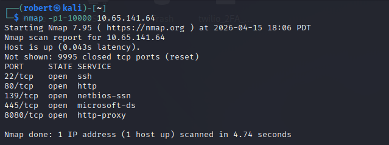
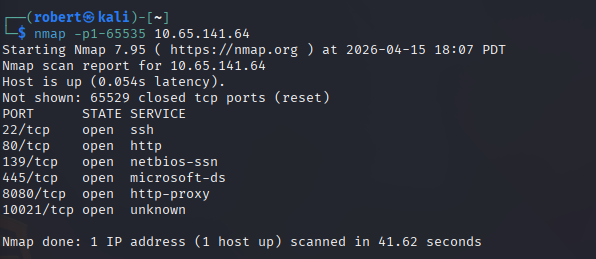
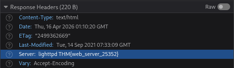
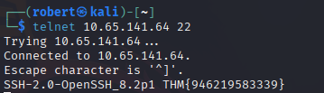
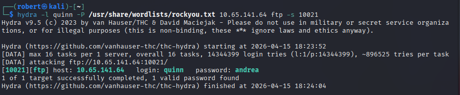
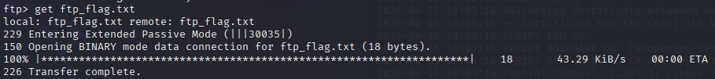
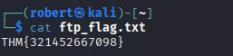
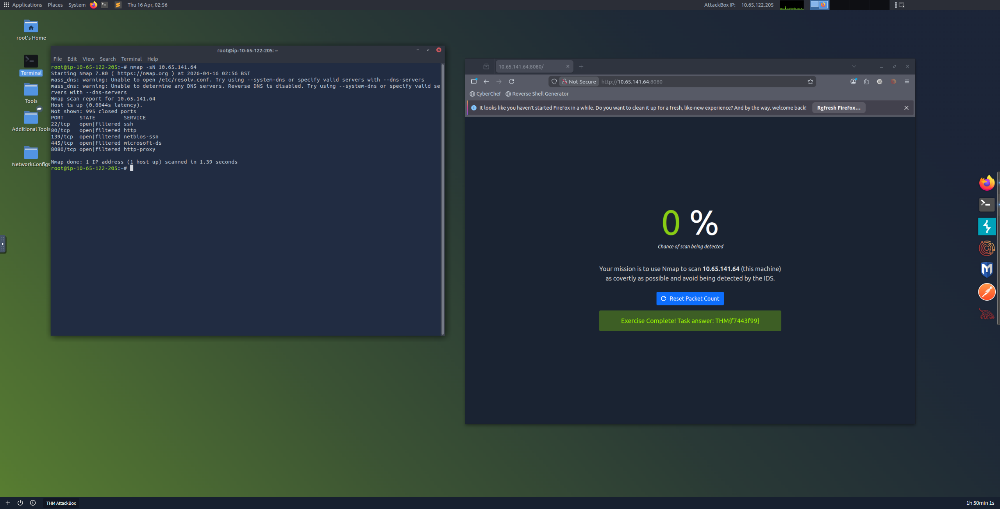

# Net Sec Challenge

**Platform:** TryHackMe  
**Difficulty:** Medium  
**Type:** Offensive Security / Network Security  
**Date:** 2026-04-15

---

## Overview

A Nmap full-range scan enumerates six open TCP ports on the target, HTTP and SSH banners on ports 80 and 22 leak two flags (the HTTP Server header inspected in a browser and the SSH version string grabbed with Telnet), Hydra brute forces the `quinn` FTP account on nonstandard port 10021 against rockyou to recover a third flag from `ftp_flag.txt`, and a covert Nmap scan tuned for 0% IDS detection against the port 8080 challenge yields the final flag.

---

**Target:** `10.65.141.64` (Linux host with SSH, HTTP, SMB, HTTP proxy, and FTP on a nonstandard port)

---

## Walkthrough

### Phase 1: Port Enumeration

The first scan covered ports 1-10000 to identify common services.



```
nmap -p1-10000 10.65.141.64
```

Five open ports were found: 22 (SSH), 80 (HTTP), 139 (NetBIOS), 445 (Microsoft-DS), and 8080 (HTTP Proxy). The highest port below 10,000 is **8080**.

A full-range scan revealed the sixth open port hiding above the common range.



```
nmap -p1-65535 10.65.141.64
```

Port **10021** appeared running an unknown service. Six TCP ports open in total.

---

### Phase 2: HTTP Server Header Flag

Inspecting the HTTP response headers in the browser from the web server on port 80 revealed a flag embedded in the Server header.



The server identified itself as `lighttpd` with the flag appended directly to the header value.

**Flag:** `THM{web_server_25352}`

---

### Phase 3: SSH Banner Flag

Using Telnet to connect to the SSH service on port 22 grabbed the SSH banner before any authentication was attempted.



```
telnet 10.65.141.64 22
```

The banner returned `SSH-2.0-OpenSSH_8.2p1` with a flag appended to the version string.

**Flag:** `THM{946219583339}`

---

### Phase 4: FTP Brute Force and Flag Retrieval

The unknown service on port 10021 was an FTP server running vsftpd 3.0.5. Two usernames obtained through social engineering — `eddie` and `quinn` — were targeted with Hydra using the rockyou wordlist.



```
hydra -l quinn -P /usr/share/wordlists/rockyou.txt 10.65.141.64 ftp -s 10021
```

Hydra cracked quinn's password: **andrea**. Logging in via FTP and listing files revealed `ftp_flag.txt`.



```
ftp> get ftp_flag.txt
```



```
cat ftp_flag.txt
```

**Flag:** `THM{321452667098}`

---

### Phase 5: Covert Nmap Scan

The final challenge required scanning the target as covertly as possible to avoid IDS detection. The browser-based challenge at port 8080 tracked the percentage chance of being detected and required a 0% detection rate to produce the flag.



A successful covert scan achieved 0% detection and revealed the final flag.

**Flag:** `THM{f7443f99}`

---

## Key Takeaways

- Port range matters. The default Nmap top-1000 scan would have missed port 10021 entirely. Running `-p1-65535` or `-p-` catches services intentionally placed on nonstandard ports
- Server banners leak information by default. Both the HTTP Server header and the SSH version string contained flags, which in a real environment could expose software versions useful for exploit matching
- Telnet is a legitimate banner-grabbing tool. Connecting to any TCP port with Telnet returns whatever the service sends before authentication, making it useful for quick reconnaissance without specialized scripts
- Hydra against FTP on a nonstandard port requires the `-s` flag to specify the port. Without it, Hydra defaults to port 21 and never reaches the target service
- Covert scanning is a real operational constraint. IDS evasion techniques like SYN scans, fragmentation, timing controls, and decoys exist because aggressive scanning is trivially detected in monitored environments
