# Nessus - Vulnerability Scanning Fundamentals

**Platform:** TryHackMe  
**Difficulty:** Easy  
**Type:** Offensive Security / Vulnerability Assessment  
**Date:** 2026-04-27

---

## Overview

A local Nessus Essentials installation on Kali is configured against a deployed TryHackMe target to run a Basic Network Scan (all ports, low-bandwidth tuning) that fingerprints the host as Apache HTTP Server 2.4.41 via the SYN scanner plugin, then a Web Application Tests scan against the same host enumerates a cleartext-credential `login.php`, a `.bak` configuration backup, an example documents directory at `/external/phpids/0.6/docs/examples/`, and a missing `X-Frame-Options` header that exposes the application to clickjacking — all surfaced and triaged from the Nessus plugin output.

---

**Target:** `10.64.168.207` (Linux web host running Apache HTTP Server 2.4.41)

---

## Walkthrough

### Phase 1: Scan Templates

`Nessus` ships a library of scan templates for different objectives. The Scanner library exposes Discovery, Vulnerabilities, and Compliance categories — Essentials covers the unlocked tiles, with paid-only tiles marked UPGRADE.

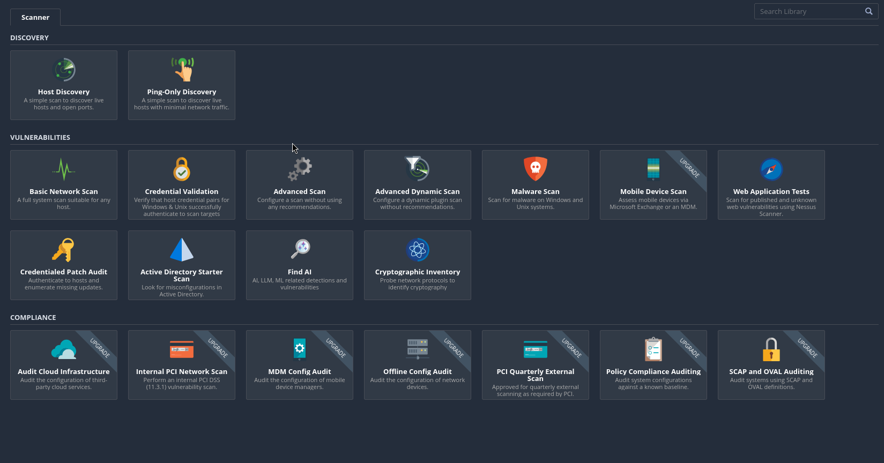

Key templates worth knowing:

- **Host Discovery** — live hosts and open ports only
- **Basic Network Scan** — full system scan suitable for any host
- **Credentialed Patch Audit** — authenticated, enumerates missing updates
- **Web Application Tests** — targeted at HTTP/HTTPS-served apps
- **Advanced Scan** — manual configuration without recommendations

The other navigation items worth knowing: **Policies** for custom scan templates and **Plugin Rules** for changing plugin properties (hide, modify severity).

---

### Phase 2: Configuring the Basic Network Scan

Created a Basic Network Scan named `test scan` against the deployed VM at `10.64.168.207`. Under the **Basic** sidebar, the **Schedule** option lets you set when a scan runs — useful when you need to avoid network congestion windows.

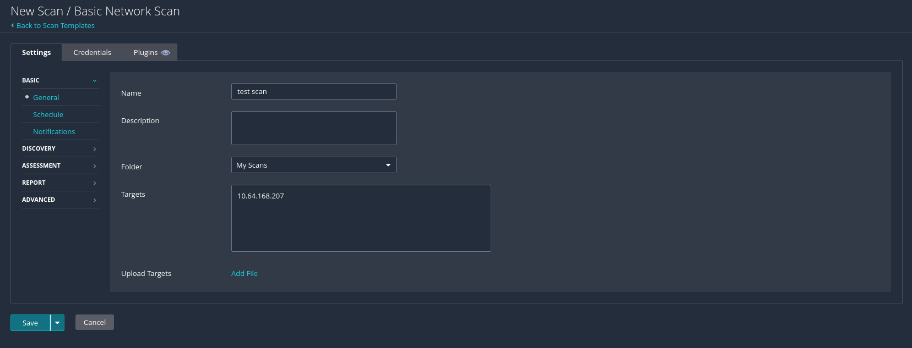

---

### Phase 3: Discovery Tuning - Full Port Range

Under **Discovery**, the default scan type only covers common ports. Switching the **Scan Type** to `Port scan (all ports)` extends coverage to 1-65535, which is the only way to surface services on nonstandard ports.

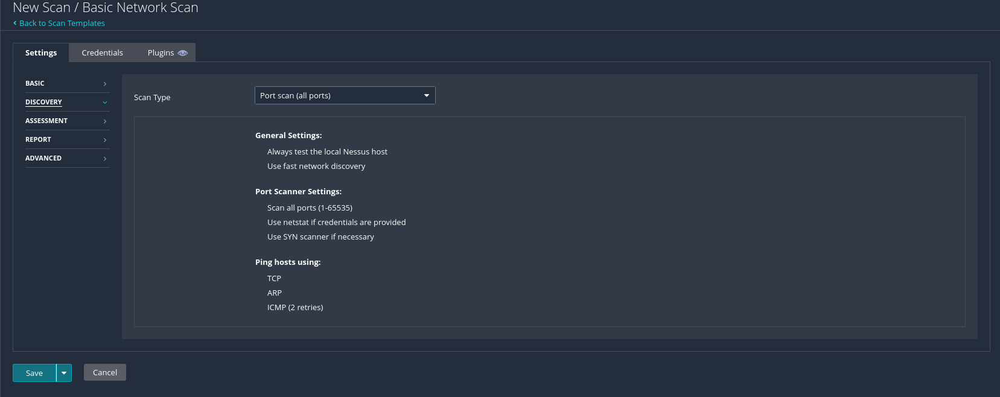

The all-ports template also pings hosts using TCP, ARP, and ICMP (2 retries) and falls back to a SYN scanner if needed.

---

### Phase 4: Advanced Tuning - Low Bandwidth

Under **Advanced**, switching the scan type to `Scan low bandwidth links` caps the scan at 2 simultaneous hosts and 2 simultaneous checks per host with a 15-second read timeout. Useful any time the scanner is on a slow link or you do not want to saturate the target's pipe.

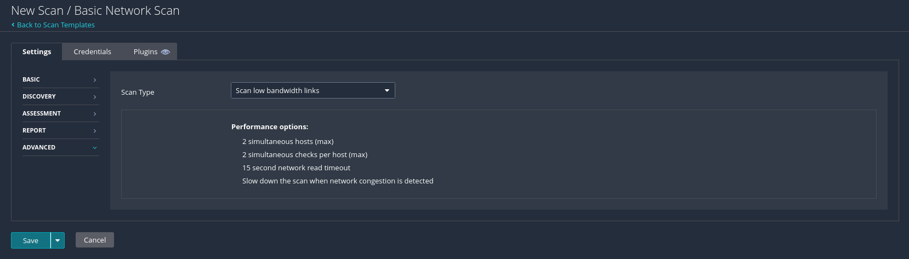

---

### Phase 5: Running the Scan

The scan ran for several minutes against the target.

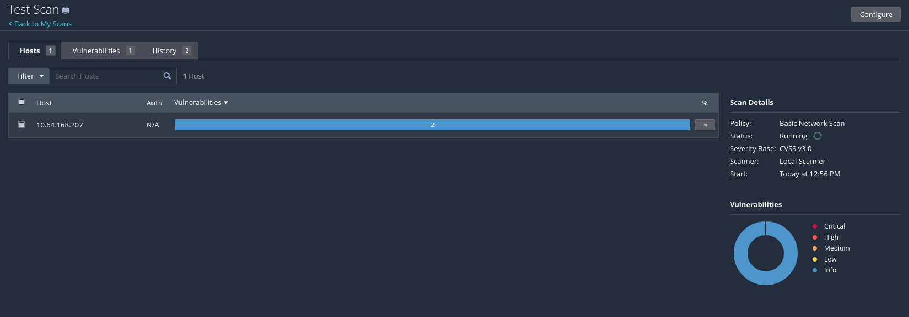

After completion, the host summary surfaced findings grouped by severity.

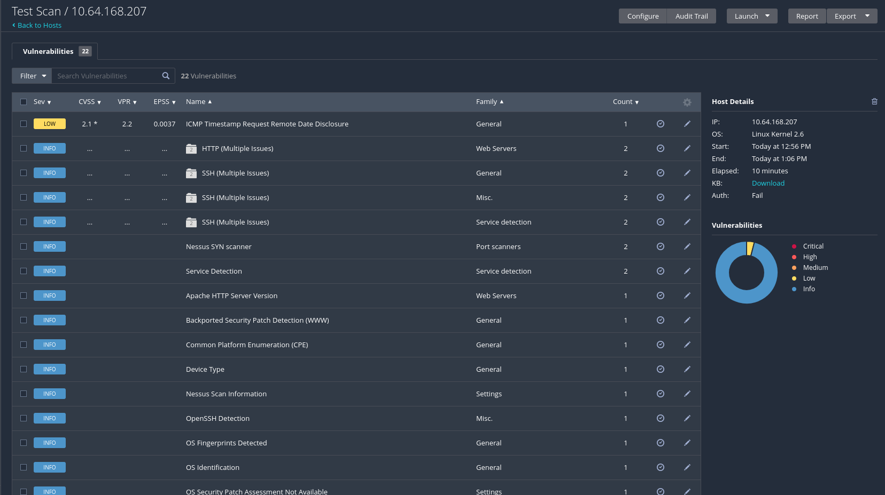

---

### Phase 6: Identifying the Web Server Version

Drilling into the Apache HTTP Server vulnerability detail surfaced the exact running version.

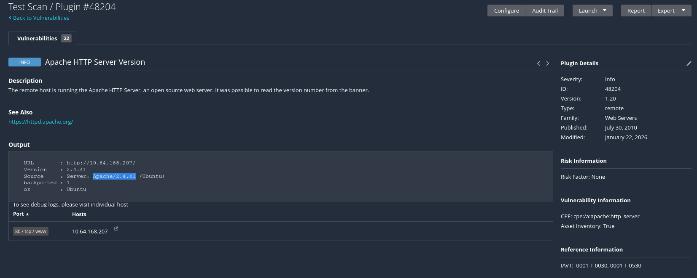

**Apache HTTP Server version:** `2.4.41`

This is exactly the kind of information defenders try to hide and pentesters need first — version pinpointing is the precondition for matching CVEs to the target.

---

### Phase 7: Plugin Details

The scan results page links every finding to the plugin that produced it. The HTTP Server Type and Version plugin is one of the most useful in the Nessus catalog.

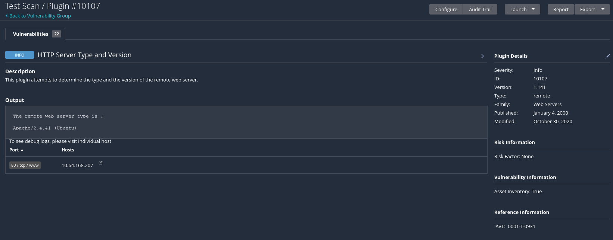

**Plugin ID for HTTP server fingerprinting:** `10107`

---

### Phase 8: Open Ports via SYN Scanner

The Nessus SYN scanner plugin in the Port Scanners family is the one to drill into for the live open-port list on the host.

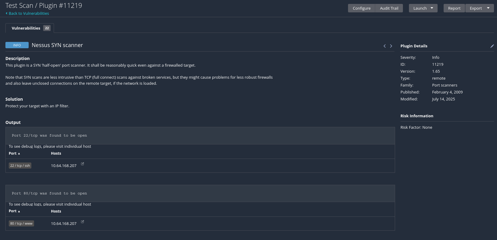

---

### Phase 9: Web Application Test Scan

A second scan was launched using the Web Application Tests template against the same host. This template is purpose-built for HTTP-served applications and runs a different family of plugins than the network-focused default.

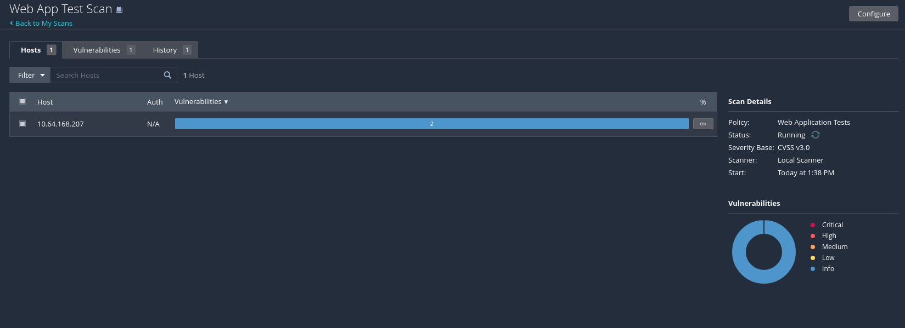

---

### Phase 10: Cleartext Authentication

The web app scan flagged a login page transmitting credentials over plaintext HTTP rather than HTTPS.

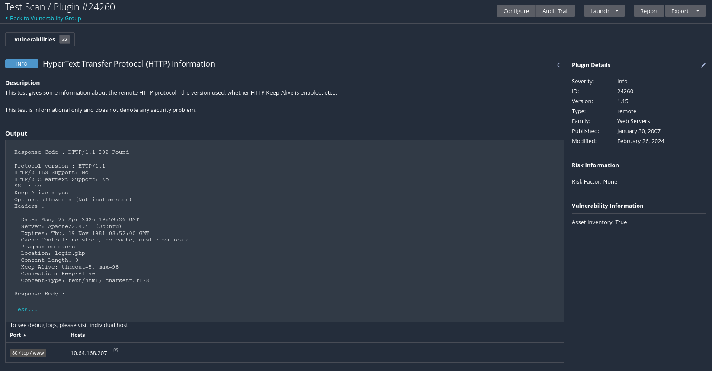

**Cleartext authentication page:** `login.php`

Any credentials submitted on this page travel as plaintext over the wire. On a shared network this is a passive sniffing primitive, exactly the same class of finding as the `su` password capture in the Overpass 2 lab.

---

### Phase 11: Configuration Backup Exposure

The scan also discovered an exposed configuration backup file accessible over HTTP.

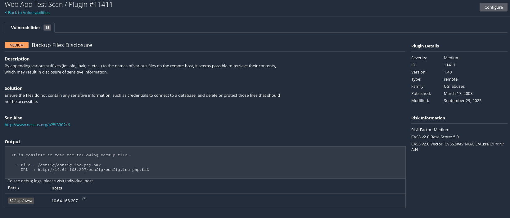

**Backup file extension:** `.bak`

Web-accessible backups of configuration files are a well-known information-disclosure class. The `.bak` extension is not interpreted by PHP, so the file is served as raw text — including any credentials, database strings, or secrets that the live config holds.

---

### Phase 12: Example Documents Directory

A directory listing of example documents shipped with PHPIDS was reachable from the web root.

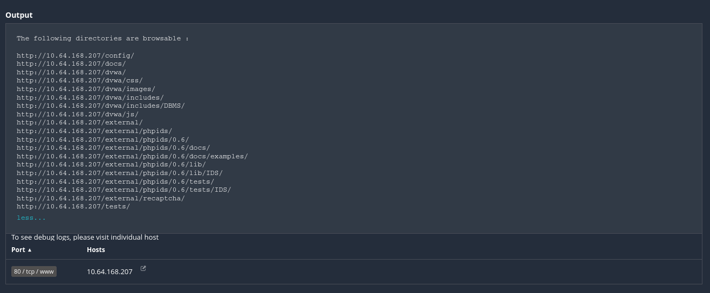

**Example directory:** `/external/phpids/0.6/docs/examples/`

Default install artifacts left in place are a recurring finding in vulnerability scans. They rarely contain exploits on their own but they confirm framework versions and often link to documentation that gives an attacker a roadmap to misconfigurations.

---

### Phase 13: Missing X-Frame-Options Header

The scan flagged the application for missing or misconfigured `X-Frame-Options`.

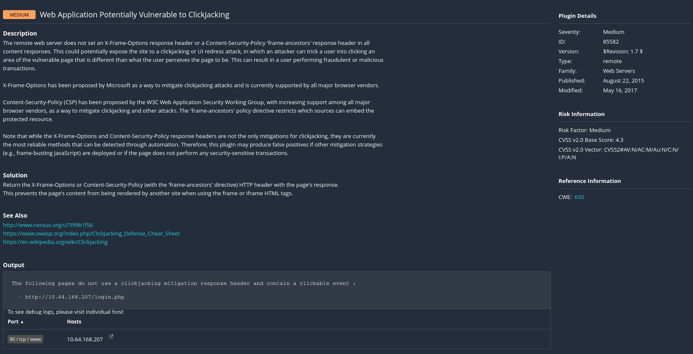

**Vulnerability class:** Clickjacking

Without `X-Frame-Options` (or a CSP `frame-ancestors` directive), the app can be loaded inside a third-party iframe, allowing an attacker to overlay invisible UI on top of the legitimate page and trick users into clicking through to actions they did not intend.

---

### Room Completed

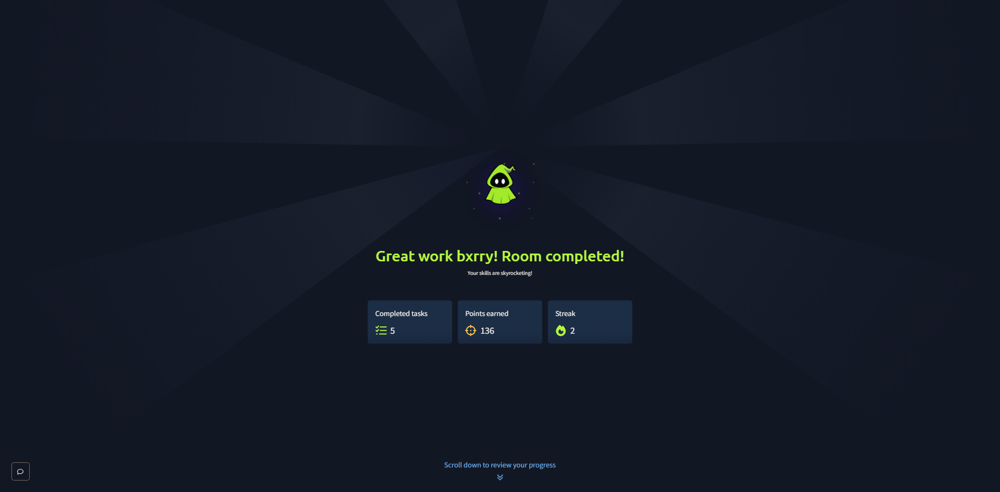

---

## Vulnerability Summary

### Cleartext Credential Submission - login.php

The application's login form posts credentials over plain HTTP rather than HTTPS. Any network position between the user and the server (open Wi-Fi, ARP spoof, malicious upstream) yields the credentials passively.

**Remediation:** Force HTTPS for the entire application via HSTS and a 301 redirect on the HTTP listener. Disable plain HTTP listeners on the public interface where possible.

### Configuration Backup Exposure (`.bak`)

A `.bak` configuration backup was reachable from the web root and served as raw text. Backup extensions (`.bak`, `.old`, `.swp`, `.tmp`) are a recurring information-disclosure class — they preserve the live config's secrets in a form the web server treats as a static download.

**Remediation:** Remove backup files from web-accessible directories. Configure the web server to deny serving common backup extensions (`Files ~ "\.(bak|old|swp|tmp)$"` in Apache, or `location ~ \.bak$ { deny all; }` in nginx). Audit the document root for any non-application files.

### PHPIDS Example Documents Exposed

Default example documents shipped with PHPIDS were accessible at `/external/phpids/0.6/docs/examples/`. Default artifacts in production confirm framework versions and provide reference material an attacker can use to find related misconfigurations.

**Remediation:** Strip vendor `docs/`, `examples/`, `tests/`, and `installer/` directories from production deployments. Use a build pipeline that excludes non-runtime files from the artifact that ships to production.

### Missing `X-Frame-Options` Header (Clickjacking)

The application does not set `X-Frame-Options` or a CSP `frame-ancestors` directive, allowing the page to be embedded inside an attacker-controlled frame for UI redressing attacks.

**Remediation:** Set `X-Frame-Options: DENY` (or `SAMEORIGIN` if iframe usage is required by a trusted domain). Prefer the modern equivalent: `Content-Security-Policy: frame-ancestors 'none'` (or a specific allowlist).

---

## Key Takeaways

- Scan template selection is most of the configuration. Basic Network Scan vs Web Application Tests vs Credentialed Patch Audit each load a different plugin family — running the wrong template against the wrong asset is the most common reason real vulnerabilities are missed
- Default Nessus discovery does not cover all 65535 ports. The all-ports option under Discovery is mandatory any time the target's services might not be on common ports — same lesson as the Net Sec Challenge room where port 10021 hid an FTP server
- Plugin IDs are stable identifiers worth knowing. `10107` for HTTP server fingerprinting comes up constantly, and Plugin Rules in the side menu let you tune severity or hide noisy plugins per environment
- Findings like cleartext authentication, exposed `.bak` files, and missing security headers are not "exploits" — they are systemic configuration errors. A scan that surfaces five low-medium findings of this class often signals broader hygiene problems on the asset
- Nessus is a triage tool, not a final verdict. The output is a starting list of plugin matches; manual verification (curl, Burp, browser DevTools) is needed before reporting any of these findings as confirmed vulnerabilities
