# Decryptify - Invite Code Forgery and Padding Oracle to RCE

**Platform:** TryHackMe
**Difficulty:** Medium
**Type:** Offensive Security / CTF (Cryptography + Web)
**Date:** 2026-04-29

---

## Overview

A web app on port 1337 leaks an app.log containing a known email and invite code pair, and an api.js exposing the invite code generation algorithm. Brute forcing the unknown constant value (**99999**) reproduces the algorithm and forges a valid invite for hello@fake.thm, granting authenticated access and the first flag. The dashboard then accepts a date parameter that the server decrypts with openssl_decrypt and executes as a shell command, while leaking padding-validation errors in the response, which is the textbook precondition for a *padding oracle attack*. **padbuster** decrypts the original "date +%Y" payload and forges a new ciphertext for "cat /home/ubuntu/flag.txt", yielding command execution and the final flag.

---

**Target:** 10.66.140.225 (Ubuntu Linux, Apache httpd 2.4.41, OpenSSH 8.2p1, web app on port 1337)

**Tools:** nmap, nessus, gobuster, base64, php (custom invite generator), Firefox, padbuster

---

## Walkthrough

### Phase 1: Vulnerability Scan

A Nessus Basic Network Scan was run against the target as a baseline before manual enumeration. The scan completed in 8 minutes and surfaced **21 findings** across HTTP, SSH, and general categories, mostly informational fingerprints and one low-severity ICMP timestamp disclosure, with no direct exploit path. The web app on port 1337 is going to need manual probing.

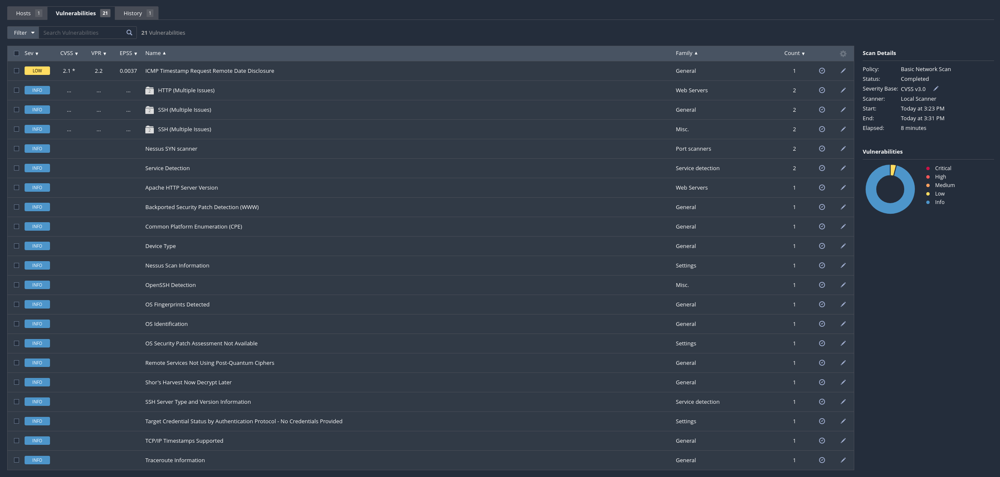

---

### Phase 2: Port and Service Enumeration

A full TCP service scan against the target confirmed two listening services: **SSH on 22** and an **Apache 2.4.41 web app on the unusual port 1337**.

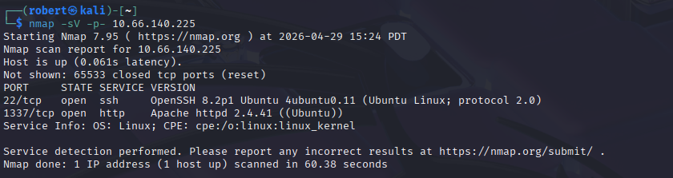

---

### Phase 3: Web App Login Page

Browsing to http://10.66.140.225:1337/ loads the Decryptify login page. Two auth modes are offered: a standard username/password tab, and a **Login with Invite Code** tab. The page footer links to API Documentation.

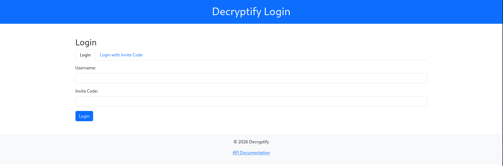

---

### Phase 4: API Documentation Locked

The API Documentation link lands on a password-gated page. No password is known yet, so this needs to come back to after credentials are recovered.

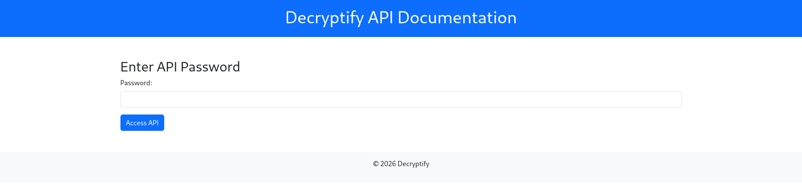

---

### Phase 5: Directory Brute Force

A gobuster directory scan against the app uncovered several reachable directories: /css, /js, /javascript, /logs, /phpmyadmin, and /server-status. The **/logs** and **/javascript** directories are the lead.

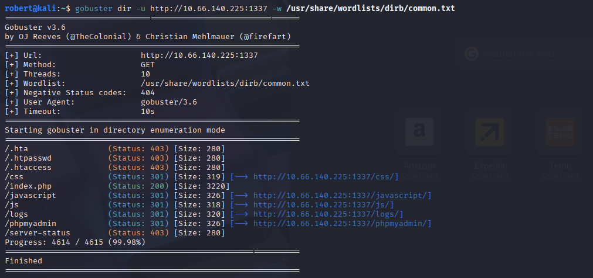

---

### Phase 6: phpMyAdmin Exposed (Dead End)

/phpmyadmin was reachable but no credentials were available, and the room's intended path is not through the database. Noted and moved on.

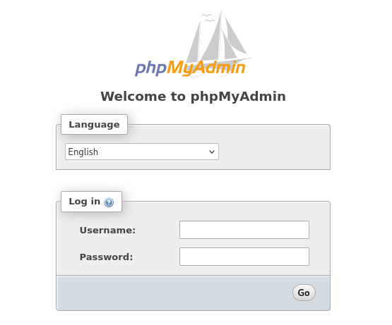

---

### Phase 7: API Logic Recovered from api.js

The /javascript/ directory exposed an obfuscated api.js file. The string array embedded in the obfuscation already hints at base64-encoded values used in token generation.

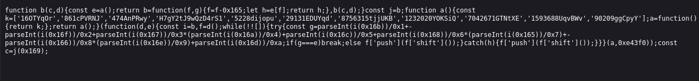

---

### Phase 8: Application Log Disclosure

/logs/app.log was readable and contained a sequence of timestamps, login attempts, and *critically* one full invite code and email pair:

```
2025-01-23 14:34:20 - Invite created, code: MTM0ODMzNzEyMg== for alpha@fake.thm
```

This is the **known-plaintext lever** needed to reverse the unknown variable in the invite generator.

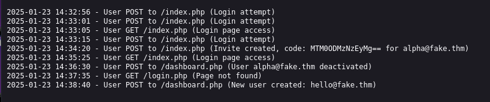

---

### Phase 9: Decoding the Invite Code

Decoding "MTM0ODMzNzEyMg==" with base64 produces **1348337122**, a numeric seed value, not a random token. The invite code is simply the base64 of mt_rand() output seeded by a deterministic function of the email.

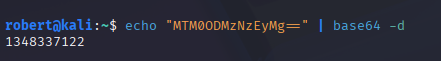

---

### Phase 10: API Documentation Bypass

Returning to /api-docs after some probing, the password gate is bypassed and the **Token Generation** algorithm is fully exposed. The algorithm is deterministic. Given the email and the constant_value, the invite code is reproducible. *Only constant_value is unknown.*

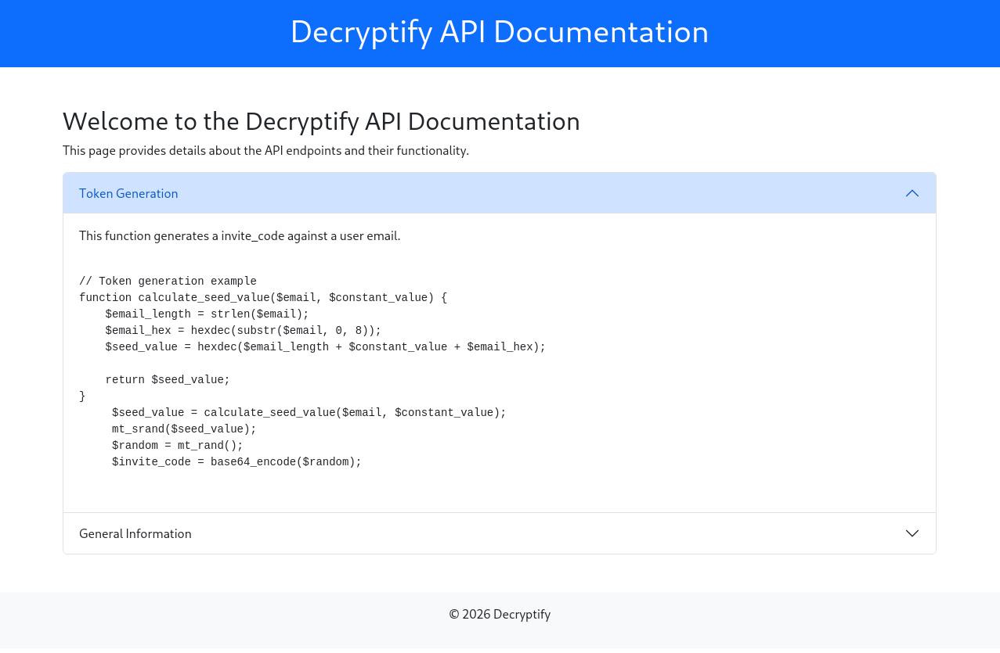

---

### Phase 11: Confirming the Original User Was Disabled

Attempting to log in as alpha@fake.thm with the leaked invite code returns *"The user alpha@fake.thm has been deactivated."* A new email needs to be created, which matches the app.log line *"New user created: hello@fake.thm"*.

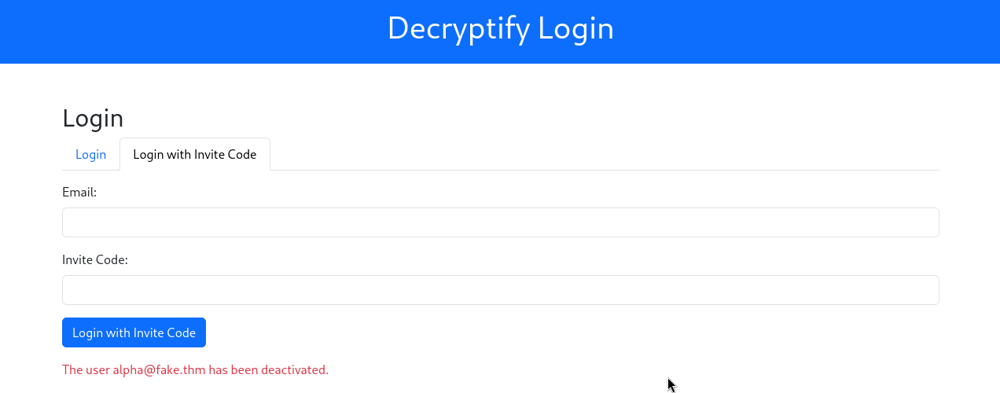

---

### Phase 12: Brute Forcing the Constant Value

A small PHP script iterates constant_value from 0 upward, runs the algorithm against alpha@fake.thm, and stops when the produced invite code matches the known leaked value MTM0ODMzNzEyMg==.

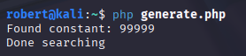

**Recovered constant:** 99999

With every variable in the algorithm now known, a valid invite code can be minted for any email.

---

### Phase 13: Forging an Invite for hello@fake.thm

The same PHP script is run with email = "hello@fake.thm" and constant_value = 99999.

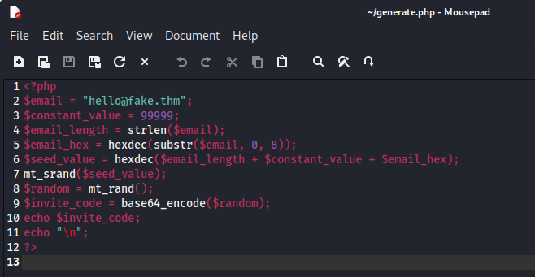

The script outputs a fresh invite code:


---

### Phase 14: Authenticated as hello@fake.thm - First Flag

Submitting hello@fake.thm with the forged invite code on the **Login with Invite Code** tab logs into the dashboard. The greeting line contains the first flag.

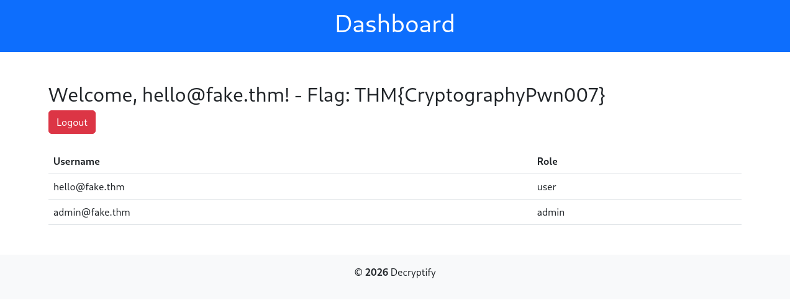

**First flag:** THM{CryptographyPwn007}

---

### Phase 15: Hidden Date Parameter and Padding Error Disclosure

The dashboard URL accepts a date parameter. Sending an arbitrary plaintext value like ?date=2024-01-01 triggers two highly informative server errors:

```
Warning: openssl_decrypt(): IV passed is only 6 bytes long, cipher expects an IV of precisely 8 bytes, padding with \0 in /var/www/html/dashboard.php on line 28
Padding error: error:0606506D:digital envelope routines:EVP_DecryptFinal_ex:wrong final block length
```

This is a **padding oracle**: the server reveals whether decrypted ciphertext has valid PKCS#7 padding through its error responses. Combined with the fact that the decrypted value is then executed as a shell command, this is *full RCE*, but only if the oracle can be turned into both decryption and forgery.

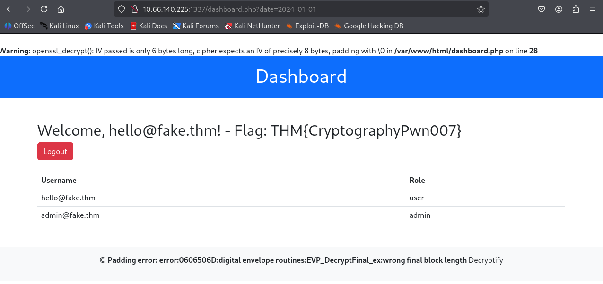

---

### Phase 16: Padding Oracle - Decrypting the Original Ciphertext

padbuster is pointed at the dashboard endpoint with the legitimate ciphertext (the URL-encoded value from a clean dashboard request) and the session cookie. The block size is **8** and encoding mode **0** (base64).

```
padbuster "http://10.66.140.225:1337/dashboard.php?date=PluygJIrA%2Fr%2FS6xGAgx9BlWHmqN9V%2BqkW88E05wRL3c%3D" \
          "PluygJIrA%2Fr%2FS6xGAgx9BlWHmqN9V%2BqkW88E05wRL3c%3D" \
          8 -encoding 0 \
          -cookies "PHPSESSID=...; role=..."
```

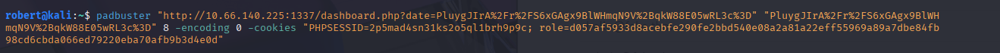

After thousands of byte-by-byte requests, padbuster recovers the intermediate state and the plaintext.

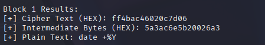

**Recovered plaintext:** date +%Y

The server has been blindly executing the decrypted ciphertext as a shell command. The dashboard literally pipes the ciphertext through openssl_decrypt and then through system().

---

### Phase 17: Padding Oracle - Forging a Malicious Ciphertext

The same oracle that allows decryption also allows **encryption** of attacker-chosen plaintext (CBC bit-flipping using known intermediate values, *no key required*). padbuster's plaintext mode is used to forge ciphertext for "cat /home/ubuntu/flag.txt".

```
padbuster ... 8 -encoding 0 -cookies "..." -plaintext "cat /home/ubuntu/flag.txt"
```

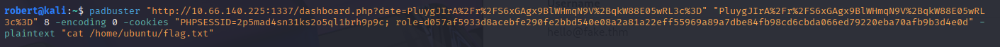

padbuster outputs a freshly-minted base64 ciphertext that the server's key will decrypt into the chosen command.

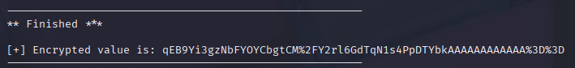

**Forged ciphertext:** qEB9Yi3gzNbFYOYCbgtCM%2FY2rl6GdTqN1s4PpDTYbkAAAAAAAAAAA%3D%3D

---

### Phase 18: RCE - Final Flag

Loading the dashboard with the forged ciphertext as the date parameter causes the server to decrypt the value into "cat /home/ubuntu/flag.txt", execute it, and surface the flag in the page footer.

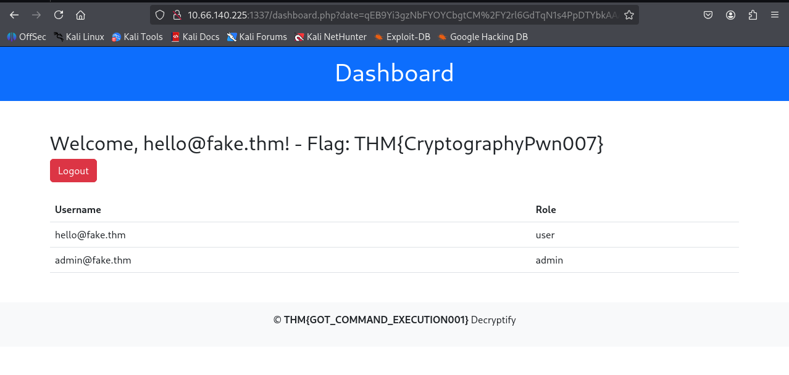

**Final flag:** THM{GOT_COMMAND_EXECUTION001}

---

### Room Completed

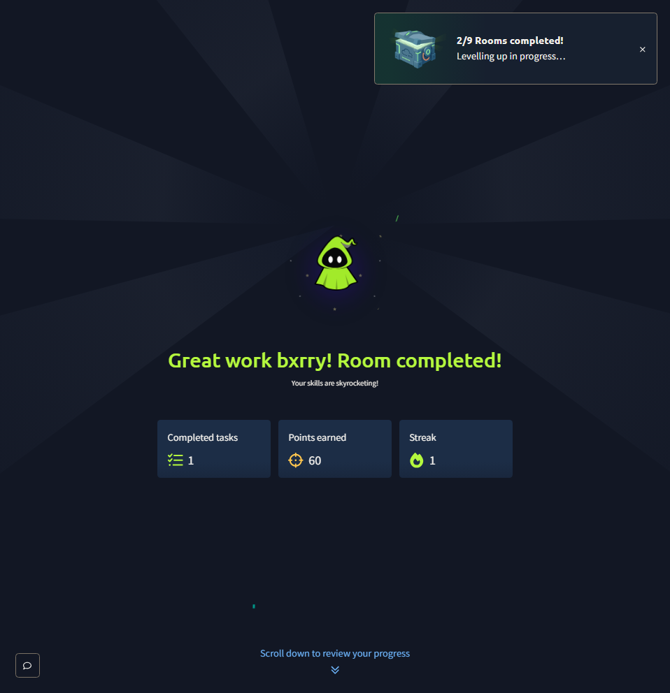

---

## Vulnerability Summary

### Predictable Invite Code Generator (CWE-330, CWE-340)

The invite code is the base64 of mt_rand() output, where mt_srand() is seeded by a deterministic function of the user's email and a hardcoded constant. **mt_rand is not cryptographically secure on its own**, and combining a deterministic seed with a publicly-derivable input (email) means every invite code in the system is reproducible by anyone who knows the constant. The constant was recoverable through brute force in milliseconds because a known plaintext and ciphertext pair leaked via app.log.

**Remediation:** Generate invite codes from random_bytes() or openssl_random_pseudo_bytes() and store them server-side rather than deriving them. Never bind invite codes to user-controllable inputs through deterministic functions. Rotate any tokens derived from mt_rand.

### Sensitive Log Disclosure - /logs/app.log

The application's log file was world-readable from the web root and contained operational events including invite code creation pairs. *This single file collapsed the cryptographic problem to a brute-force search for one integer.*

**Remediation:** Move logs outside the web root entirely (for example, /var/log/app/). If they must live inside the web tree, deny serving them via the web server. Strip secrets and tokens from log messages before they are written.

### Padding Oracle on Dashboard date Parameter (CWE-209, CWE-326)

The server decrypts user-supplied ciphertext with openssl_decrypt and surfaces both PHP warnings ("IV passed is only 6 bytes long") and OpenSSL errors ("EVP_DecryptFinal_ex:wrong final block length") directly in the HTTP response. This converts an internal cryptographic check into an oracle that an attacker can query *256 times per byte* to recover plaintext and forge ciphertext.

**Remediation:** Use authenticated encryption such as AES-GCM or AES-CCM, so any tampered ciphertext fails authentication before padding is checked. If CBC must be used, prepend an HMAC over the ciphertext and verify the HMAC in constant time before calling openssl_decrypt. Never differentiate padding errors from authentication errors in client-visible responses; return a single generic 400 for all decryption failures and log the detail server-side only.

### Command Execution of Decrypted User Input (CWE-78)

Even if the cryptography were sound, the dashboard pipes the decrypted value into a shell command. *A valid signed token would still let an authenticated user run arbitrary commands as the web user.*

**Remediation:** Do not pass user-controlled values, encrypted or otherwise, into shell commands. If a date is needed, parse it into an integer or DateTime and use language-native time formatting. **Treat decryption as parsing untrusted input, not as a trust boundary.**

---

## Key Takeaways

- A padding oracle is a **bidirectional primitive**: the same query pattern that decrypts the server's ciphertext also encrypts attacker-chosen plaintext. Forgetting the encryption half is the most common reason this class of bug looks "harmless" in a triage. padbuster's plaintext flag does both halves with the same oracle.
- "Custom" token generators built on mt_rand plus a deterministic seed are *not random in any meaningful sense*. The moment one token and email pair leaks through a log, a support ticket, or an email screenshot, the entire token space collapses. This is the same lesson as predictable session IDs from the DVWA labs, scaled up to invite codes.
- Verbose error messages are not a low-severity finding when the underlying operation is a cryptographic primitive. The PHP warning *and* the OpenSSL error message both contributed to the oracle here, and either alone would have given the attacker a binary signal, which is all that is needed.
- **Decryption is parsing, not authentication.** Anything decrypted from user-controlled ciphertext is still attacker-influenced input and must not be passed into system(), eval(), SQL strings, or anywhere else where unvalidated input is dangerous. Authenticated encryption (AES-GCM) is the floor for any new code; CBC plus raw padding checks is essentially un-deployable safely.
- The app.log exposure was the smallest finding by itself but the *load-bearing one* for the chain. Real attacks rarely chain CVEs, they chain low-severity hygiene issues (a directory listing, a stale log, a verbose error) into a critical path. Gobuster plus reading every recovered file is the move every time.
