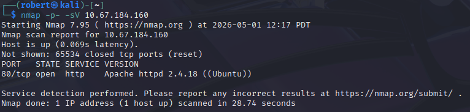
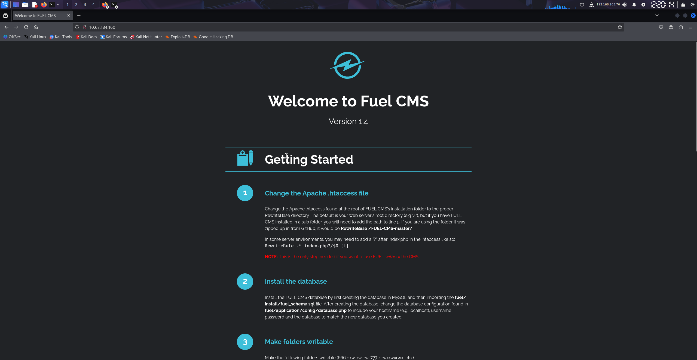
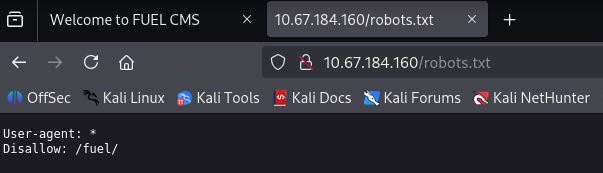
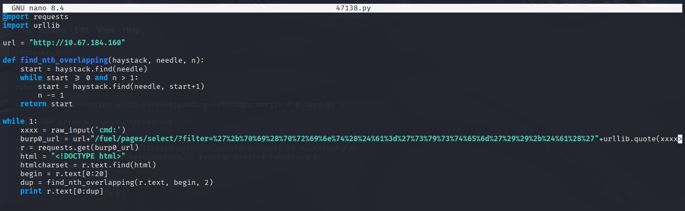
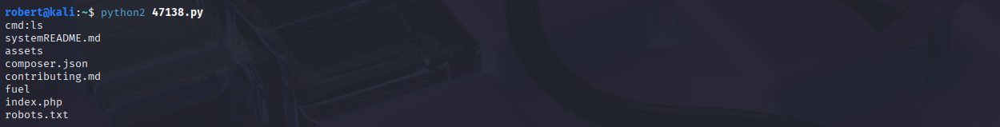
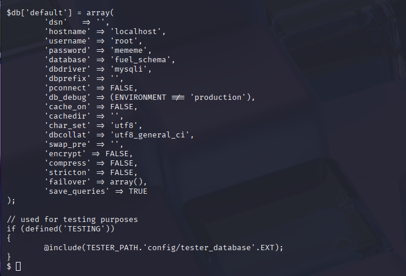
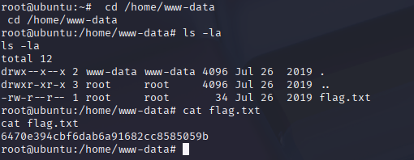
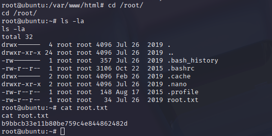
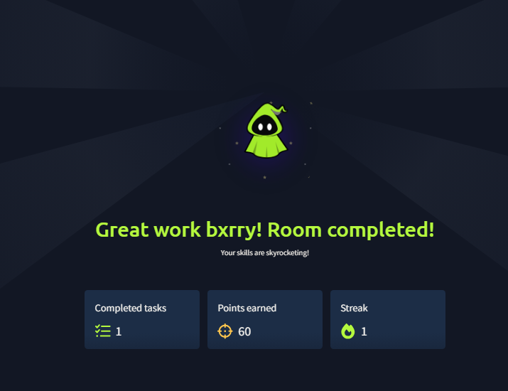

# Ignite - Fuel CMS Unauthenticated RCE and Reused MySQL Root Password

**Platform:** TryHackMe
**Difficulty:** Easy
**Type:** Offensive Security / CTF (Web + Linux Privesc)
**Date:** 2026-05-01

---

## Overview

A short, sharp boot-to-root that shows what happens when an outdated CMS sits on the open internet next to a reused root password. The Fuel CMS landing page on port 80 cheerfully advertises **Version 1.4**, the location of the admin panel, and the documented default credentials. robots.txt confirms the */fuel/* directory. Fuel CMS 1.4.1 is vulnerable to **CVE-2018-16763**, an *unauthenticated remote code execution* (the attacker does not need to log in at all) flaw in the */fuel/pages/select/* endpoint where the *filter* parameter is passed into PHP's *create_function()* without any sanitization, which lets an attacker close out the function body and run arbitrary code. A public Exploit-DB Python script (47138.py) is used to confirm RCE as **www-data**, and a netcat reverse shell upgrades the foothold to an interactive session. The Fuel database config at *fuel/application/config/database.php* contains the MySQL root password **mememe**. That same password is reused as the system root account, so *su root* opens both flag files in one step.

---

**Target:** 10.67.184.160 (Ubuntu Linux, Apache httpd 2.4.18, Fuel CMS 1.4.1)

**Tools:** nmap, Firefox, Exploit-DB 47138.py, python2, netcat, su

---

## Walkthrough

### Phase 1: Port and Service Enumeration

A full TCP service scan against the target returned a single open port: **HTTP on 80**, served by **Apache 2.4.18 (Ubuntu)**. 65534 closed ports rule out the usual SSH/SMB/database-on-the-side surprises and force the engagement straight at the web app.



---

### Phase 2: Fuel CMS Landing Page

Browsing to http://10.67.184.160/ loads a *Welcome to Fuel CMS* getting-started page that openly displays **Version 1.4** in the header. The page walks through the install steps, including how to *change the database configuration* found in *fuel/application/config/database.php* and a note that the admin panel lives at */fuel/* with default credentials of *admin* / *admin*. That single page hands over the version number, the admin path, and a credential pair, all without any authentication.



---

### Phase 3: robots.txt Confirms /fuel/

/robots.txt contains a single *Disallow: /fuel/* line, which corroborates the admin panel location surfaced by the landing page.



---

### Phase 4: CVE-2018-16763 Exploit Script

Fuel CMS 1.4.1 is affected by **CVE-2018-16763**, a remote code execution bug in the */fuel/pages/select/* endpoint. The *filter* query parameter is concatenated into PHP's *create_function()* (a now-removed function that compiled a string into a runnable function at runtime), so an attacker can break out of the intended expression with a closing parenthesis and append any PHP they want. The Exploit-DB entry **47138** is a small Python 2 script that wraps the request, URL-encodes the payload, and prints back the page so the response slice is readable as a shell.



The relevant payload (URL-decoded) is roughly:

```
?filter=')+pi(print(exec($a)))+$a('
```

which substitutes into create_function and ends up executing the user-supplied *$a* via PHP's *exec()*.

---

### Phase 5: RCE Confirmed as www-data

Running the exploit and typing *ls* at the *cmd:* prompt returns the contents of the web root: *README.md, assets, composer.json, contributing.md, fuel, index.php, robots.txt*. Code execution is confirmed.



A bash reverse shell is then sent through the same exploit prompt, with a netcat listener on the attacker box catching the callback as **www-data**. (Standard upgrade after that: *python -c 'import pty; pty.spawn("/bin/bash")'*, *export TERM=xterm*, and Ctrl-Z plus *stty raw -echo; fg* to get a full PTY.)

---

### Phase 6: Database Credentials in database.php

The Fuel install instructions pointed straight at the database config file. Reading *fuel/application/config/database.php* reveals the full MySQL connection block:

```
$db['default'] = array(
    'hostname' => 'localhost',
    'username' => 'root',
    'password' => 'mememe',
    'database' => 'fuel_schema',
    'dbdriver' => 'mysqli',
    ...
);
```



**MySQL root password:** mememe

By itself, this is a *database* credential, not a system credential. But on small installs it is extremely common for the same operator password to be reused for the system *root* account, so testing it is the obvious next step.

---

### Phase 7: User Flag

Before pivoting to root, the user flag is collected from www-data's home directory.



**User flag:** 6470e394cbf6dab6a91682cc8585059b

---

### Phase 8: Reused Password to Root

*su root* with the MySQL password *mememe* succeeds on the first try, confirming that the database credential and the system credential were the same string. /root is fully readable, and root.txt drops out.



**Root flag:** b9bbcb33e11b80be759c4e844862482d

---

### Room Completed



---

## Vulnerability Summary

### CVE-2018-16763 - Fuel CMS Unauthenticated RCE (CWE-94: Code Injection)

Fuel CMS 1.4.1's */fuel/pages/select/* endpoint passes the *filter* query parameter into PHP's *create_function()* with no sanitization. Because *create_function* dynamically compiles a string into PHP code, any closing parenthesis followed by attacker-controlled syntax is treated as new code and runs in the web server's process. The result is full pre-auth code execution as the web user, and a working public exploit (Exploit-DB 47138) has been available since 2019.

**Remediation:** Upgrade to Fuel CMS 1.4.4 or later, which removes the use of *create_function* entirely. *create_function* itself was deprecated in PHP 7.2 and removed in PHP 8, so any application still relying on it should be migrated to closures or anonymous functions. As a defense-in-depth measure, place the */fuel/* admin path behind authentication (HTTP basic auth at the web server layer, an IP allowlist, or a VPN) so that even an unauthenticated RCE in the panel is not internet-reachable.

### Verbose Version Disclosure on Landing Page (CWE-200: Information Exposure)

The default Fuel CMS welcome page openly prints the major version number, the URL of the admin panel, the location of the database config file, and the documented default admin credentials. An attacker enumerating the box does not need to fingerprint anything, because the application volunteers the exact pieces of information needed to look up a working CVE.

**Remediation:** Delete the install/getting-started landing page once setup is complete. Replace it with the actual application's home page (or a generic 404). Strip *Server* and *X-Powered-By* response headers, and never hardcode default credential text in any production-facing template.

### Default Credentials Documented and Active (CWE-798, CWE-521: hardcoded and weak credentials)

Although CVE-2018-16763 was the actual entry point in this engagement, the documented *admin* / *admin* credentials would have produced the same outcome by giving the attacker an authenticated session in the admin panel, which itself supports arbitrary file editing.

**Remediation:** Force a password change on first login for every administrative account. Refuse to start the application until the default credentials are rotated. Document this requirement loudly in the install guide.

### Database Credentials Stored in Plaintext in the Web Root (CWE-256, CWE-538)

The MySQL root password is stored in plaintext in *fuel/application/config/database.php*, which sits inside the web-served directory tree. Any vulnerability that grants file read on the web root (LFI, path traversal, exposed *.git*, a misconfigured backup) immediately exposes the database credentials.

**Remediation:** Move secrets out of the web root entirely. Read database credentials from environment variables loaded by systemd, from a secrets manager (Vault, AWS Secrets Manager), or from a file in */etc/* with mode 0640 and ownership restricted to the web service account. Never store credentials in a path the web server is configured to serve.

### Password Reuse Between MySQL root and System root (CWE-521: Weak Password Requirements)

The same string, *mememe*, is used as both the MySQL administrative password and the Linux system root password. This collapses two privilege boundaries into one. Compromise of a single config file equals full host compromise.

**Remediation:** Generate independent, high-entropy passwords for every privileged account, store them in a password manager, and never reuse the same string across two trust boundaries (database, system, application, cloud, VPN). For root specifically, disable password login on root entirely (*PermitRootLogin prohibit-password* in sshd plus *passwd -l root* on the local account) and require *sudo* with per-administrator credentials.

---

## Key Takeaways

- **The whole chain in this room is a credential reuse story dressed up as an RCE.** CVE-2018-16763 was the entry point, but the privesc to root depended entirely on the operator using the same password for MySQL and Linux. The CMS could have been patched yesterday and the box would still fall the moment any other vulnerability surfaced *fuel/application/config/database.php*. Operational hygiene (independent secrets per account, secrets out of the web root) is the load-bearing control here, not the patch level.
- **A "version 1.4" string on a landing page is a working exploit.** Modern attackers do not fingerprint, they grep CVE feeds. Any product version printed on a public-facing page is an invitation for an automated scan to come back hours later with a working payload. Strip version banners from every production response.
- **Default credentials in install documentation are themselves a vulnerability.** The Fuel CMS welcome page literally tells the attacker what credentials to try. Even when the install is otherwise correct, a default-creds page that survives into production is functionally identical to leaving the panel unauthenticated.
- ***create_function* is a code-injection sink waiting to happen.** Any function that compiles strings into runnable code (*eval*, *create_function*, *new Function* in JavaScript, *exec* in Python) is a one-byte bug away from RCE the moment user input touches it. PHP itself agreed and removed *create_function* in PHP 8. Treat any audit hit on those functions as critical until proven otherwise.
- **Always read every config file the foothold can reach.** The path from *www-data* to *root* in this room was a single *cat* command on a file the web user could read by design. The first move after every web shell, before downloading enum scripts or pivoting, should be to enumerate readable application config files for plaintext secrets. They are almost always there.
