# Mr Robot - WordPress Brute Force, Hash Cracking, and SUID Nmap to Root

**Platform:** TryHackMe
**Difficulty:** Medium
**Type:** Offensive Security / CTF (Web + Linux Privesc)
**Date:** 2026-05-01

---

## Overview

A 3-flag boot-to-root inspired by the Mr Robot TV series. The target's robots.txt leaks both the first key and a custom wordlist, *fsocity.dic*. WordPress on the box reveals a valid username (**elliot**) through the classic *username enumeration via error-message differential* (the login page returns a different error string when a username is valid versus invalid). Hydra brute forces the password using fsocity.dic, an authenticated session edits a Twenty Fifteen theme template to drop a **PHP reverse shell**, and the shell returns as the daemon user. A readable file under /home/robot leaks a raw **MD5** hash (a one-way cryptographic fingerprint of the password) for the robot user, which CrackStation resolves in seconds. With the robot password in hand, a quick *su robot* yields the second key. The final escalation abuses **SUID nmap** (a copy of nmap with the set-user-ID bit on, meaning it runs as root no matter who launches it) and nmap's legacy interactive mode (*!sh*) to drop into a root shell.

---

**Target:** 10.65.148.191 (Ubuntu Linux, Apache httpd, OpenSSH 8.2p1, WordPress 4.3.1)

**Tools:** nmap, nessus, gobuster, hydra, Firefox, netcat, pentestmonkey php-reverse-shell, CrackStation

---

## Walkthrough

### Phase 1: Vulnerability Scan

A Nessus Basic Network Scan was run against the target as a baseline. The scan completed in 16 minutes and surfaced **24 findings** across HTTP, SSH, and general categories, with one medium-severity issue and the rest informational fingerprints. None of the findings point to a direct exploit, so manual web enumeration is the next move.

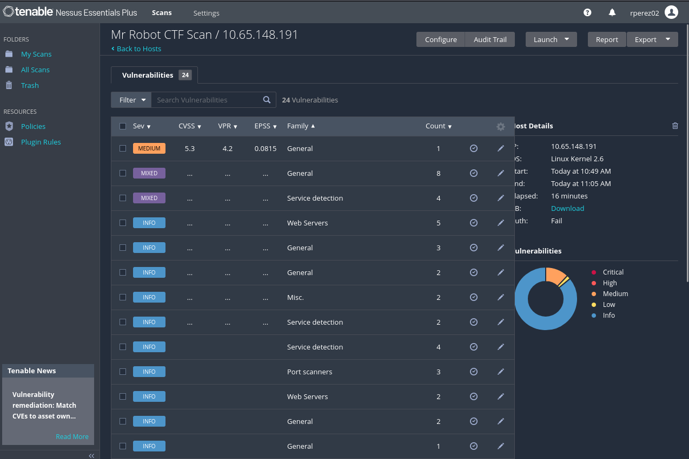

---

### Phase 2: Port and Service Enumeration

A full TCP service scan against the target returned three open ports: **SSH on 22** (OpenSSH 8.2p1), **HTTP on 80** (Apache), and **HTTPS on 443** (Apache). 65532 ports were filtered, which is consistent with a strict host firewall.

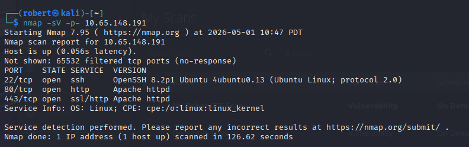

---

### Phase 3: Web App Landing Page

Browsing to http://10.65.148.191/ loads an interactive Mr Robot themed page with an in-character intro from *mr. robot* and a list of commands (*prepare, fsociety, inform, question, wakeup, join*). Aesthetic, but no obvious foothold from the surface, so the next step is to look at the standard web hygiene files.

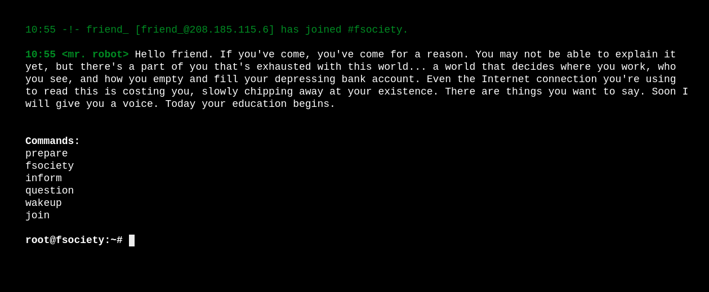

---

### Phase 4: robots.txt Disclosure

/robots.txt is readable and lists two entries: **fsocity.dic** (a custom wordlist) and **key-1-of-3.txt** (the first flag file). robots.txt is supposed to tell crawlers which paths to skip, but anything listed there is, by definition, world-readable.

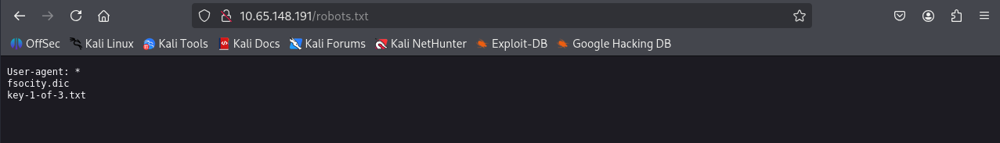

---

### Phase 5: First Key

Fetching /key-1-of-3.txt returns the first flag directly.

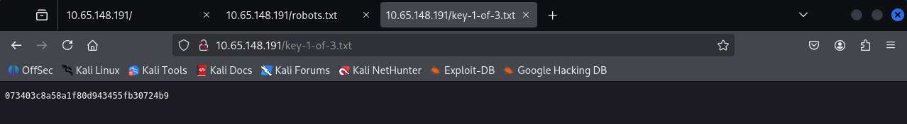

**First key:** 073403c8a58a1f80d943455fb30724b9

---

### Phase 6: Directory Brute Force

A gobuster directory scan against the web root surfaces the full WordPress structure: */wp-login.php*, */wp-admin*, */wp-content*, */wp-includes*, */license*, */readme*, and a number of theme and plugin paths. The site is a stock WordPress install, so the login page is the obvious foothold.

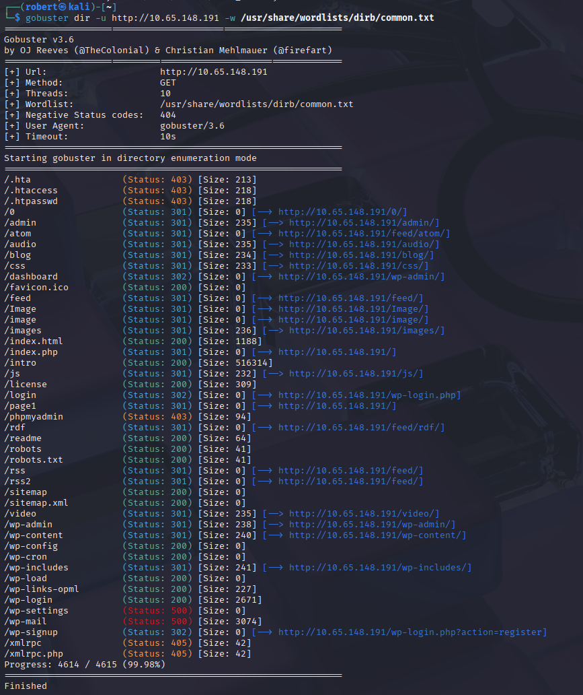

---

### Phase 7: The fsocity.dic Wordlist

Downloading /fsocity.dic returns a custom wordlist seeded with terms from the show: *Wikia, Robot, Elliot, mrrobot, Alderson, fsociety,* and so on. The file is heavy with duplicate entries, so deduplication (*sort -u fsocity.dic > fsocity_unique.dic*) shrinks it from roughly 858k lines down to about 11k unique words and makes Hydra runs orders of magnitude faster.

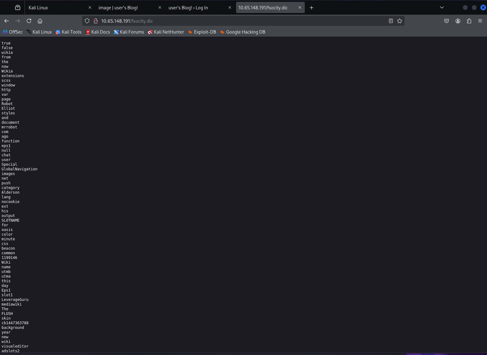

---

### Phase 8: WordPress Login Page

/wp-login.php loads the standard WordPress login form. Two pieces of information are needed before brute forcing: a valid username, and a small enough wordlist that an online attack is realistic.

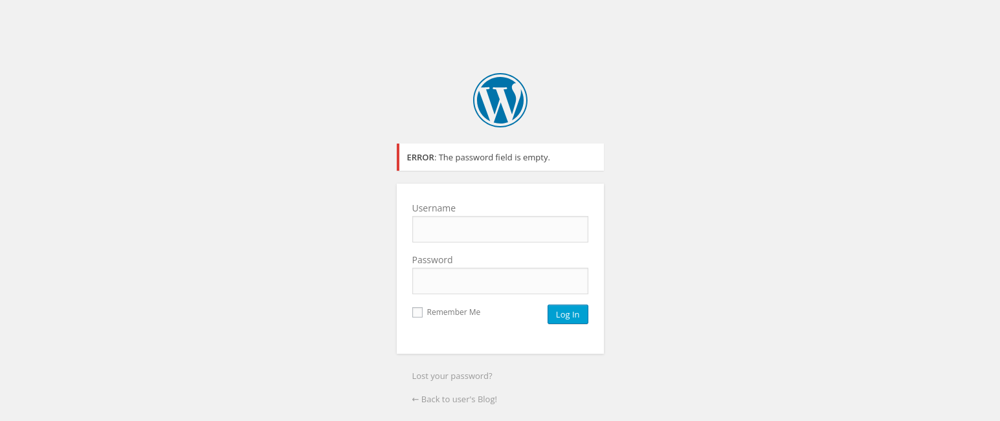

---

### Phase 9: Username Enumeration via Error Differential

Submitting the form with username *elliot* and an empty password returns *"ERROR: The password you entered for the username elliot is incorrect."* Submitting with a junk username instead returns *"ERROR: Invalid username."* This response differential is a textbook **username enumeration** vulnerability (the application admits whether a username exists by changing its error wording). **elliot** is confirmed as a valid account.

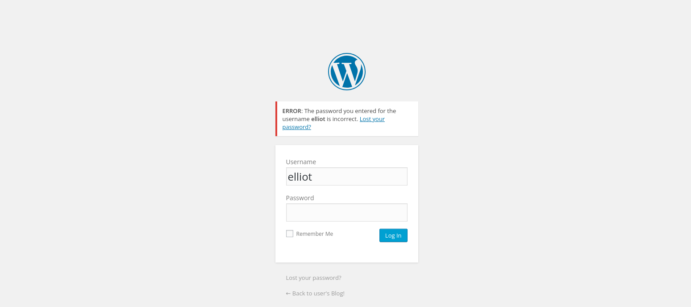

---

### Phase 10: Hydra Brute Force

Hydra is pointed at /wp-login.php in http-post-form mode with the deduplicated wordlist. The failure marker *ERROR* is what tells Hydra a given password attempt failed.

```
hydra -l elliot -P fsocity_unique.dic 10.65.148.191 \
      http-post-form "/wp-login.php:log=^USER^&pwd=^PASS^&wp-submit=Log+In:ERROR"
```

Hydra returns a hit after roughly two minutes:

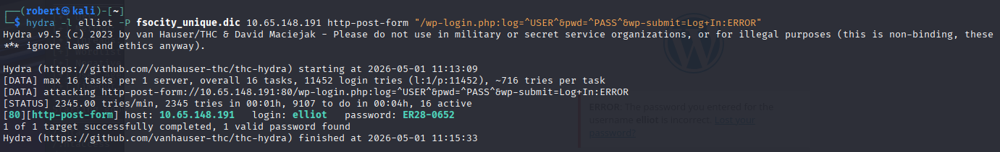

**Recovered credentials:** elliot : **ER28-0652**

---

### Phase 11: Authenticated WordPress Dashboard

Logging in with the recovered credentials lands on the admin dashboard as **Elliot Alderson**. The header reads *WordPress 4.3.1 running Twenty Fifteen theme*, and the Appearance menu in the sidebar exposes the theme **Editor** (which lets an admin rewrite any PHP file in any installed theme directly from the browser). That is the code execution primitive needed for a shell.

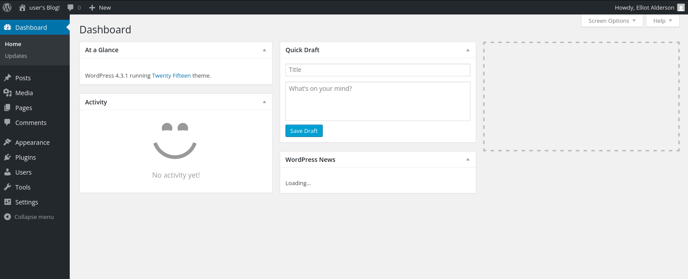

---

### Phase 12: Theme Editor PHP Reverse Shell

Inside Appearance > Editor, the **404 Template (404.php)** of the Twenty Fifteen theme is overwritten with the *pentestmonkey* PHP reverse shell, with the *$ip* variable pointed at the attacker box and *$port* set to **4444**. The 404 template is a good drop point because hitting any nonexistent URL in the theme's path will trigger it without needing to navigate through the WordPress UI.

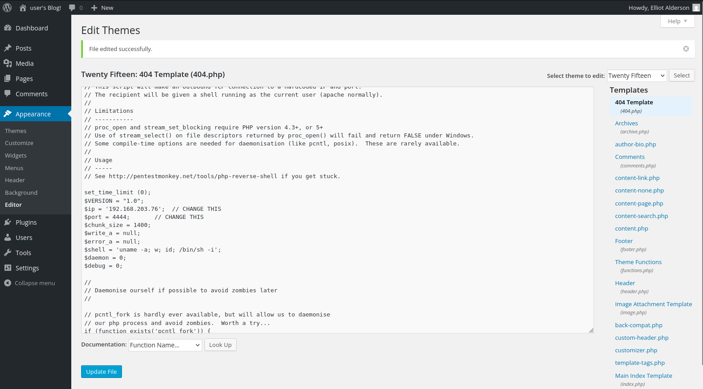

---

### Phase 13: Catching the Reverse Shell

A netcat listener is started on the attacker box, and a request to a nonexistent path under the theme triggers the modified 404.php, which calls back. The callback lands as **uid=1 (daemon)** on Ubuntu running kernel 5.15.0-139-generic.

```
nc -lvnp 4444
```

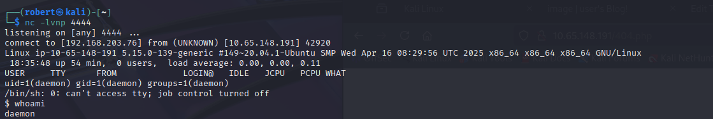

The shell is non-interactive at first, so the usual *python -c 'import pty; pty.spawn("/bin/bash")'* trick is used to upgrade it before moving on.

---

### Phase 14: Discovering the robot Hash

Inside /home/robot, two files are readable: *key-2-of-3.txt* (which is owned by robot and not readable as daemon) and *password.raw-md5* (which **is** readable). Catting the latter reveals a *user:hash* line for robot.

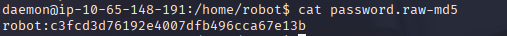

**Hash:** robot : c3fcd3d76192e4007dfb496cca67e13b (raw MD5)

MD5 (a fast hashing algorithm now considered broken for passwords because GPUs can try billions of guesses per second) is exactly the wrong choice for storing credentials, and *raw* (unsalted, no per-user random value mixed in) makes it trivially crackable.

---

### Phase 15: Cracking the Hash on CrackStation

CrackStation maintains precomputed lookup tables of common passwords mapped to their MD5 (and other) hashes. Pasting the hash returns the plaintext **immediately**, which means the password was already in CrackStation's dictionary.

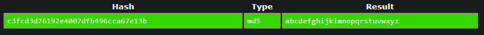

**Recovered password:** abcdefghijklmnopqrstuvwxyz

---

### Phase 16: Second Key via su robot

With the password in hand, *su robot* upgrades the session from daemon to robot. The home directory is now readable end to end, including key-2-of-3.txt.

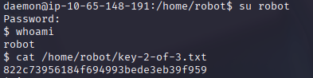

**Second key:** 822c73956184f694993bede3eb39f959

---

### Phase 17: SUID Nmap to Root and Third Key

Searching for binaries with the **SUID bit** set (the set-user-ID bit, which makes a binary execute with the privileges of its owner regardless of which user runs it) surfaces an unusual entry: */usr/local/bin/nmap*. Modern nmap (7.x) does not support interactive mode, but the version installed here is **3.81**, which still does. Old nmap's interactive mode accepts the *!* prefix to spawn arbitrary shell commands and inherits the SUID privilege of the parent process, so *!sh* drops directly into a root shell. /root/key-3-of-3.txt then reads cleanly.

```
find / -perm -4000 -type f 2>/dev/null
nmap --interactive
nmap> !sh
```

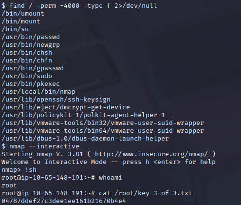

**Third key:** 04787ddef27c3dee1ee161b21670b4e4

---

### Room Completed

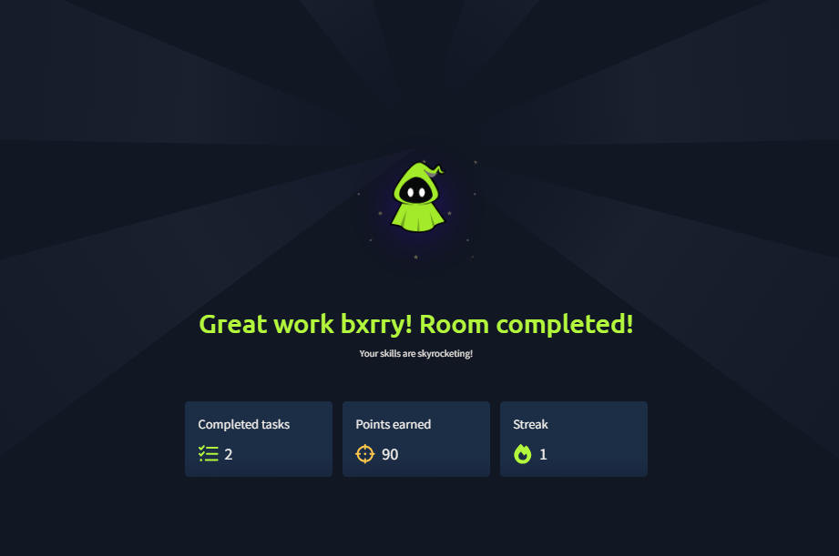

---

## Vulnerability Summary

### Sensitive File Disclosure via robots.txt (CWE-200: Information Exposure)

The application's robots.txt advertises a flag file (*key-1-of-3.txt*) and a custom wordlist (*fsocity.dic*). robots.txt is a hint to crawlers, not an access control mechanism, so listing a path there guarantees attackers will fetch it directly.

**Remediation:** Never reference sensitive paths in robots.txt. Either remove them entirely or place them behind authentication. If the goal is to deindex content, use *X-Robots-Tag: noindex* response headers and proper authorization checks together, not robots.txt alone.

### Username Enumeration on WordPress Login (CWE-204: Response Discrepancy)

The /wp-login.php form returns *"Invalid username"* when the supplied user does not exist and *"The password you entered for the username elliot is incorrect"* when the user does. This response differential lets an attacker iterate a wordlist of usernames against the login page and harvest a list of valid accounts before any password attempt is made, which is exactly what enabled the Hydra run.

**Remediation:** Return a single generic error for any failed login attempt (for example *"Invalid login credentials"*) regardless of whether the username, the password, or both were wrong. Equalize response timing between the two cases as well, since timing differences are themselves an oracle. WordPress can be hardened with the *Stop User Enumeration* plugin, by disabling the */?author=N* redirect, and by blocking xmlrpc.php's *system.multicall* method (a feature originally for blog clients that attackers abuse to amplify password guessing).

### No Brute-Force Protection on Login (CWE-307: Improper Restriction of Excessive Authentication Attempts)

The WordPress install accepts unlimited login attempts from the same source against the same username. Hydra ran 16 parallel tasks at roughly 2300 attempts per minute and was never throttled, blocked, or challenged.

**Remediation:** Install a rate-limiter such as *Limit Login Attempts Reloaded* or *Wordfence*, enforce CAPTCHA after a small number of failed attempts, and rate limit at the web server or WAF layer per-IP and per-account. Strong passwords reduce the impact but are not a substitute for throttling, since *ER28-0652* would have survived almost any wordlist except the one shipped on the box itself.

### Arbitrary Code Execution via Theme Editor (CWE-732 + CWE-94: dangerous default permission to write executable code)

Any WordPress administrator can rewrite arbitrary PHP files inside any installed theme through Appearance > Editor and have the changes execute on the next request. This collapses *"compromise an admin account"* into *"get an interactive shell as the web user"* with no other vulnerability needed.

**Remediation:** Set the *DISALLOW_FILE_EDIT* constant in wp-config.php to disable the in-dashboard file editor, which is the single most effective hardening step for production WordPress. Pair it with *DISALLOW_FILE_MODS* to also block plugin and theme installs from the dashboard. File integrity monitoring on the web root catches the same class of attack after the fact.

### Weak Password Hashing - Unsalted MD5 (CWE-916, CWE-759: weak hash and missing salt)

The robot user's password was stored as a **raw, unsalted MD5** in a world-readable file inside the user's home directory. MD5 is a fast hash that GPUs can attempt billions of times per second, and the absence of a per-user salt means precomputed rainbow tables and online lookup services like CrackStation resolve common passwords instantly. The plaintext was returned without any actual cracking effort.

**Remediation:** Store password material with a slow, salted, memory-hard hash designed for credentials, such as **Argon2id** or **bcrypt** with a work factor tuned for the deployment. Never store password files inside web-accessible paths, and never store password files inside another user's readable directories at all. Restrict the file's permissions to *0600* and the parent directory's permissions so that lateral movement on the box does not equal credential compromise.

### SUID Nmap Privilege Escalation (CWE-250 + CWE-732: execution with unnecessary privileges)

A copy of nmap is installed at */usr/local/bin/nmap* with the SUID bit set. The installed version (**3.81**) still supports the legacy *--interactive* mode, which exposes a *!* shell escape that inherits the SUID context. Anyone who can execute the binary can pop a root shell with two commands.

**Remediation:** Remove the SUID bit (*chmod u-s /usr/local/bin/nmap*). nmap has not needed SUID in over a decade. If raw socket access is genuinely required, use Linux capabilities (*setcap cap_net_raw,cap_net_admin,cap_net_bind_service+eip*) on a current binary instead, which grants only the specific kernel privilege needed rather than full root. Audit /usr/local/bin and the rest of the filesystem regularly for unexpected SUID binaries (*find / -perm -4000 -type f*).

---

## Key Takeaways

- **robots.txt is not access control.** Anything listed there is something an attacker will fetch first, before they even think about exploitation. The first flag in this room arrived as a free read because the file pointed straight at it.
- **Username enumeration turns a 100x harder problem into a 1x problem.** A login page that distinguishes "wrong user" from "wrong password" hands the attacker the entire username axis of the brute force search for free, which is what made the Hydra run finish in minutes against an 11k-word list.
- **Admin in WordPress equals shell on the host.** The dashboard's theme and plugin editors are intentional code execution by design. Treat WP admin credentials as equivalent in blast radius to web-server-user shell access, and set *DISALLOW_FILE_EDIT* by default on every production install.
- **Unsalted MD5 password files belong to a previous era.** Public lookup services like CrackStation resolve any common plaintext instantly, and GPUs make even uncommon ones practical. The chain *daemon shell to root shell* in this room rested entirely on a single readable raw MD5 file, which is the kind of finding that would normally read as low severity in isolation but is *load-bearing* in the chain.
- **SUID on a complex binary is almost always a privesc bug waiting to happen.** Anything with a shell escape (nmap, vim, less, find, awk, perl, python, and dozens more) becomes a one-line root the moment its SUID bit is set. The *find / -perm -4000* command should be the first thing to run on any new Linux foothold, before deeper enumeration, because it often shortens the rest of the engagement to a single command.
