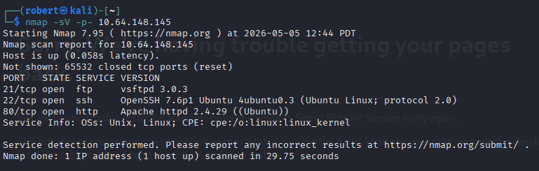
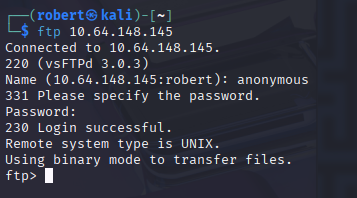
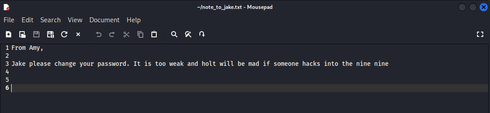
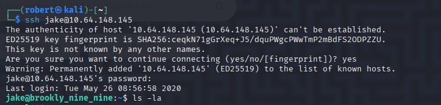
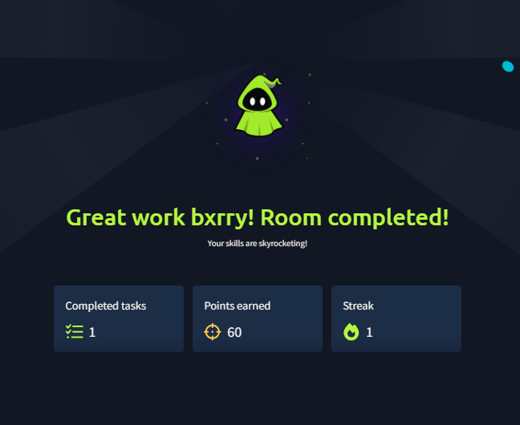
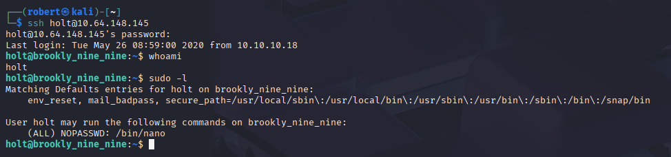

# Brooklyn Nine Nine - Two Roads to Root via Anonymous FTP, Steghide, and Sudo Shell Escapes

**Platform:** TryHackMe
**Difficulty:** Easy
**Type:** Offensive Security / CTF (Linux)
**Date:** 2026-05-05

---

## Overview

A boot-to-root themed after the TV show that ships with **two complete and independent attack chains**, both ending at the same root flag. Path 1 (Jake) starts with an **anonymous FTP** login (the special FTP convention where the username *anonymous* requires no password), pulls down a note that complains the user's password is *too weak*, runs Hydra against SSH with rockyou, lands as jake, and abuses *sudo less* to break out to a root shell. Path 2 (Holt) downloads an image from the web server, runs **steghide** (a tool that hides files inside images, audio, and video by tweaking imperceptible bits) with the passphrase *admin*, recovers Holt's plaintext password, SSHes in as holt, and abuses *sudo nano* the same way. Both privesc steps land on the same class of bug: **sudo on a binary with a built-in shell escape** (a legitimate program feature that lets the user spawn a subshell from inside the program, which inherits the sudo'd root context).

---

**Target:** 10.64.148.145 (Ubuntu Linux, vsftpd 3.0.3, OpenSSH 7.6p1, Apache httpd 2.4.29)

**Tools:** nmap, ftp, hydra, ssh, steghide, less, nano, GTFOBins (mental reference)

---

## Walkthrough

### Phase 1: Port and Service Enumeration

A full TCP service scan against the target returned three open ports: **FTP on 21** (vsftpd 3.0.3), **SSH on 22** (OpenSSH 7.6p1 Ubuntu 4ubuntu0.3), and **HTTP on 80** (Apache 2.4.29). Three services means three separate enumeration tracks, each of which could be the entry point.



---

## Path 1 - Jake: FTP to SSH to less Shell Escape

### Phase 2: Anonymous FTP Login

vsftpd is configured to allow **anonymous** access (the convention where any user typing *anonymous* as the username, with any string for the password, is granted a guest session). The connection succeeds without credentials.



A directory listing reveals *note_to_jake.txt*, which is downloaded with *get*.

---

### Phase 3: The Note - Hint About Weak Password

The note is a plaintext message from *Amy* to Jake telling him to change his password because *"it is too weak and holt will be mad if someone hacks into the nine nine."* This is two pieces of intel in one sentence: there is a user account named **jake**, and his password is weak enough to be brute-forceable.



---

### Phase 4: Hydra SSH Brute Force

Hydra is pointed at SSH with username *jake* and the **rockyou.txt** wordlist (a famous 14-million-word password list leaked from the RockYou site in 2009 and shipped by default in Kali at /usr/share/wordlists/rockyou.txt). The note's "too weak" hint suggests rockyou will land a hit early in the wordlist.

```
hydra -l jake -P /usr/share/wordlists/rockyou.txt 10.64.148.145 ssh
```

Hydra returns a hit within seconds, since the password sits near the top of rockyou. **Recovered credentials:** jake : *(password redacted)*.

---

### Phase 5: SSH In as jake

A standard SSH login lands a clean interactive session as jake on the host *brookly_nine_nine*.



---

### Phase 6: sudo less to Root Shell

*sudo -l* (the command that lists what the current user is allowed to run with sudo) reveals that jake can run **less** as root. The *less* pager has a built-in shell-escape feature: typing *!command* from inside the pager runs that command in a subshell, and because *sudo less* is running as root, the spawned subshell inherits root's UID. *!sh* drops directly to a root prompt.

```
sudo less /etc/passwd
!sh
```

This is a textbook **GTFOBins entry** (the community-curated database that catalogs every Unix binary with a known shell-escape under sudo, SUID, or capabilities). Both *less* and *nano*, used in the two paths of this room, are headline GTFOBins examples.

---

### Phase 7: User and Root Flags

With root, *user.txt* under /home/holt and *root.txt* under /root are both readable in a single *cat*. Both flag values are deliberately omitted from this writeup.

---

### Room Completed



---

## Path 2 - Holt: Web Image to Steghide to nano Shell Escape

The room intentionally ships a second, completely independent route to the same root flag, useful for practicing the *image-as-credential-vault* and *sudo nano* patterns.

### Phase 9: Steghide Extraction from the Web Image

The Apache instance on port 80 serves an image. Downloading it and running **steghide extract** with the guessable passphrase *admin* reveals an embedded text file with Holt's plaintext credentials.

```
steghide extract -sf <image>.jpg -p admin
```

**Recovered credentials:** holt : *(password redacted)*

Steghide hides files inside the **least significant bits** of image, audio, or video data (the bits that contribute the smallest amount to a pixel's color or a sample's amplitude, so flipping them produces a change the human eye and ear cannot detect). The carrier file looks visually identical to the original, so a defender browsing the web root would have no obvious reason to think anything was wrong with the image.

---

### Phase 10: SSH In as holt

Holt's password works on SSH. *sudo -l* this time reveals that holt may run **/bin/nano** as root with the **NOPASSWD** flag (meaning sudo will not even prompt for a password before letting nano run as root).

```
holt@brookly_nine_nine:~$ sudo -l
User holt may run the following commands on brookly_nine_nine:
    (ALL) NOPASSWD: /bin/nano
```



---

### Phase 11: sudo nano to Root Shell

nano's **Execute Command** feature (reachable with Ctrl-R followed by Ctrl-X, depending on the build) prompts for a shell command and runs it in a subshell. Because nano is running under sudo, the subshell starts as root. The payload *reset; sh 1>&0 2>&0* clears the terminal state nano left behind and reattaches the new shell's stdout and stderr (file descriptors 1 and 2) to nano's existing stdin (descriptor 0), giving a usable interactive root shell instead of a half-broken one.

```
sudo nano
^R ^X
Command to execute: reset; sh 1>&0 2>&0
```

*whoami* returns **root**, and the same root.txt drops out.

---

## Vulnerability Summary

### Anonymous FTP Enabled (CWE-284: Improper Access Control)

vsftpd is configured to accept the *anonymous* username with no password and serve files from a world-readable directory that contains operational notes. The note itself is the entire foothold, since it discloses both a valid username and the fact that the account uses a weak, brute-forceable password.

**Remediation:** Disable anonymous FTP entirely (*anonymous_enable=NO* in /etc/vsftpd.conf) unless there is a hard business requirement for it. Replace FTP with SFTP or SCP for any case where authenticated file transfer is needed, since both run inside SSH and inherit its credential and transport security. Never store internal notes, credentials hints, or system documentation in any directory that an anonymous user can list.

### Sensitive Information Disclosure in Plaintext Note (CWE-200, CWE-532)

The note explicitly says *"Jake please change your password. It is too weak and holt will be mad if someone hacks into the nine nine."* That single sentence discloses a valid username (*jake*), confirms the existence of another account (*holt*), and gives the attacker explicit confidence that an online password attack will succeed.

**Remediation:** Treat any cleartext message that names accounts, gives password guidance, or hints at internal naming conventions as sensitive. Out-of-band channels (not the public file share) should be used for any operational message that references a user's authentication state.

### Weak Password Vulnerable to Online Brute Force (CWE-521: Weak Password Requirements)

The string *987654321* lives near the top of the rockyou wordlist. Hydra returns a hit in roughly one second of the run.

**Remediation:** Enforce a strong password policy (minimum 14 characters, dictionary-word screening such as *pwned-passwords*, mixed character classes) at the PAM or directory layer. Require multi-factor authentication for SSH on any internet-reachable host. Rate-limit and account-lock after a small number of failed SSH attempts using *fail2ban* or sshd's own *MaxAuthTries* and *LoginGraceTime* knobs.

### Steganographic Credential Storage with Weak Passphrase (CWE-321, CWE-1391)

A plaintext credential file is hidden inside a public web image with a single-word passphrase, *admin*, that an attacker would guess on the first try. Steganography is *obscurity, not security*, and a weak passphrase reduces the steghide layer to a no-op.

**Remediation:** Never store credentials inside steganographic carriers and treat any "hidden in a file on the web server" pattern as broken by design. Use a real secrets manager (Vault, AWS Secrets Manager, 1Password Secrets Automation), and rotate any credential that has ever lived in a publicly-served file. Even ignoring the credentials issue, public-facing media files should be scanned periodically for embedded payloads.

### sudo on Binaries with Shell-Escape Features (CWE-250 + CWE-269: execution with unnecessary privileges, improper privilege management)

Both jake's *sudo less* entry and holt's *sudo nano NOPASSWD* entry hand root to anyone who can run the binary. *less, nano, vi, vim, awk, find, ftp, more, less, perl, python,* and dozens of other common Unix tools have built-in shell escapes (the full list lives in **GTFOBins**), and granting *sudo* on any of them is functionally equivalent to granting *sudo ALL*.

**Remediation:** Audit the sudoers file (*sudo -l* per user, plus *visudo* review) and remove any entry that points at a GTFOBins binary unless the operational need is real and documented. If a user genuinely needs to read root-owned files, give them a narrow wrapper script with *NOPASSWD* and limit the script to a single safe command (for example *cat /var/log/specific.log*), rather than handing them a general-purpose tool that can spawn a shell. Ban the *NOPASSWD* flag by policy except in rare, audited automation accounts.

---

## Key Takeaways

- **Anonymous FTP is almost always the first finding to act on, because the *contents* matter more than the protocol.** vsftpd by itself is fine, but the moment a directory is anonymously listable, every file in it becomes part of the public attack surface. The note on this box is a perfect example: harmless on its own, but it converts a blind brute force into a targeted one.
- **Hydra plus rockyou is still the fastest way to validate a "weak password" suspicion.** A wordlist that is sixteen years old continues to produce hits because users keep choosing the same hundred passwords. Throttling, MFA, and key-only SSH are the actual fixes, not stronger passwords.
- **GTFOBins is the single most valuable bookmark for Linux privesc.** Any *sudo -l* output that names a common Unix utility should be cross-referenced against GTFOBins immediately. The *less* and *nano* escapes used in this room are two of the most-cited entries on the site for exactly this reason.
- **Steganography is a hiding trick, not a control.** The steghide passphrase *admin* in this room is a deliberate joke, but the deeper lesson generalizes: any time secrets are stored "out of sight" in a file an attacker can fetch, the only thing standing between the attacker and the secret is the passphrase, which is usually an easy guess. Treat steg-hidden files like base64-encoded files: encoding, not encryption.
- **NOPASSWD on a general-purpose binary is the worst possible sudo entry.** It removes both the password barrier and the audit trail for what is functionally an unrestricted root grant. Reserve NOPASSWD for narrow, single-purpose scripts that have been reviewed for shell-escape paths, and never apply it to *nano, less, vi, awk, find,* or anything else with a documented escape.
