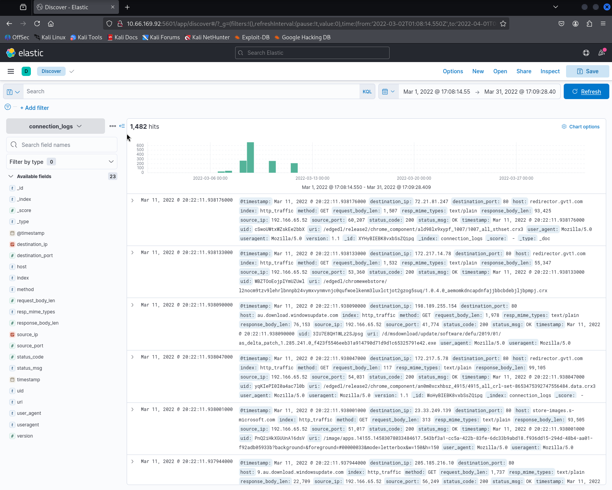
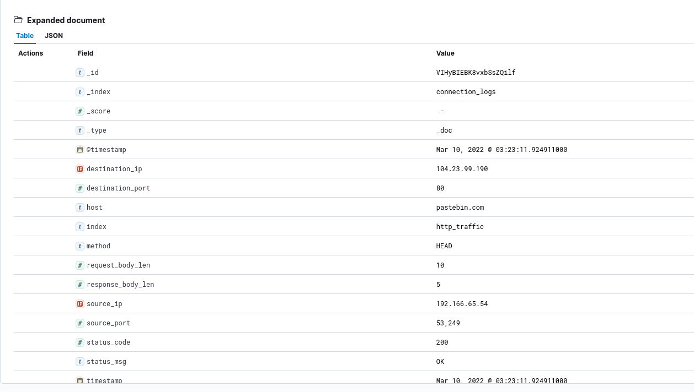
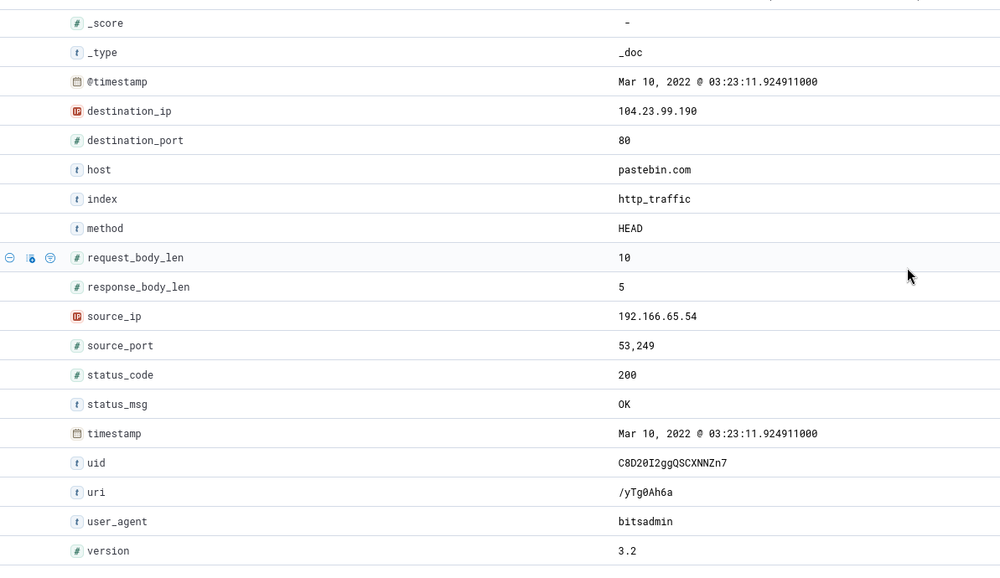
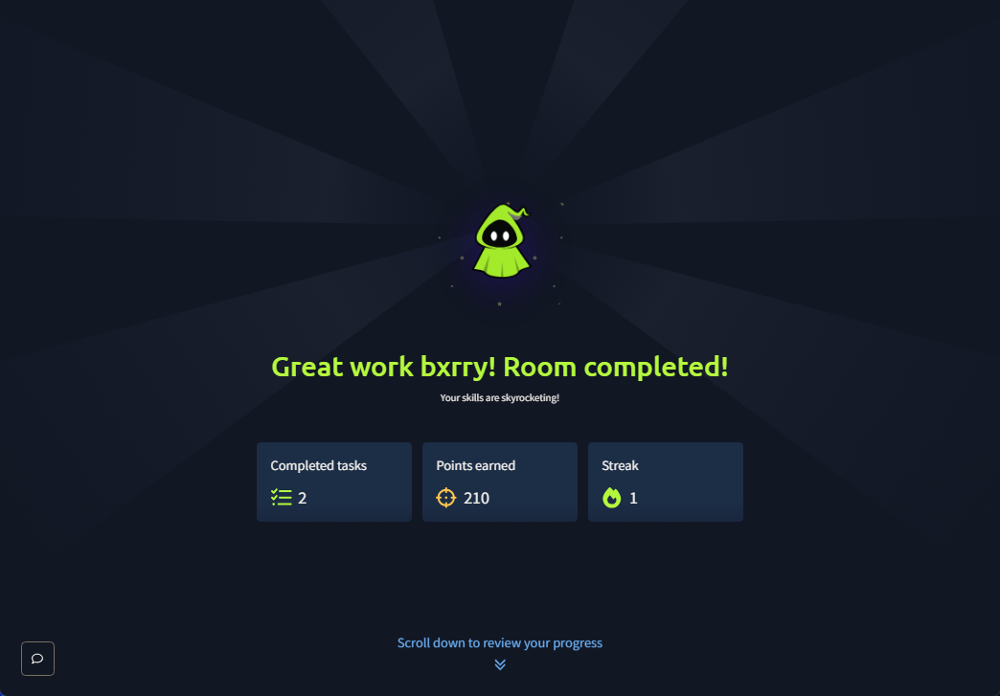

# ItsyBitsy - Hunting bitsadmin Beacons to Pastebin in Kibana

**Platform:** TryHackMe
**Difficulty:** Easy
**Type:** Blue Team / Detection (ELK + Kibana)
**Date:** 2026-05-10

---

## Overview

A short detection-focused room built around an IDS alert for **potential C2 communication** (command and control, the channel a piece of malware uses to take instructions from its operator) originating from a workstation in the HR department. The investigation is run inside **Kibana** (the visualization front-end for the **ELK stack**, the standard open-source pipeline of Elasticsearch for storage, Logstash for ingest, and Kibana for search and dashboards). The *connection_logs* index is filtered down to March 2022 and 1,482 events are surfaced. A single record stands out because the **user-agent** field reads *bitsadmin*, the name of a legitimate Windows binary normally used by sysadmins to transfer files (*Background Intelligent Transfer Service Admin Tool*) but routinely abused by malware to fetch payloads while blending in with the noise of Windows Update traffic. The same record shows the host connecting outbound to **pastebin.com** at URI **/yTg0Ah6a**, which is a textbook **LOLBin-plus-LOTL** pattern (*living off the land binaries*, abusing a built-in OS tool, combined with *living off trusted sites*, abusing a legitimate public service for payload hosting or C2). Browsing to the recovered Pastebin URL reveals a *secret.txt* paste containing the room's flag.

---

**Index:** connection_logs (in Elasticsearch, an *index* is the equivalent of a database table for a class of log records)

**Tools:** Kibana Discover, Elasticsearch query bar, browser

---

## Walkthrough

### Phase 1: Scope the Time Window and Index

The alert names March 2022 as the window of interest. Kibana's Discover view is pointed at the **connection_logs** index with a time range of **Mar 1, 2022 to Mar 31, 2022**. The query returns **1,482 events** total, which is a small enough corpus to scan field-by-field for anomalies rather than building heavy aggregations.



The histogram at the top of the page shows a clear traffic spike on March 10, which is a useful pivot before drilling into individual records.

---

### Phase 2: Identify the Suspicious Record

Scrolling the per-row event list (or filtering on the *user_agent* field directly with a query like *user_agent : "bitsadmin"*) surfaces one connection whose user-agent string is **bitsadmin**. The vast majority of HTTP traffic in a normal enterprise comes from real browser user-agents (Chrome, Firefox, Edge), with a smaller volume from update agents and search engine crawlers. Anything that names a command-line tool as its user-agent is, by definition, not someone clicking a link in a browser, which is enough to escalate the record for closer inspection.



The expanded document view in Kibana shows the top of the record: index *connection_logs*, type *_doc*, timestamp *Mar 10, 2022 @ 03:23:11.924911000*, destination IP *104.23.99.190*, destination port *80*, host *pastebin.com*, method *HEAD*, source IP **192.166.65.54** (the HR workstation), source port *53249*, status code *200*.

---

### Phase 3: Confirm the Indicators

Scrolling the rest of the same document reveals the remaining detection-grade fields:



The full pivot list:

- **uri:** /yTg0Ah6a
- **user_agent:** bitsadmin
- **host:** pastebin.com
- **destination_ip:** 104.23.99.190 (Cloudflare-fronted Pastebin)
- **method:** HEAD (used by bitsadmin to check the file before pulling it down)
- **status_code:** 200 (the resource exists)
- **uid:** C8D20I2ggQSCXNNZn7 (the Zeek connection identifier, which would correlate this HTTP entry to a parent *conn.log* record for full network-flow context in a follow-up pivot)
- **version:** 3.2 (bitsadmin version reported by the agent)

Two findings at once: a **LOLBin** (*living off the land binary*, a trusted built-in Windows tool being repurposed) and an outbound connection to a **legitimate-but-abused** service (Pastebin) that the security team probably does not block because real developers and admins use it daily.

---

### Phase 4: Visit the Pastebin URL

Following the URI from the log record loads a Pastebin titled **secret.txt** posted by an anonymous guest on Apr 6, 2022. The body of the paste contains the flag. In a real engagement this is the **stage two** retrieval, the moment the analyst confirms the host actually pulled down attacker-controlled content rather than just performing a benign check, and would be the trigger to isolate the workstation and begin incident response.

---

### Room Completed



---

## Detection Notes

### Why bitsadmin is a Tier-1 Indicator

BITS (the **Background Intelligent Transfer Service**) is the Windows component that performs throttled background file transfers for Windows Update, SCCM, and other Microsoft tooling. Its command-line front-end *bitsadmin.exe* is signed by Microsoft and shipped on every modern Windows desktop. That combination, *signed, built-in, and capable of arbitrary HTTP downloads*, is exactly why APT and commodity-malware operators alike use it. Mapping to **MITRE ATT&CK**:

- **T1197 - BITS Jobs:** the technique of using *bitsadmin* (or its PowerShell cousin *Start-BitsTransfer*) to fetch a payload, often with the *AlwaysOnline* or *NoProgressTimeout* options that survive reboots.
- **T1105 - Ingress Tool Transfer:** the umbrella for "malware retrieves additional tooling from an external location," which is exactly what the bitsadmin HEAD-then-GET pattern is doing here.
- **T1071.001 - Application Layer Protocol: Web Protocols:** the malware's choice of plain HTTP over port 80 to a popular site, which slides through proxy allow-lists that block "unknown" destinations but permit big-name SaaS.

### Why Pastebin is a Tier-1 Indicator

Pastebin's value to an attacker is the same as its value to a developer: anyone can host arbitrary text under an opaque URL, the site is reachable from inside almost every corporate proxy, and TLS hides the payload contents from network DLP (data loss prevention systems that inspect outbound traffic for sensitive content). Pastebin C2 typically looks like a small HEAD or GET to *pastebin.com/<paste-id>*, repeated on a schedule. Defensive signals:

- **Domain-based detections:** alert on outbound connections to *pastebin.com, paste.ee, ghostbin.com, hastebin.com,* and the long tail of paste sites, especially from non-developer hosts and especially from non-browser user-agents.
- **User-agent baselining:** the user-agent field has *very low cardinality* in a healthy environment. A workstation that has only ever sent Chrome and Edge user-agents suddenly emitting *bitsadmin, curl, wget, python-requests,* or *PowerShell/5.1* is an anomaly worth investigating.
- **Endpoint detections:** *Microsoft-Windows-Bits-Client* Event ID 59 and 60 log every BITS transfer and are noisy but high-value when correlated with destination-domain filtering.

### Detection Rule Sketch

The literal Lucene-style query that would surface this single event in real-time, written for the Kibana query bar:

```
user_agent : "bitsadmin" AND host : "pastebin.com"
```

A production version would generalize:

```
user_agent : ("bitsadmin" OR "curl" OR "wget" OR "python-requests" OR /PowerShell.*/) 
  AND host : (/pastebin\.com/ OR /paste\.ee/ OR /ghostbin\.com/ OR /hastebin\.com/)
```

The exact form depends on the field names in the ingest pipeline (Elastic Common Schema would call this *user_agent.original* and *url.domain*) and on how strictly the SOC wants to tune for false positives. The list of paste sites is the part that ages, since attackers rotate constantly.

### Pivots a Real SOC Would Run Next

The investigation in this room stops at finding the flag, but in a live engagement the next moves would be:

1. **Endpoint pivot:** query EDR for the parent process of bitsadmin.exe on host *192.166.65.54* at 03:23:11 UTC on Mar 10. *bitsadmin* launched from an Office macro, a script-host (*wscript.exe, cscript.exe*), or a temp directory is a much stronger signal than bitsadmin launched from cmd.exe by a logged-in admin.
2. **Network pivot:** correlate the Zeek *uid* (C8D20I2ggQSCXNNZn7) into the parent *conn.log* record for full connection metadata (bytes sent/received, duration, history flags). A short flow with a tiny payload is consistent with C2 beaconing, not actual file download.
3. **Subsequent traffic:** check whether the same source_ip touched *pastebin.com* again over the next 24 hours, and whether *bitsadmin* user-agents appear from any other source IP in the same fleet (a campaign rarely hits one host).
4. **Lateral movement check:** the HR workstation is rarely a target of opportunity. Confirm whether the user logged into other hosts (4624 type 3 lateral logons, Kerberos TGS in domain logs) in the window after the BITS download.

---

## Key Takeaways

- **User-agent is a low-cost, high-signal detection field.** Most enterprises have at most a few dozen real user-agents in normal traffic. Any record with *bitsadmin, curl, wget, Python-urllib, PowerShell, Go-http-client,* or other tool-name user-agents from a non-administrative workstation is worth alerting on. The cost of building that detection is one Kibana saved search; the value is catching an entire class of T1197 and T1105 abuse.
- **Trusted sites are an attacker's preferred C2 cover.** Pastebin, Discord, GitHub Gist, Google Drive, Telegram, and Dropbox are all used as live C2 channels in the wild because corporate proxies are configured to allow them by default. Domain reputation as a control is binary, *allow or block*, and produces a constant tension between business-allow and security-block. The compensating control is **content and behavior detection at the egress layer**, not destination-domain reputation alone.
- **LOLBins are not exotic.** *bitsadmin, certutil, mshta, regsvr32, rundll32, msbuild, wmic,* and dozens of others are all signed, shipped, and necessary for some legitimate workflow, which is exactly why attackers reach for them first. A SOC that bakes a watchlist of these binary names into both EDR queries and network user-agent queries gets a meaningful detection lift for almost no engineering cost.
- **Always preserve the connection ID.** Zeek's *uid* field, or whatever the equivalent flow-ID is in your stack, is the difference between a single suspicious HTTP record and a full reconstructed network flow. In a real engagement, the *uid* pivot is what tells you whether the bitsadmin transfer was 200 bytes (probably a beacon) or 20 megabytes (probably an actual second-stage download).
- **One alert is rarely the whole story.** This room ends when the flag is read out of the Pastebin, but a production-grade investigation would treat that read as the *start* of the case, not the end: confirm the parent process on the endpoint, confirm the user, search for the same indicators across other hosts, and confirm there is no follow-on traffic. *Closure on a single record is how dwell time grows.*
