# Splunk 2 - BOTSv2 Investigation Across Four Adversary Scenarios

**Platform:** TryHackMe
**Difficulty:** Medium
**Type:** Blue Team / Detection (Splunk + BOTSv2)
**Date:** 2026-05-12

---

## Overview

A long-form blue team room built around the **BOTSv2** (Boss of the SOC version 2) dataset, a publicly-released Splunk corpus of real-world attack telemetry from the security community's annual training competition. The room casts the analyst as **Alice Bluebird**, a SOC analyst at *Frothly* (a fictional craft brewery), investigating four very different adversary scenarios that all hit the same environment.

The four series, in order of escalation:

1. **100 series - Insider Threat.** An employee (Amber Turing) visiting a competitor's website and exfiltrating company secrets by email.
2. **200 series - Web Attacks.** A vulnerability scan, SQL injection, and reflected XSS against the company's web forum (brewertalk.com), plus a spear-phishing account creation.
3. **300 series - Ransomware and Malware.** File-encrypting ransomware on a Mac (MACLORY-AIR13), a USB-delivered Perl-based macOS malware (FruitFly / Quimitchin), and C2 communications over dynamic DNS.
4. **400 series - APT.** A North Korean APT group (Taedonggang) using spear phishing, encrypted FTP downloads, PowerShell Empire, Korean-language decoy documents, and registry-stored C2 URLs.

This took roughly three days of focused work. The hard parts were not the individual queries but the **multi-step decoding chains** (Base64 → PowerShell → registry → Base64 again), the **pivots between data sources** (pan:traffic to stream:HTTP to stream:smtp to osquery), and the **time-correlation skills** needed to find a USB event one minute before a malware file write.

---

**Target:** Frothly enterprise network, BOTSv2 dataset

**Tools:** Splunk SIEM (BOTSv2 corpus), VirusTotal, CyberChef, Any.run, Hybrid Analysis, the-sz.com (USB vendor lookup)

---

## Walkthrough

### Phase 0: Data Source Inventory

Every BOTSv2 investigation starts with knowing what data is available. A quick metadata pivot lists every sourcetype in the index, which determines the queries available downstream.

```spl
| metadata type=sourcetypes index=botsv2 | sort -lastTime
```

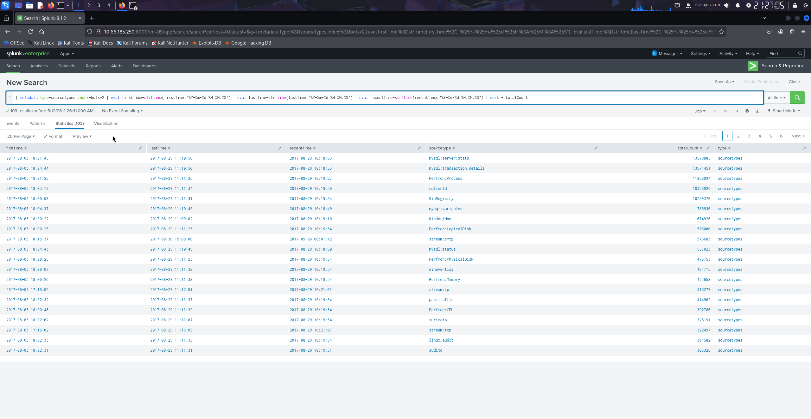

The corpus contains *pan:traffic* (Palo Alto firewall logs), *stream:http*, *stream:smtp*, *stream:dns*, *stream:ftp*, *stream:tcp*, *osquery*, *XmlWinEventLog* (Sysmon), *WinRegistry*, and dozens more. Knowing the sourcetype menu is the difference between blind keyword searches and targeted pivots.

---

## 100 Series: Insider Threat - Amber Turing

### Phase 1.1: Find Amber's Workstation IP

The pan:traffic logs include a *src_user* field that resolves Active Directory usernames to source IPs. One query gives the workstation.

```spl
index="botsv2" sourcetype="pan:traffic" src_user="frothly\amber.turing"
```

### Phase 1.2: Enumerate Sites Amber Visited

With the IP known, pivot to *stream:http* and list every unique site the workstation talked to.

```spl
index="botsv2" 10.0.2.101 sourcetype="stream:HTTP" 
| dedup site 
| table site
```

The competitor's site appears in the list.


### Phase 1.3: Pages Visited on the Competitor Site

Once the suspicious destination is known, list the URIs Amber requested from it.

```spl
index="botsv2" src_ip="10.0.2.101" sourcetype="stream:http" site="www.berkbeer.com" 
| table uri
```

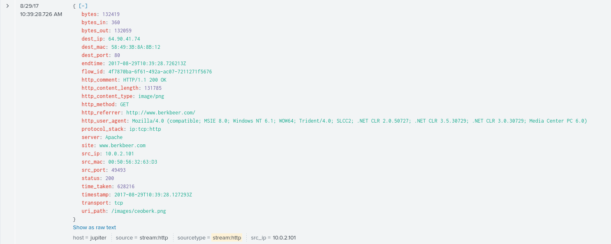

The URIs include an executive contact image, which leads to the next pivot point: identifying who Amber was looking up.

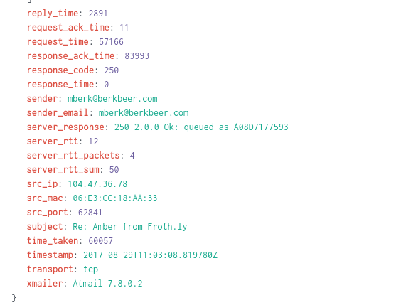

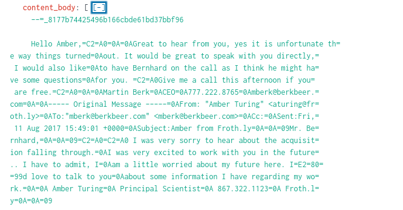


### Phase 1.4: Email Exfiltration

With both the competitor's executives and Amber's email identified, pivot to *stream:smtp* to find the outbound message and its attachment. The *attach_filename* field uses curly braces because it is a multi-value field in Splunk.

```spl
index="botsv2" sourcetype="stream:smtp" aturing@froth.ly berkbeer.com 
| table sender, recipient, subject, attach_filename{}
```

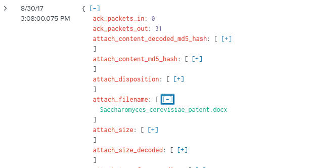

A separate exchange shows the competitor's executive replying back. Reading the Base64-encoded body of the reply (CyberChef *From Base64*) reveals a personal email address used to continue the conversation off the corporate channel.

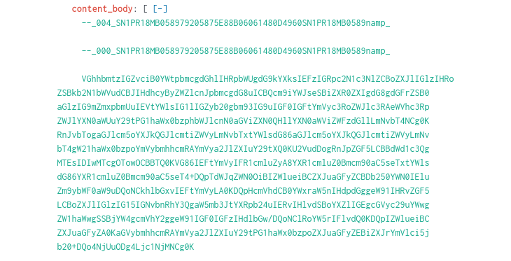

**Detection takeaway:** the entire chain is *outbound email volume + attachment name patterns + competitor domain regex*. Every step except the Base64 decode is one Splunk query.

---

## 200 Series: Web Attacks - Brewertalk and Kevin

### Phase 2.1: Tor Browser Download

A quick keyword pivot surfaces Tor Browser activity on Amber's workstation, with the version number in the user-agent or download URL.

```spl
index="botsv2" amber tor version
```

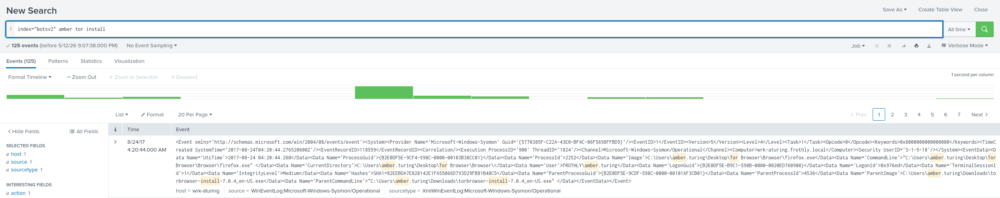

Tor Browser by itself isn't malware, but Tor usage on a corporate workstation is a flag-worthy anomaly.

### Phase 2.2: Identify the Web Scanner

The brewertalk forum was hit by a web vulnerability scanner. Grouping requests by source IP and sorting by count surfaces the noisy attacker.

```spl
index="botsv2" brewertalk.com sourcetype="stream:http" 
| stats count by src_ip 
| sort -count
```

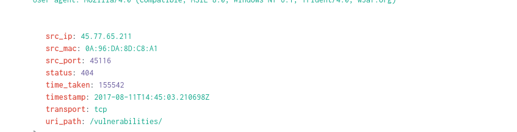

The brewertalk server's public IP also surfaces from the request side, which matters for understanding the network topology.

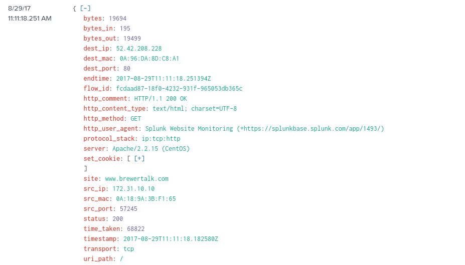

### Phase 2.3: Target URI Path

With the scanner IP known, enumerate the URIs it requested. The most-requested URI is usually the target.

```spl
index="botsv2" src_ip="45.77.65.211" uri_path
```

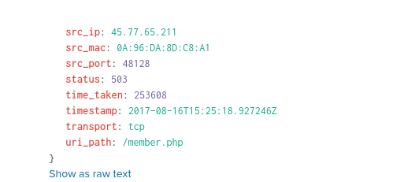

### Phase 2.4: Identify the SQLi Function

Most SQL keywords (*SELECT, FROM, WHERE*) appear in legitimate queries. The unusual ones are the indicator. **UPDATEXML** is a textbook SQLi error-based exfiltration function: it forces the database to throw a verbose error containing data the attacker is reading.

```spl
index="botsv2" src_ip="45.77.65.211" uri_path="/member.php"
```

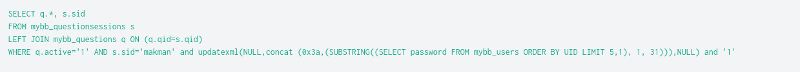

### Phase 2.5: Spear-phishing Account Creation

Following the scan, the attacker registers a forum account using a *kevin*-like-but-misspelled username.

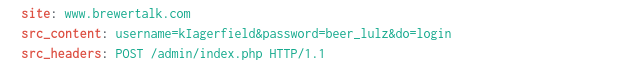

The capital *I* in place of a lowercase *L* is a textbook **homoglyph** trick to make the account name look real at a glance.

### Phase 2.6: Reflected XSS Cookie

A separate pivot through Kevin's HTTP activity surfaces an `` style XSS payload designed to steal cookies. The recovered cookie value is what the room treats as the "stolen" credential.

```spl
index="botsv2" kevin sourcetype="stream:http" cookie script
```

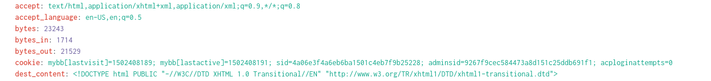

**Detection takeaway:** SQLi shows up in noisy patterns (many requests, error-based exfil functions). XSS shows up in HTTP requests containing both *script* and *cookie* in the same request body. Both are catchable at the WAF layer.

---

## 300 Series: Ransomware and Malware - Mallory and Kutekitten

### Phase 3.1: Encrypted File on Mallory's Mac

A keyword search for Mallory's name surfaces filesystem activity on her workstation, **MACLORY-AIR13**. Filtering for Office filetypes, then for the *.crypt* extension that the ransomware appends, identifies the encrypted asset.

```spl
index="botsv2" host="MACLORY-AIR13" (*.ppt OR *.pptx)
index="botsv2" host="MACLORY-AIR13" *.crypt
```

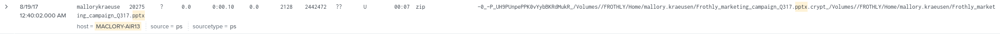

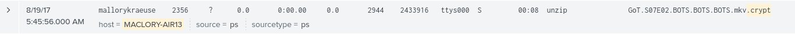

### Phase 3.2: USB Pivot on Kutekitten

A separate host (**kutekitten**, a research Mac) shows USB-device telemetry from **osquery**, an open-source tool that exposes OS state (processes, files, registry, USB devices) as a queryable SQL-like table.

```spl
index="botsv2" host="kutekitten" usb_devices
```

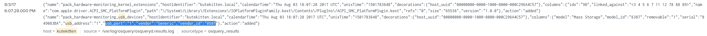

The vendor ID in the osquery output (the *058f* in the example) is looked up at *the-sz.com* (a public USB vendor database) to resolve the manufacturer.

### Phase 3.3: Malware File and Language Identification

A file landed shortly after the USB event. Pulling the file's path and hash, then submitting the hash to VirusTotal, reveals the malware family.

```spl
index="botsv2" mallory
```

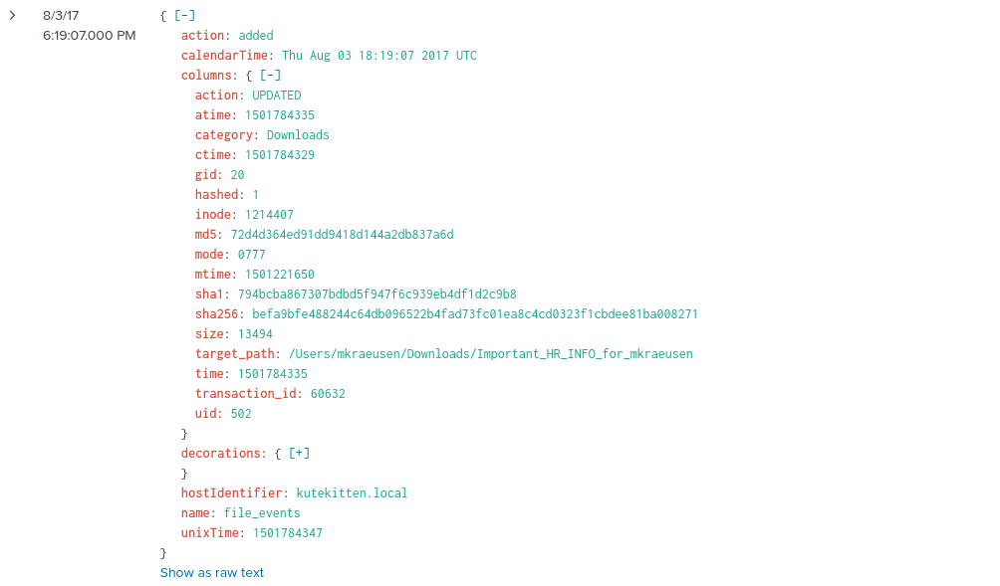

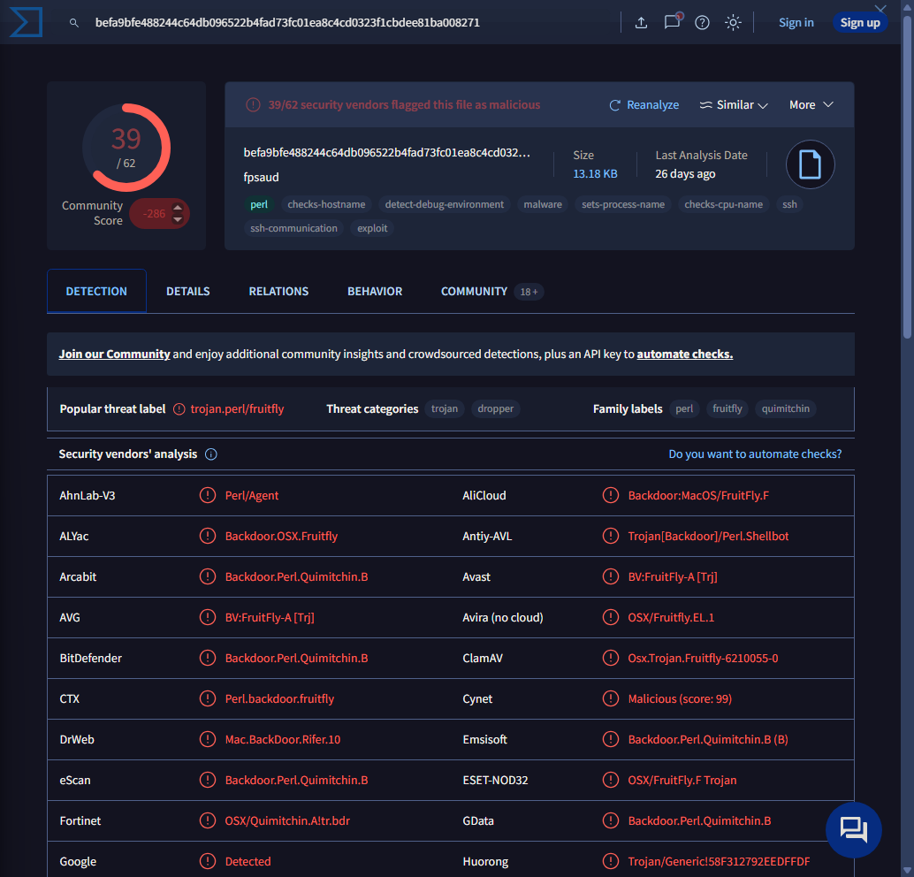

VirusTotal's detection names plus the *first seen* date pin down the family.

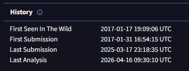

The malware is **FruitFly** (also catalogued as Quimitchin), a Perl-based macOS spyware notable because macOS malware is uncommon and *Perl* in particular is unusual on modern systems.

### Phase 3.4: Time-Correlated DNS Pivot for C2

Once the malware install timestamp is known, narrow DNS queries from the infected host to a tight window after the install. C2 callbacks happen quickly because the malware wants to phone home before it's stopped.

```spl
index="botsv2" src_ip="10.0.4.2" sourcetype="stream:dns" 
       earliest="08/03/2017:18:19:00" latest="08/03/2017:18:30:00" 
| table _time, query{}
```

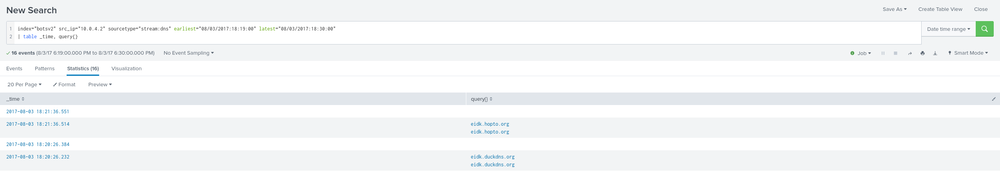

Both C2 hosts use **dynamic DNS** (duckdns.org, hopto.org), which lets the operator change the resolved IP at will. Detection rule: flag any process on a workstation that performs DNS lookups against known dynamic-DNS providers (duckdns, no-ip, hopto, ddns, dynu).

---

## 400 Series: APT - Taedonggang

### Phase 4.1: Spear-Phishing Attachment

Filter SMTP for ZIP attachments and look for any sender that doesn't match the company's normal correspondence.

```spl
index="botsv2" sourcetype="stream:smtp" *.zip 
| table sender, recipient, subject, attach_filename{}
```

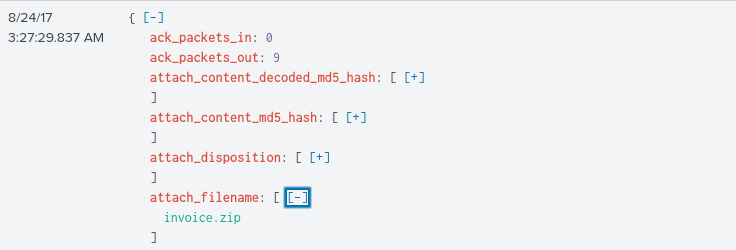

The phish drops an *invoice.zip*. The password to the ZIP is in the message body.

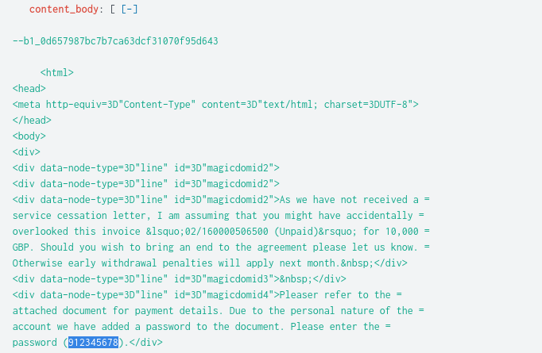

### Phase 4.2: SSL Issuer Fingerprint

The attacker's C2 server uses HTTPS with a self-signed certificate. The *stream:tcp* logs include SSL handshake fields that let an analyst fingerprint the certificate issuer.

```spl
index="botsv2" sourcetype="stream:tcp" 45.77.65.211
```

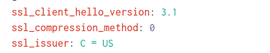

The same SSL fingerprint can be searched across the index to find every other host the attacker was using with the same cert.

### Phase 4.3: Unusual File Format

Among the attacker's tooling is a file with a *.hwp* extension, the format of Korea's Hancom Office word processor. A craft brewery in the United States has zero legitimate reason to have HWP files on the network.

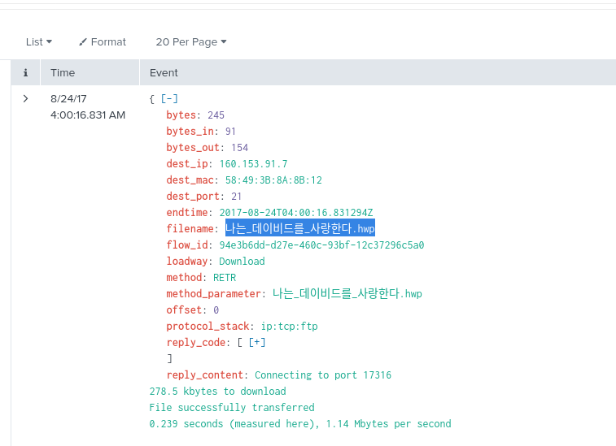

The Korean characters in the filename translate roughly to *"I love David"*. Rendering them on Kali required installing `fonts-noto-cjk`. The TryHackMe answer form rejected the raw Unicode and required *CyberChef → Unescape Unicode Characters* to produce the form-accepted version.

### Phase 4.4: Document Author Attribution

VirusTotal's *Details* tab exposes embedded document metadata (author, last-modified-by, creation date, application name). The author field on one of the attacker's documents resolves to a known security researcher.

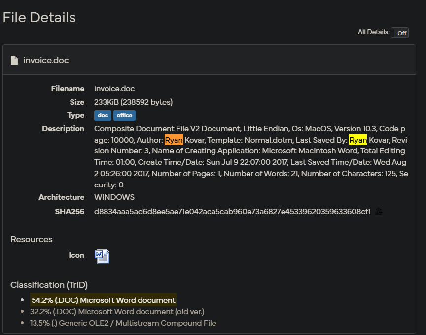

This is **metadata-driven attribution**, and it's why responsible adversary documents always strip metadata before deployment. Real APTs do this; tutorials and test documents often don't.

### Phase 4.5: PowerShell Scheduled Task Beacon

A spawned-process search for *schtasks.exe* under Sysmon shows the parent process that created a scheduled task, with the full CommandLine of both.

```spl
index="botsv2" schtasks.exe sourcetype="XmlWinEventLog:Microsoft-Windows-Sysmon/Operational" 
| dedup ParentCommandLine 
| table ParentCommandLine CommandLine
```

The scheduled task's command line includes a Base64-encoded PowerShell payload. Decoding the payload reveals it reads C2 metadata from a registry key:

```spl
index="botsv2" source="WinRegistry" "\\Software\\Microsoft\\Network"
```

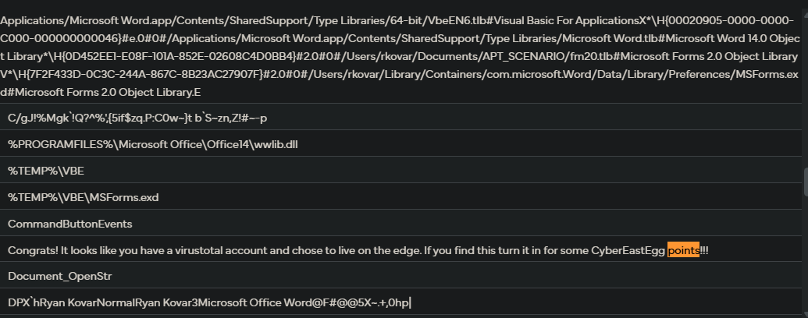

The registry value is itself Base64-encoded. Decoding it a second time reveals the actual C2 URL and beacon webpage.

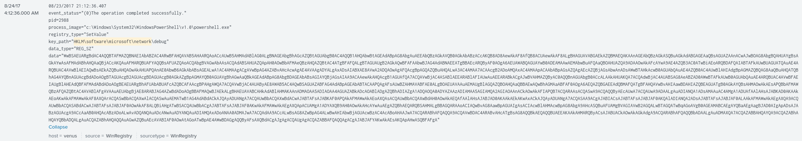

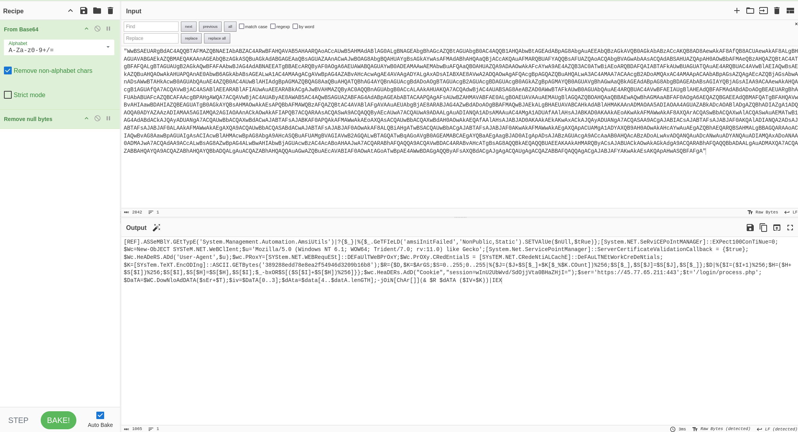

In CyberChef, the decode chain that worked: *From Base64 → Remove null bytes → Extract URLs*. The *$t=* variable in the decoded PowerShell holds the webpage path. The *$ser=* variable holds the C2 server.

---

## Framework Mapping

The room ends by asking the analyst to translate raw findings into two industry-standard analysis frameworks. This is the part most beginners skip and most senior SOC analysts spend the majority of their time on, because frameworks are how investigations get communicated to leadership, IR teams, and threat-intel partners.

### Diamond Model of Intrusion Analysis

The **Diamond Model** is a four-cornered model for describing an intrusion. Every adversary event has an **Adversary**, **Capability**, **Infrastructure**, and **Victim**. The corners are connected by a **socio-political axis** (the *why*) and a **technical axis** (the *how*).

Applied to the Taedonggang campaign:

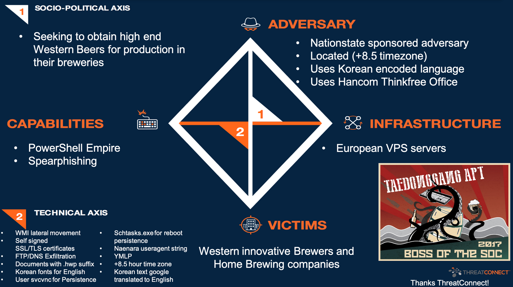

- **Adversary:** nation-state sponsored, located in a +8.5 timezone, uses Korean-encoded language, uses Hancom Thinkfree Office (Korean MS Office equivalent).
- **Capability:** PowerShell Empire, spear phishing.
- **Infrastructure:** European VPS servers.
- **Victim:** Western innovative brewers and home brewing companies.
- **Socio-political axis:** seeking to obtain high-end Western beers for production in their own breweries.
- **Technical axis:** WMI lateral movement, self-signed SSL/TLS, FTP / DNS exfiltration, *.zip*-suffix decoys, Korean fonts on documents that translate to English, *super.svc* / *svcms* for persistence, schtasks.exe for reboot persistence, *Naenara* user-agent, YMLP, *+8.5 hour timezone*.

The framework forces the analyst to answer questions outside the SIEM (the *why*, the *who*) by pivoting through open-source intelligence and threat-intel feeds. That broader picture is what gets escalated to executives, not the raw SPL queries.

### MITRE ATT&CK Mapping

**MITRE ATT&CK** is the industry-standard taxonomy of adversary tactics and techniques. Each column is a tactic (Initial Access, Execution, Persistence, Privilege Escalation, Defense Evasion, Credential Access, Discovery, Lateral Movement, Collection, Exfiltration, Command and Control). Each cell is a specific technique.

The room provides a pre-marked matrix highlighting the techniques the Taedonggang campaign exercised:

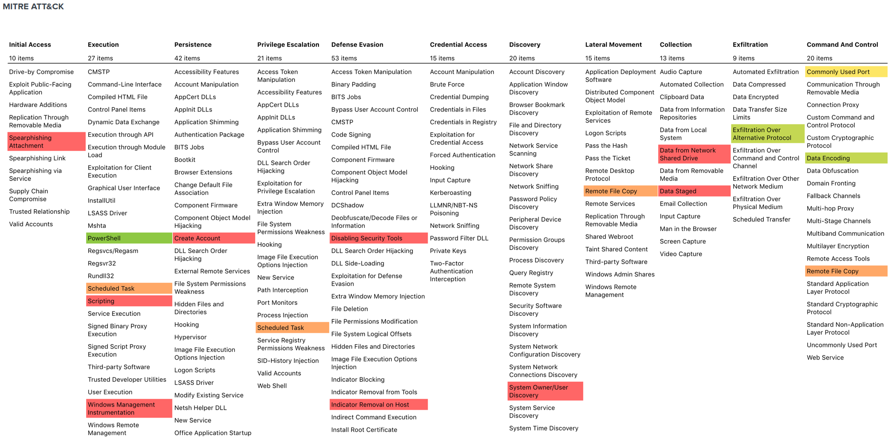

Highlighted techniques observed across the BOTSv2 dataset include **Spearphishing Attachment** (Initial Access), **PowerShell** + **Scheduled Task** (Execution + Persistence), **Modify Registry** (Defense Evasion), **Account / System Information Discovery**, **Remote Services** (Lateral Movement), **Data Compressed** (Collection), and **Standard Application Layer Protocol** (Command and Control).

Mapping observed events to ATT&CK technique IDs makes detection engineering follow logically: each highlighted technique points at a known set of detection rules, telemetry sources, and mitigations published in the framework. It also makes campaign comparison possible: any future campaign with the same technique fingerprint can be flagged as a likely Taedonggang follow-up.

---

## Detection Summary

### Outbound Email to Competitor Domain (CWE-200: Information Exposure)

The 100 series chain was *workstation → competitor website → SMTP to competitor's executives*. The whole chain is detectable by:

- DLP rules on outbound email containing internal document patterns.
- Allow-listing or alerting on *first-time-seen* recipient domains.
- Alerting on outbound email with attachments to addresses outside the standard corporate contact list.

### Web Vulnerability Scanner (T1190 - Exploit Public-Facing Application)

A single source IP issuing thousands of requests against one URI in minutes is the textbook signature. Detection:

- WAF rate-limit by source IP per endpoint.
- Alert on response status anomalies (many 500s in short window indicate scanner / injection attempts).
- Match request bodies against SQLi patterns (*UPDATEXML, SLEEP, BENCHMARK, INFORMATION_SCHEMA*) and XSS patterns (`<script>, onerror=, javascript:`).

### USB Malware Delivery (T1091 - Replication Through Removable Media)

The Kutekitten chain was *USB insertion → malware drop → DNS lookup to dyn-DNS C2*. Detection:

- Enable osquery (or equivalent EDR USB telemetry) on every endpoint.
- Alert on new USB devices not in the corporate inventory.
- Alert on DNS queries to dynamic DNS providers (duckdns, no-ip, hopto, ddns) from non-IT endpoints.

### PowerShell Empire Persistence (T1053.005 - Scheduled Task)

The 400 series persistence was a scheduled task that ran a Base64-encoded PowerShell payload pulling C2 config from a registry key. Detection:

- Alert on EventID 4698 (scheduled task creation) for any task whose command line contains *powershell -enc*, *powershell -EncodedCommand*, or the Base64 marker pattern.
- Alert on PowerShell child processes spawned by *taskeng.exe* or *svchost.exe* hosting the Task Scheduler service.
- Detect registry writes to `HKLM\Software\Microsoft\Network` (or any sub-key under the *Network* namespace that the OS doesn't normally write to).

---

## Key Takeaways

- **Knowing the sourcetype menu changes everything.** A *| metadata type=sourcetypes index=botsv2* query at the start of any new investigation tells you the pivots available downstream. Without it, you're keyword-spamming.
- **Pivoting between data sources is where the skill lives.** A query against *pan:traffic* finds the user's IP. A pivot to *stream:http* finds the destination. A pivot to *stream:smtp* finds the exfiltration. Each pivot uses a value from the previous query as input.
- **Time correlation finds events that keyword search misses.** The USB event before the malware file landed one minute earlier. Narrowing the DNS query window to ten minutes after the malware install isolated the C2 lookups from thousands of unrelated DNS records.
- **Base64 is not security, it is obfuscation.** Attackers use it because plain-text antivirus and SIEM rules don't decode it by default. CyberChef plus the *Magic* operation handles recursive Base64 in seconds. The 400 series payload was Base64 → PowerShell → registry → Base64 again. Decoding immediately is a habit worth building.
- **Multi-value fields use curly braces.** `attach_filename{}`, `query{}`, `commandLine{}`. The pattern is everywhere in BOTSv2 because emails have multiple attachments, DNS queries have multiple records, and so on. Forgetting the braces produces no results.
- **VirusTotal is a SIEM-adjacent tool, not just a sandbox.** Hash submission gives detection names. The *Details* tab gives document metadata. The *Relations* tab gives the network infrastructure. Pivoting between Splunk and VirusTotal is the rhythm of every modern investigation.
- **Three days on one room is fine.** This is the longest single lab I've done, and it covered four conceptually independent investigations. Working through the friction (Korean fonts on Kali, Unicode rejection in answer forms, recursive Base64, time-window pivots) is where the actual learning happens.
